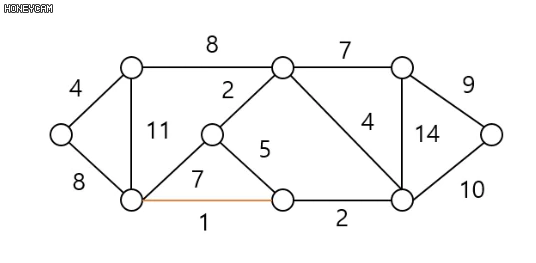

# Minimum Spanning Tree


## Spanning tree

Given a connected graph G=(V,E).

a spanning tree of G is a subgraph of a that is tree where set is eduals to V

- 스패닝 트리란, 연결된 그래프중 가장 적은 경우(연결 상태를 우지 할 수 있는 최소 부분 그래프)


### 스패닝 트리의 특징

- DFS, BFS을 이용하여 그래프에서 신장 트리를 찾을 수 있다.
- 탐색 도중에 사용된 간선만 모으면 만들 수 있다.
- 하나의 그래프에는 많은 신장 트리가 존재할 수 있다.
- Spanning Tree는 트리의 특수한 형태이므로 **모든 정점들이 연결** 되어 있어야 하고 **사이클을 포함해서는 안된다.**
- 따라서 Spanning Tree는 그래프에 있는 n개의 정점을 정확히 (n-1)개의 간선으로 연결 한다.


### 스패닝 트리의 활용

- 네트워크에 주로 사용된다.
- 가장 적은 비용으로 모든 지역을 커버하는 전선을 깔고 싶을 때


## Minimum Spanning Tree

- 최소 신장 트리
- 각 간선의 가중치가 주어져 있을 때, 모든 간선의 합이 가장 작은 트리


### MST를 구하는 방법

#### Kurskal's Algorithm

greedy method를 이용해 MST를 구한다


##### 동작
  1. 그래프의 간선들을 가중치의 오름차순으로 정렬한다.
  2. 정렬된 간선들 중에서 가중치가 가장 작은 간선을 선택한다.
  3. 사이클을 이루지 않는지 확인한다.
     1. 이룬다면 현재의 간선을 MST에 추가한다.
     2. 아니라면 다음 간선을 탐색한다.
  4. 반복한다.



##### 주의점

- 이미 선택된 간선들과 사이클을 이루는지 꼭 확인
  
- 사이클을 이룬다면 MST가 아니다.
  
- 사이클 여부를 확인하는 방법

  - 추가하고자 하는 간선의 양 끝점이 같은 집합에 속해있는지 먼저 검사해야한다.

    -> union-find 알고리즘
    
    

```python
def main() :
    n,m = input().split()

    n = int(n)
    m = int(m)

    matrix =[];

    for i in range(m) :
        temp = input().split()
        matrix.append([int(temp[2]),int(temp[0]),int(temp[1])]);

    parent = [i for i in range(n+1)]
    level = [i for i in range(n+1)]

    temp = None
    matrix.sort()

    weight = 0
    leng = len(matrix)
    for i in range(leng) :
        if(i==0) :
            weight+=matrix[i][0]
            merge(matrix[i][1],matrix[i][2],level,parent)
            continue;
        else :
            if merge(matrix[i][1], matrix[i][2], level, parent) :
                weight += matrix[i][0]


    print(weight)

def find(u,parent) :
    if u==parent[u] :
        return u;
    parent[u] = find(parent[u],parent);
    return parent[u];

def merge(u, v,level,parent) :
    u = find(u,parent)
    v = find(v,parent)
    if (u == v) :
        return False
    if (level[u] > level[v]) :
        temp =u
        u=v
        v=temp
    parent[u] = v
    if (level[u] == level[v]) :
        level[v]+=1
    return True

main()
```


## Prim's Algorithm

하나의 시작점을 잡고 시작점과 연결된 정점들에 대해 가장 가중치가 적은 간선부터 연결하면서 최소 스패닝 트리를 찾는 알고리즘을 말한다.

가장 가중치가 간선부터 연결하지만, 만약 사이클이 생긴다면 무시하고 다음으로 가중치가 작은 간선을 찾는다.


### 동작

1. 시작 점을 정하고, 점 박스에 넣는다.
2. 해당 점들과 연결된 간선들을 모두 구한다.
3. 그 중에서 가장 가중치가 가장 작은 간선을 구한다.
4. 해당 간성으로 연결 했을때 사이클이 생기는지 확인한다.
   1. 만약 사이클이 생기지 않는다면 간선을 연결한다.
   2. 만약 사이클이 생긴다면 다른 간선을 선택한다.
5. 다음 점을 선택한 다음에 반복


### 코드

```C++
while (!pq.empty())
    {
        int here = pq.top().second;
        int hereCost = pq.top().first;
 
        pq.pop();
 
        // 이미 방문한 정점은 무시한다.
        if (visit[here])
            continue;
 
        visit[here] = true;
 
        ans += hereCost;
 
        // 다음 정점을 우선순위 큐에 넣어준다.
        for (int i = 0; i < vc[here].size(); i++)
        {
            int there = vc[here][i].first;
            int thereCost = vc[here][i].second;
 
            pq.push(pii(thereCost, there));
        }
    }

//출처: https://www.crocus.co.kr/733 [Crocus]
```


### 직접 짠 Prim

```python
# baejeon 1922 - https://www.acmicpc.net/problem/1922
from sys import stdin
from heapq import heappush,heappop

input = stdin.readline

def find(u, parent):
    if (u == parent[u]):
        return u;
    parent[u] = find(parent[u], parent);
    return parent[u];

def merge(u, v, level, parent):
    u = find(u, parent)
    v = find(v, parent)
    if (u == v):
        return
    if (level[u] > level[v]) :
        temp = u;
        u = v;
        v = temp;

    parent[u] = v

    if(level[u]==level[v]) :
        level[v] = level[v] +1

if __name__=='__main__':
    n = int(input().strip())
    m = int(input().strip())

    parent = [i for i in range(n + 1)]
    level = [1] * (n + 1)
    vertexDic = {}
    check = [False] * (n+1)
    check[1] = True
    for i in range(m) :
        s,e,w = map(int,input().strip().split())
        vertexDic[s,e] = w

    prim = []
    pos = 1
    result = 0
    flag = False
    while(True) :
        for i in range(1,n+1) :
            if (pos, i) in vertexDic :
                heappush(prim, [vertexDic[pos, i], pos, i])
                del vertexDic[pos,i ]
            if (i, pos) in vertexDic :
                heappush(prim, [vertexDic[i, pos], i, pos])
                del vertexDic[i,pos]
        while(True) :
            if (not prim):
                flag = True
                break
            temp = heappop(prim)
            u = find(temp[1], parent)
            v = find(temp[2], parent)
            if(u == v) :
                continue
            else :
                break
        if(flag) : break
        result += temp[0]
        merge(temp[1],temp[2],level, parent)
        if(check[temp[1]]) :
            pos = temp[2]
            check[pos] = True
        else :
            pos = temp[1]
            check[pos] = True

    print(result)
```

직접 짠 프림은 유니온 파인드를 이용해서 만약 같은 그룹에 있다면 묶는 방식으로 사용했다.

그런데 다른 사람이 짠 코드는 간단하게 이미 사용한 점인지만 구분했다.

크루스칼은 정점 기준이니 유니온 파인드를 이용해야 되지만 프림은 간선 기준이니 유니온 파인드를 이용할 필요성이 없다.

### 다시 짠 프림

```java
// 프림 알고리즘 객체
class Prim {
    private ArrayList<Node>[] edgelist;
    private int v, e;
    // 각 정점과 간선의 갯수와, 이어진 간선의 갯수를 저장할 List초기화
    Prim(int v, int e) {
        this.v = v;
        this.e = e;
        edgelist = new ArrayList[v+1];
        for(int i = 1; i<v+1; i++) {
            edgelist[i] = new ArrayList<>();
        }
    }

    // 각 정정과 이어진 간선의 갯수를 초기화
    public void setEgelist(BufferedReader bf) throws IOException{
        int start = 0;
        int end = 0;
        int weight = 0;
        StringTokenizer st = null;
        for(int i = 0; i<e; i++) {
            st = new StringTokenizer(bf.readLine());
            start = Integer.parseInt(st.nextToken());
            end = Integer.parseInt(st.nextToken());
            weight = Integer.parseInt(st.nextToken());
            edgelist[start].add(new Node(end, weight));
            edgelist[end].add(new Node(start, weight));
        }
    }

    // 프림 알고리즘
    public int prim() {
        // 가장 작은 간선을 뽑기 위한 우선 순위 큐
        PriorityQueue<Node> pque = new PriorityQueue<>();
        int answer = 0;
        boolean[] visited = new boolean[v+1];
        // 첫번째 정점을 초기화
        pque.add(new Node(1, 0));
        Node outed = null;
        Node node_to_pque = null;
        while (!pque.isEmpty()) {
            outed = pque.poll();
            // 이어지는 edge가 한번 방문한 곳이라면 continue
            if(visited[outed.end]) {
                continue;
            }
            visited[outed.end] = true;
            answer += outed.weight;
            // 우선 순위 큐에서 간선을 출력한 다음에 방문하지 않은 곳이라면 que에 넣는다.
            for(int i = 0; i < edgelist[outed.end].size(); i++) {
                node_to_pque = edgelist[outed.end].get(i);
                if(visited[node_to_pque.end])
                    continue;
                pque.add(node_to_pque);
            }
        }
        return answer;
    }
}

class Node implements Comparable<Node>{
    public int end;
    public int weight;

    Node(int end, int weight) {
        this.end = end;
        this.weight = weight;
    }

    @Override
    public int compareTo(Node o) {
        return this.weight - o.weight;
    }
}
```


## 시간 복잡도

크루스칼 알고리즘 시간 복잡도 :: **O(ElgE)**

프림 알고리즘 시간 복잡도 :: **O(ElgV)**

결국, **간선의 개수가 작은 경우**에는 **크루스칼 알고리즘**을, **간선의 개수가 많은 경우**에는 **프림 알고리즘**이 더 좋다는 것이 자명하다.


## 참고

출처: https://www.crocus.co.kr/733 [Crocus]

