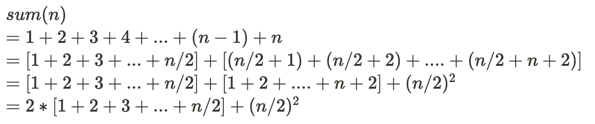

# Sum

## 1~n까지의 수를 더하는 방법

### 가장 보편적인 방식의 1~n까지 더하는 방법

``` python
def sum(n: int):
    answer = 0
    for i in range(n):
        answer += (i + 1)
    return answer
```

- 가장 직관적인 방법
- 시간복잡도 **O(n)** -> n이하의 모든 값을 한번씩 방문해 주면서 더해주기 때문에 시간 복잡도는 O(n)이 된다.


### 재귀를 이용한 방식

```python
def sum(n: int):
    if n == 1:
        return 1
    elif n % 2 == 0:
        return 2 * sum(n // 2) + (n // 2) ** 2
    else:
        return 2 * sum((n - 1) // 2) + ((n - 1) // 2) ** 2 + n
```

- 재귀를 이용한 시간 단축형
- 시간 복잡도 -> $logn$

- 원리
  
  - 예제 : 1~6까지 더하는 경우
    1. 1+2+3+4+5+6
    2. [1+2+3] + [(3+1)+(3+2)+(3+3)]
    3. [1+2+3]*2 + 3<sup>2</sup>
- 시간 복잡도 계산 방법
  - n은 단계를 거칠 때마다 n/2로 줄어들고 2개의 부분문제로 나뉘게 된다.
  - $T(n) = 2*T(n) + O(1)$
  - 마스터 정리 : n<sup>log<sub>2</sub>2</sup> = n<sup>0</sup> = 1 > 1
  - 시간 복잡도 : O(logn)