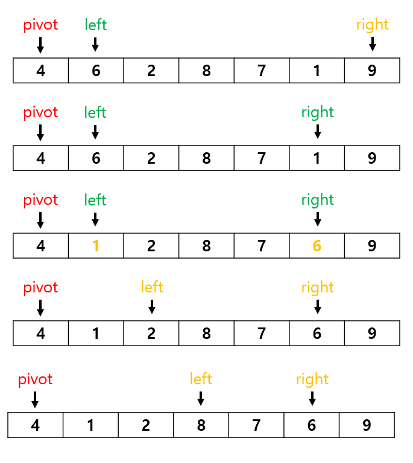
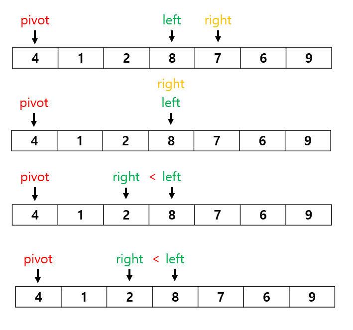
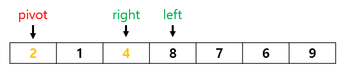

# 정렬
## 퀵 정렬

퀵 정렬이라는 이름 그대로 평균적인 상황에서 가장 빠른 정렬

### 장점

1. 속도가 빠르다.

### 단점

2. 최악의 경우에는 O(n2)로 굉장히 느려 질 수도 있다.

### 방법

1. 적당한 원소 하나를 선택한 (pivot)
2. 피벗을 기준으로 삼아 작은 것을 앞으로 교환 및 큰 것은 뒤로 옮겨서 피벗보다 작은 건 뒤로 옮기며 정렬한다. 
3. 피벗을 그 정렬된 중앙과 교환한다.
4. 피벗을 기준으로 왼쪽과 오른쪽도 각각 정렬한다

### 그림

이 과정을 교환된 부분을 기중르로 반복한다.

### 시간 복잡도

O(nlog2n)

