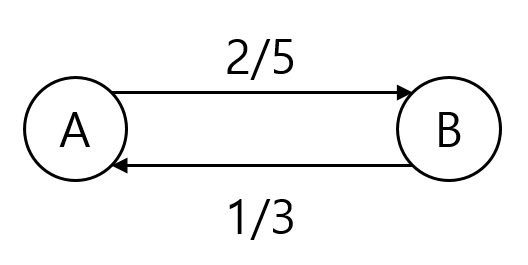

# Max Flow Algorithm

https://ratsgo.github.io/data%20structure&algorithm/2017/11/29/maxflow/

최대 유량 알고리즘이란, 가중치가 있는 방향 그래프의 시작과 도착노드가 주어졌을때 시작에서 끝까지 흘려 보낼 수 있는 최대 유량을 계산하는 알고리즘

각 간선의 가중치를 용량(capacity)라고 하며,  정점 A와 정점 B가 간선으로 이어져 있을 때 정점 A에서 B방향으로의 용량을 c(A,B)라고 씁니다.<!--용량은 항상 0 이상입니다.-->

A,B사이를 흐르는 유량을 f(A,B)라고 쓰며, 유량은 항상 실수 입니다.

그리고 제약 조건이 3가지가 있는데

1. **capacity constraint** : f(A,B)<=c(A,B), 즉 유량은 용량을 초과할 수 없다.
2. **skew symmetry** : f(A,B)=−f(B,A)
3. **flow conservation** : 각 노드에서 유량은 새로 더해지거나 감소되지 않는다.

### 용량 표기법 

1. c(A,B) =5 ,c(B,A)=3

2. c(A,B) =5 ,c(B,A)=3, f(A,B) =2,f(B,A)=1

3. **cancellation**

위 그래프를 양의 순 유량(positive net flow)으로 다시 표시

*residual capacity* cf(u,v)cf(u,v)는 다음과 같이 정의됩니다.

cf(u,v)=c(u,v)−f(u,v)

- cf(u,v)=c(u,v)−f(u,v)=9−4=5cf(u,v)=c(u,v)−f(u,v)=9−4=5
- cf(v,u)=c(v,u)−f(v,u)=0−(−4)=4cf(v,u)=c(v,u)−f(v,u)=0−(−4)=4

**augmenting path**란 *residual network* GfGf 상에서 ss에서 tt로 가는 경로를 가리킵니다.

## Ford-Fulkerson Algorithm

포드-풀커슨 알고리즘(Ford-Fulkerson Algorithm)은 *residual network*를 활용해 최대 유량을 구하는 기법입니다. 다음 그림과 같은 *residual network* GfGf가 주어졌다고 칩시다.

포드-풀커슨 알고리즘(Ford-Fulkerson Algorithm)은 *residual network*를 활용해 최대 유량을 구하는 기법입니다. 다음 그림과 같은 *residual network* GfGf가 주어졌다고 칩시다.

우선 [깊이우선탐색(DFS)](https://ratsgo.github.io/data structure&algorithm/2017/11/20/DFS/)이나 [너비우선탐색(BFS)](https://ratsgo.github.io/data structure&algorithm/2017/11/19/BFS/) 방식으로 ss에서 tt로 가는 경로를 하나 찾습니다. 아래 예시에서는 {s,a,b,ts,a,b,t}를 찾았습니다. 이 경로를 통해 흐를 수 있는 최대 유량은 1입니다.

직전 단계에서 구한 경로의 반대 방향으로 최대 유량(1)만큼을 흘려 보내는 엣지를 만들어 줍니다(`augmenting path`+`cancellation`). 다시 ss에서 tt로 가는 경로를 하나 찾습니다. {s,a,ts,a,t}입니다. 이 경로를 통해 흐를 수 있는 최대 유량은 1입니다.

직전 단계에서 구한 경로의 반대 방향으로 최대 유량(1)만큼을 흘려보내는 엣지를 만들어 줍니다. 다시 ss에서 tt로 가는 경로를 하나 찾습니다. {s,b,a,ts,b,a,t}입니다. 이 경로를 통해 흐를 수 있는 최대 유량은 1입니다.

직전 단계에서 구한 경로의 반대 방향으로 최대 유량(1)만큼을 흘려보내는 엣지를 만들어 줍니다. 다시 ss에서 tt로 가는 경로를 하나 찾습니다. {s,b,ts,b,t}입니다. 이 경로를 통해 흐를 수 있는 최대 유량은 2입니다.

직전 단계에서 구한 경로의 반대 방향으로 최대 유량(2)만큼을 흘려보내는 엣지를 만들어 줍니다. 다시 ss에서 tt로 가는 경로를 하나 찾습니다. 그런데 이제는 ss에서 tt로 가는 경로가 존재하지 않습니다.

포드-풀커슨 알고리즘 수행을 종료합니다. 위 그래프는 *residual network* GfGf이기 때문에, ss에서 tt로 향하는 최대 유량은 aa에서 tt의 2, bb에서 tt의 3, 이렇게 해서 총 5가 됩니다. 포드-풀커슨 알고리즘의 의사코드는 다음과 같습니다.

### 출처

https://ratsgo.github.io/data%20structure&algorithm/2017/11/29/maxflow/