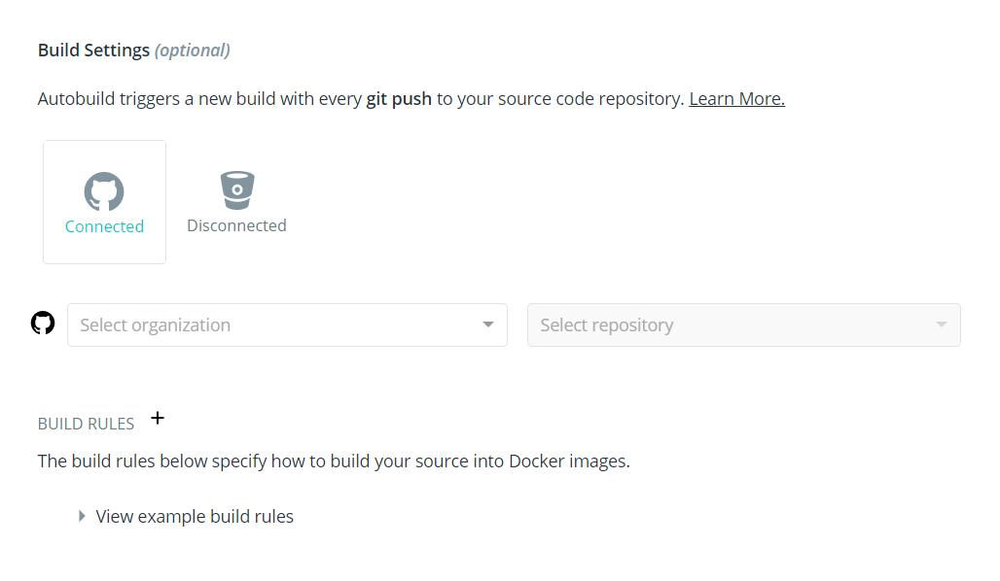
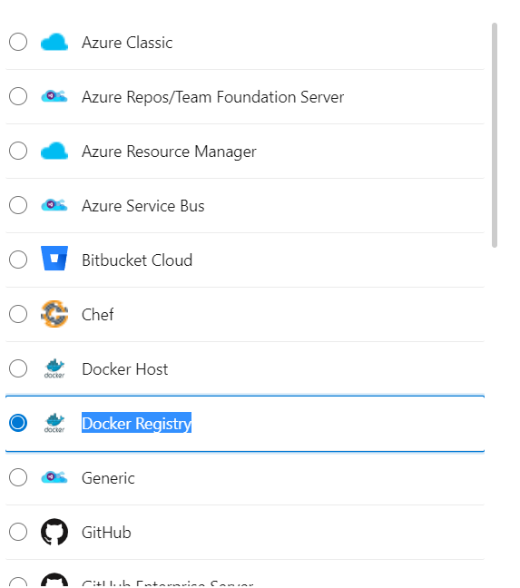
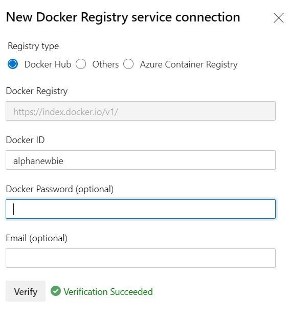
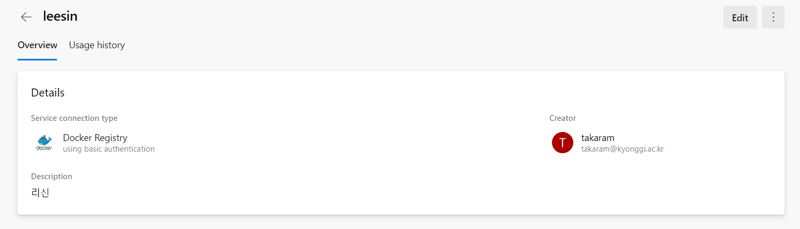
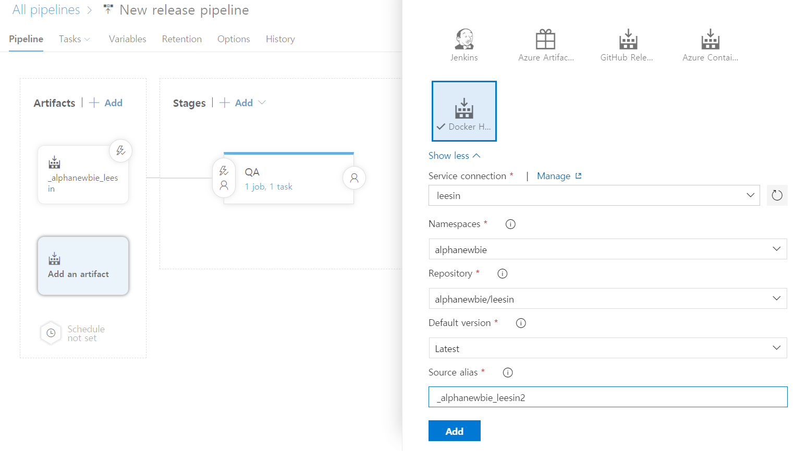
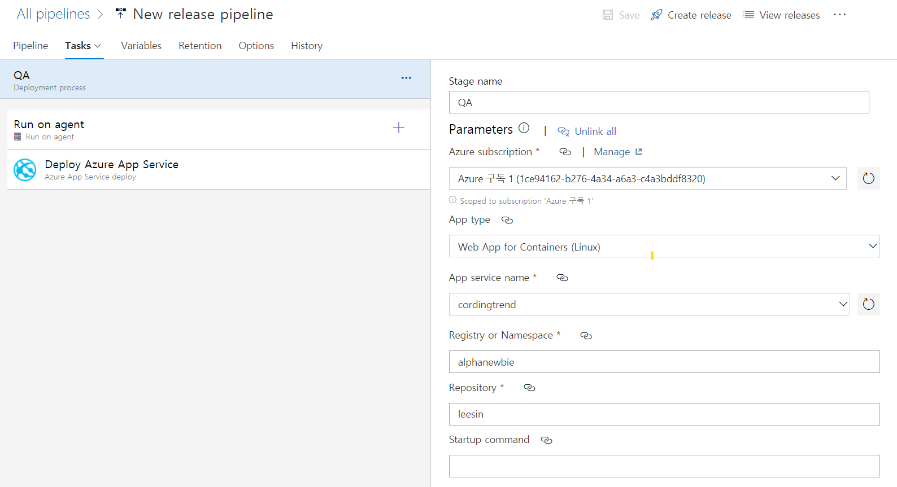
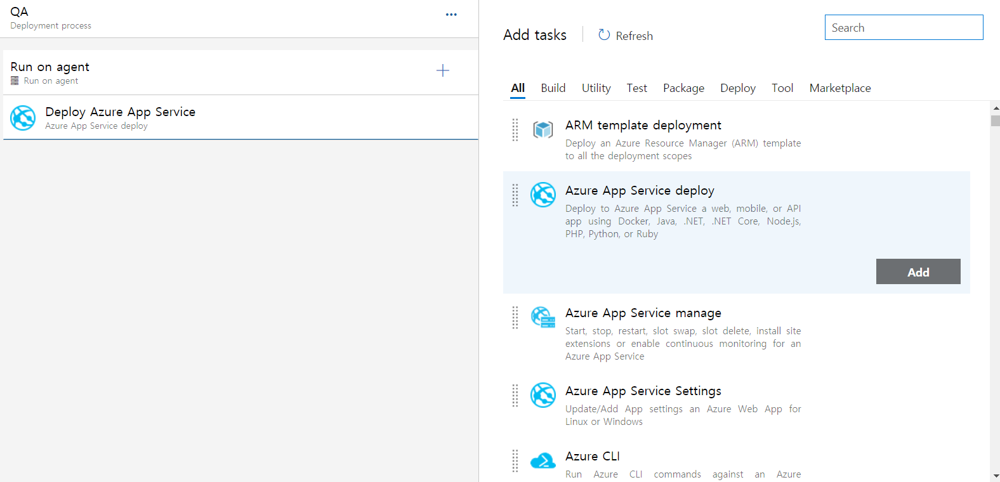
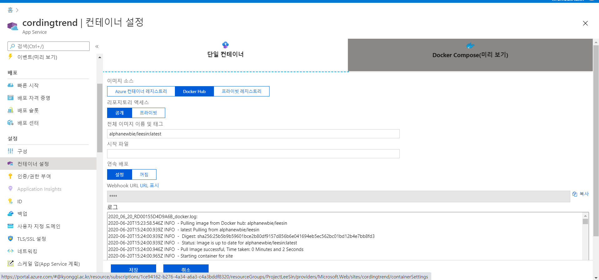

1. 일단 도커를 하나 빌드 하여 Docker hub에 올린다.
   1. 도커 허브의 CI는 그렇게 어렵지 않다.
   2. 도커 허브를 가서 레포지토리를 만드는 과정에 하단을 보면 이런 목록이 있다.
   
   
   
1. github repository에 psuh하면 시간이 좀 오래 걸리지만, 자동으로 docker image가 자동으로 빌드 된다.
   
2. 아래는 이제 이 이미지를 Azure pipeline을 통해 자동으로 빌드 되는 것을 만들기 위한 시행 착오 과정
3. 일단, release를 자동으로 하기 위해서 docker hub와의 연결을 하는 과정이다.
   1. 해당 devops프로젝트에 들어가서 **setting**에 들어간다
   2. 하단 **Pipelines** 항목에 **Service connections**로 들어간다
   3. 상당의 **New service connection** 클릭
   4. Docker Registry 클릭한다.
   
   1. 입력하라는 항목을 입력한다.(비밀번호를 비워두긴 했지만 비밀번호도 채워야 된다.)
   
   1. 그럼 이런식으로 추가된 것을 볼수 있다.(이건 클릭해서 들어간 다음의 창)
   

4. 그리고 DevOps프로젝트 메인 화면으로 돌아와서 **pipelines**항목의 **release pipeline**을 클릭해 새로운 파이프 라인을 생성한다.
   1. 처음으로 **Artifacts**를 생성
      - 하단의 그림은 이미 아티펙트를 생성해 놓은 이후이기에 2번째로 만드는 걸로 예시를 만들었다.
      - 이런식으로 아까 만들어놓은 connect로 연결한다
   
   2. 그리고 이제 **stage**를 채워야 한다.
   3. 스테이지 제목을 클릭하고 타입과 webapp타입을 지정한다.
   
   4. 하단의 agent는 container가 있는 것으로 선택한다.
   
   5. 밑의 내용을 딱히 완성되있는걸 사용하고 release클릭

5. 이제 배포는 제대로 되었다.
6. 하지만 이제 문제가 생겼는데 배포가 끝난 후에 컨테이너가 재시작이 안된다는 점이다.
   - 즉 수동으로 webapp재시작을 눌러줬어야 했다.
   - 재시작을 안 누르면 배포만 되지 컨테이너가 갱신이 안되서 이전 버전만 나온다.
7. 그래서 이제부터가 이것을 해결해 보기 위한 노력
8. 일단 도커 재시작을 위해서 아까 **stage**에 **Startup command**을 채워보았다.
   1. 첫번째 레포지토리에서 받은 컨테이너의 경우에는 `게시자명/프로젝트명`으로 설정이 되길래 `docker restart 게시자명/프로젝트명`을 넣어보았다.
      - 결과는 실패 : 에러가 터져서 웹앱이 죽었다.
   2. 다음은 tag도 붙혀 보았다. ``docker restart 게시자명/프로젝트명:latest`
      - 역시 에러가 나서 죽었다.
   3. 마지막으로 웹앱을 리스타스 시켜주기 위해서 `az webapp restart --name cordingtrend --resource-group ProjectLeeSin`했는데 여전히 실패
      - 역시 이번에도 에러가 나서 죽었다.
      - 아마 이유는 docker 컨테이 안에서 명령어가 실행되서 죽거나, 이번건 로그인이 안되서 죽은 것 같다.
   4. 이 모든 문제는 ssl로 접근 할 수 있으면 해결될거 같은데 이유를 모르겠다.
   

### 해결 방법

저기 밑에 연속 배포를 설정으로 해준다...

ㅠㅠ 한참 고생했는데.