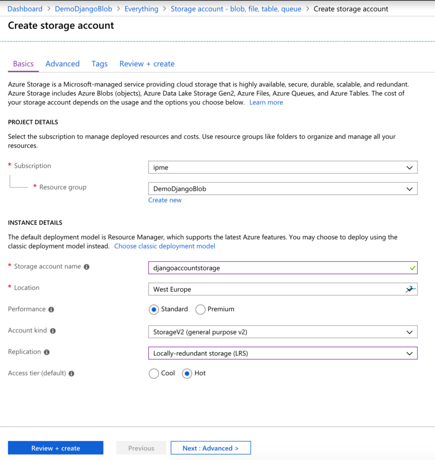

# Auzre blob과 django와의 연동

1. Azure로 들어가서 스토리지 계정을 생성

   1. 위의 검색 창으로 생성하던 스토리지 계정이 나온다.
   2. 인스턴스도 자유롭게 만든다.
      1. 
         
         출처 : https://medium.com/@DawlysD/django-using-azure-blob-storage-to-handle-static-media-assets-from-scratch-90cbbc7d56be
      2. 위 처럼 자유롭게 생성, 위는 범용 v2로 생성되어 있지만 blob으로 생성해도 잘 됬다.
         복제의 지역은 그 지역에서만 복제해서 백업해 두는건지, 등등인거 같지만, 별 문제는 없었다.
         쿨 : 자주 엑세스 되지 않는 데이터보관할 때
         핫 : 자주 엑세스 되는 데이터 보관할 때
      3. 그 뒤의 내용은 읽어보면서 필요하다 싶은걸로 생성

2. 그리고 생성된 리소스로 접근 해서, 컨테이너 항목에 들어간다.

   1. 새 컨테이터 생성 : 이번에는 static과 media파일을 저장할 컨테이너를 만드는 것이므로 컨테이너 2개 생성,

3. 이제 로컬로 돌아가서 pip를 통해 필요한 항목 설치및 생성

   ```bash
   $ pip install django
   $ pip install django-storages[azure]
   $ django-admin.py startproject exampleproject
   ```

4. 그리고 이번엔 장고 프로젝트로 가서 [프로젝트명]/settings.py로 들어가서

   ```python
   INSTALLED_APPS = [
       'storages',
       'django.contrib.admin',
       'django.contrib.auth',
       'django.contrib.contenttypes',
       'django.contrib.sessions',
       'django.contrib.messages',
       'django.contrib.staticfiles',
   ]
   ```

   `'storages'`모듈을 `INSTALLED_APPS`안에 추가한다.

5. 그리고 setting.py 최 하단에 참조값을 선언한다.

   ```python
   DEFAULT_FILE_STORAGE = '[backend].custom_azure.AzureMediaStorage'
   MEDIA_LOCATION = "media"
   AZURE_ACCOUNT_NAME = "[djangoaccountstorage]"
   AZURE_CUSTOM_DOMAIN = f'{AZURE_ACCOUNT_NAME}.blob.core.windows.net'
   MEDIA_URL = f'https://{AZURE_CUSTOM_DOMAIN}/{MEDIA_LOCATION}/'
   
   STATICFILES_STORAGE = '[backend].custom_azure.AzureStaticStorage'
   STATIC_LOCATION = "static"
   STATIC_URL = f'https://{AZURE_CUSTOM_DOMAIN}/{STATIC_LOCATION}/'
   ```

   [backend]를 자신의 프로젝트 이름으로 교체한다.

   [djangoaccountstorage]는 자신의 엑세스 키에 있는 스토리지 계정 이름으로 교체한다.

   만약 static을 저장하기 싫다면 static은 부분은 사용 안해도 된다.

   예시 : 

   ```python
   DEFAULT_FILE_STORAGE = 'exampleproject.custom_azure.AzureMediaStorage'
   MEDIA_LOCATION = "media"
   AZURE_ACCOUNT_NAME = "examplestorage"
   AZURE_CUSTOM_DOMAIN = f'{AZURE_ACCOUNT_NAME}.blob.core.windows.net'
   MEDIA_URL = f'https://{AZURE_CUSTOM_DOMAIN}/{MEDIA_LOCATION}/'
   ```

6. settings.py가 있는 디렉토리, 즉 examplestorage/examplestorage하단에 `custom_azure.py`파일을 생성

   ```python
   from storages.backends.azure_storage import AzureStorage
   
   class AzureMediaStorage(AzureStorage):
       account_name = '[djangoaccountstorage]'
       account_key = '[your_key_here]'
       azure_container = 'media'
       expiration_secs = None
   
   class AzureStaticStorage(AzureStorage):
       account_name = '[djangoaccountstorage]' 
       account_key = '[your_key_here]'
       azure_container = 'static'
       expiration_secs = None
   ```

   `[djangoaccountstorage]`와 `[your_key_here]`를 각각 자신의 스토리지 계정과 키로 저 `account_name`과 `account_key` 항목을 대체한다. (키가 2개 있는데 하나만 써도 된다.)

   - 키를 확인하는 방법,

     - Azure포털에 들어가서 액세스 키 항목을 찾아본다.

     - Azure CLI를 통해 키를 찾아본다. 물론 이 경우에도 [examplestorage]를 자신의 스토리지 계정으로 대체한다.

       ```bash
       $ az login
       $ az storage account keys list -n djangoaccountstorage -g examplestorage
       ```

   위에 static을 안쓰기로 했으면 밑에도 안 써도 된다.

   예시:

   ```python
   from storages.backends.azure_storage import AzureStorage
   
   class AzureMediaStorage(AzureStorage):
       account_name = 'examplestorage'
       account_key = 'dS~$P5B%lJn+Vu*#G`$f6I+5L~/iGTLdKM2CVN|dU.=.!bfqWOQLstgx2YhmtJao&S,F9,M.Ixm%Tb.bO,bawwN'
       azure_container = 'media'
       expiration_secs = None
   ```

   이런 식으로 (예시의 키는 실제 키가 아닌 무작위로 생성한 키를 넣어줬다. 예시니까.)

7. 스태틱을 사용해줬다면,

   ```bash
   $ python manage.py collectstatic
   ```

   을 입력하면 static파일들이 스토리지에 들어가 있는 것을 볼 수 있다.

   물론, 안 했다면 볼 수 없다.

   그럼 static 스토리지 안의 static 폴더 안에 들어가 있는 것을 볼 수 있다.

8. 만약 form 이나 그런 방식으로 이미지 파일을 올리게 되면 media컨테이너에 올라가게 된다. 올라가는 디렉토리는 model.py(즉, 자기가 선언한) `models.FileField(upload_to='exam')`에 올라가게 된다. 즉, `media/exam/`의 하위에 들어가게 된다.
   이 주소가 중요한 이유가 이 파일에 접근하기 위한 경로이기 때문이다.

9. 예를 들면 `beta.md`라는 파일을 업로드 한다면, `media/exam/beta.md`라는 경로로 올라가게 되고 만약 그 파일을 다운로드 하고 싶다면

   ```html
   <a href="https://examplestorage.blob.core.windows.net/media/exam/beta.md">다운로드</a>
   ```

   이렇게 지정하면 된다.

   

----
- https://medium.com/@DawlysD/django-using-azure-blob-storage-to-handle-static-media-assets-from-scratch-90cbbc7d56be
- https://django-storages.readthedocs.io/en/latest/backends/azure.html