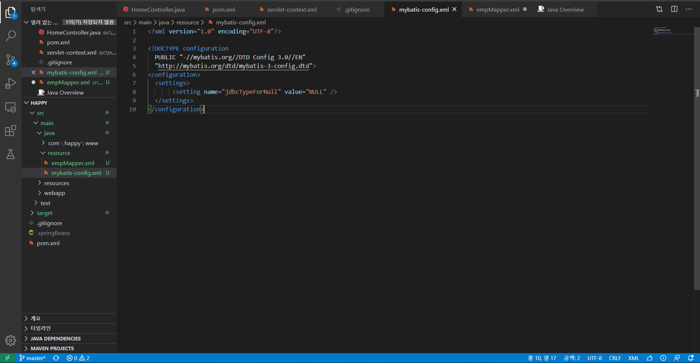
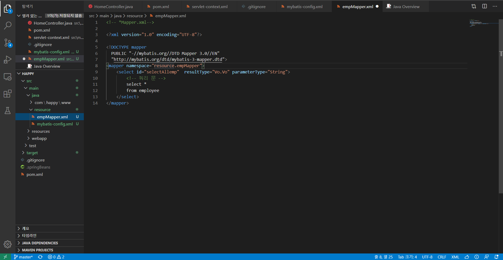
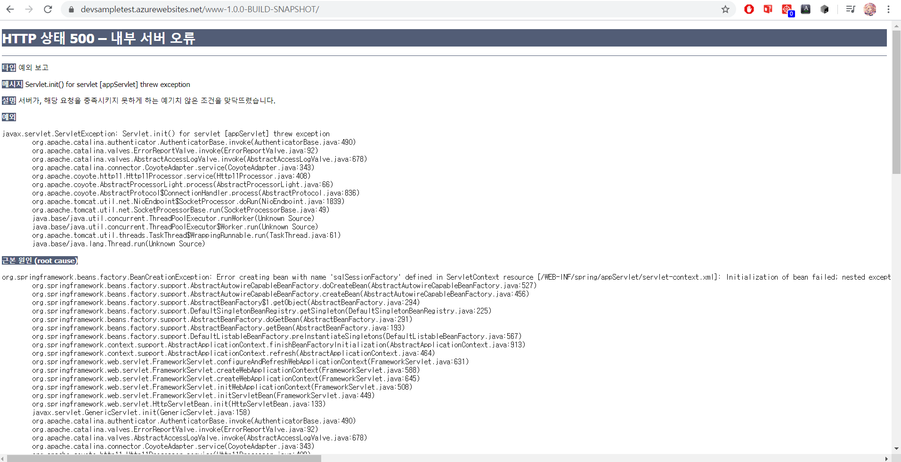
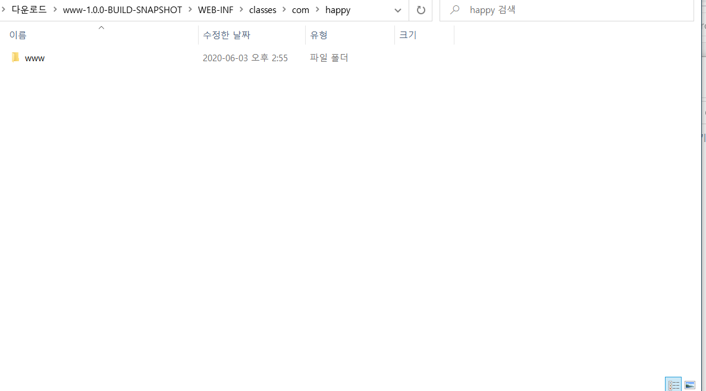
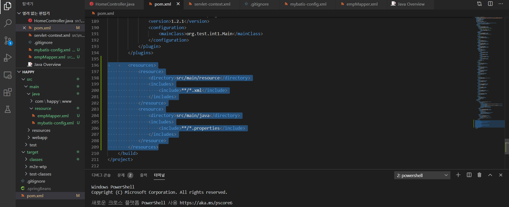
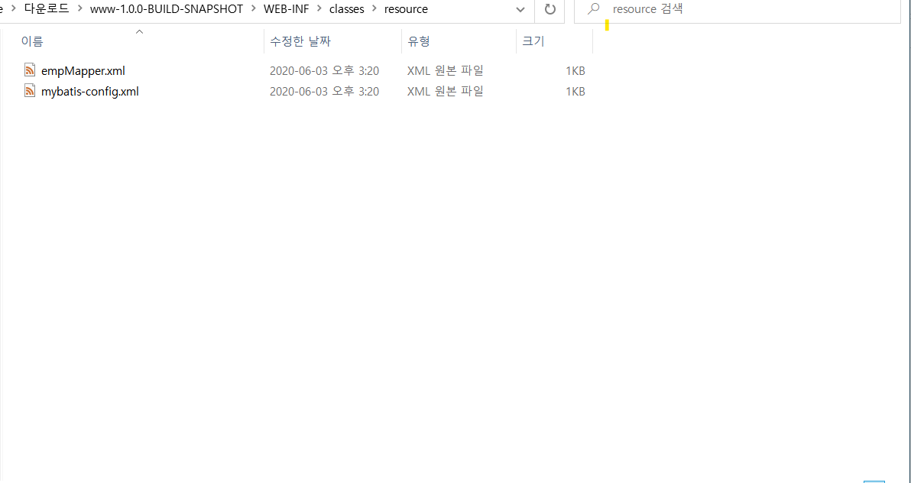

# 스프링 MVC

## Mybatis

### pom.xml에 추가

```xml
		<dependency>
            <groupId>mysql</groupId>
            <artifactId>mysql-connector-java</artifactId>
            <version>6.0.5</version>
        </dependency>

		<dependency>
			<groupId>com.jslsolucoes</groupId>
			<artifactId>ojdbc6</artifactId>
			<version>11.2.0.1.0</version>
		</dependency>

		<dependency>
			<groupId>org.springframework</groupId>
			<artifactId>spring-jdbc</artifactId>
			<version>5.0.2.RELEASE</version>
		</dependency>

		<dependency>
			<groupId>org.mybatis</groupId>
			<artifactId>mybatis</artifactId>
			<version>3.5.4</version>
		</dependency>

		<dependency>
			<groupId>org.mybatis</groupId>
			<artifactId>mybatis-spring</artifactId>
			<version>1.3.2</version>
		</dependency>
		
		<dependency>
			<groupId>javax.xml.bind</groupId>
			<artifactId>jaxb-api</artifactId>
			<version>2.3.0</version>
		</dependency>
```


### servlet-context.xml에 추가

```XML

	<beans:bean id="dataSource"
		class="org.springframework.jdbc.datasource.DriverManagerDataSource">
		<beans:property name="driverClassName"
			value="com.mysql.cj.jdbc.Driver" />
		<beans:property name="url"
			value="jdbc:mysql://happyness.mysql.database.azure.com/donghang" />		
        <!-- 데이터베이스서버 주소/DB이름--> 
        <!-- 이건 MYSQLDB로 들어가서 미리 생성해주자-->
		<beans:property name="username" value="계정암호" />							
        <!-- 사용자 계정, Azure의 경우에는 계정@서버주소 이다-->
		<beans:property name="password" value="계정비밀번호" />						
        <!-- 사용자 암호 -->
	</beans:bean>

	<beans:bean id="sqlSessionFactory"
		class="org.mybatis.spring.SqlSessionFactoryBean">
		<beans:property name="dataSource" ref="dataSource" />
		<beans:property name="configLocation"
			value="classpath:/resource/mybatis-config.xml" />
		<beans:property name="mapperLocations"
			value="classpath:/resource/*Mapper.xml" />
	</beans:bean>

	<beans:bean id="sqlSession"
		class="org.mybatis.spring.SqlSessionTemplate"
		destroy-method="clearCache">
		<beans:constructor-arg index="0"
			ref="sqlSessionFactory" />
	</beans:bean>
```


### Mapper파일 추가

위에 언급한 경로 내에 mybatis-config.xml과 *Mapper.xml파일들을 추가해준다.

즉, `src\main` 안에 집에 resource 디렉도리를 생성한 다음에 파일들을 집어 넣는다.



```xml
<!-- mybatis-config.xml-->
<?xml version="1.0" encoding="UTF-8"?>

<!DOCTYPE configuration
  PUBLIC "-//mybatis.org//DTD Config 3.0//EN"
  "http://mybatis.org/dtd/mybatis-3-config.dtd">
<configuration>
  <settings>
       <setting name="jdbcTypeForNull" value="NULL" />      
  </settings>  
</configuration>
```



```xml
<?xml version="1.0" encoding="UTF-8"?>

<!DOCTYPE mapper
  PUBLIC "-//mybatis.org//DTD Mapper 3.0//EN"
  "http://mybatis.org/dtd/mybatis-3-mapper.dtd">
<mapper namespace="resource.empMapper">
	<select id="selectAllemp"  resultType="Vo.Vo" parameterType="String">
        <!-- 쿼리 문 -->
        select ename
        from employee
	</select>
</mapper>
```


### 문제



```error
org.springframework.beans.factory.BeanCreationException: Error creating bean with name 'sqlSessionFactory' defined in ServletContext resource [/WEB-INF/spring/appServlet/servlet-context.xml]: Initialization of bean failed; nested exception is org.springframework.beans.TypeMismatchException: Failed to convert property value of type 'java.lang.String' to required type 'org.springframework.core.io.Resource[]' for property 'mapperLocations'; nested exception is java.lang.IllegalArgumentException: Could not resolve resource location pattern [classpath:/resource/*Mapper.xml]: class path resource [resource/] cannot be resolved to URL because it does not exist
	org.springframework.beans.factory.support.AbstractAutowireCapableBeanFactory.doCreateBean(AbstractAutowireCapableBeanFactory.java:527)
	org.springframework.beans.factory.support.AbstractAutowireCapableBeanFactory.createBean(AbstractAutowireCapableBeanFactory.java:456)
	org.springframework.beans.factory.support.AbstractBeanFactory$1.getObject(AbstractBeanFactory.java:294)
	org.springframework.beans.factory.support.DefaultSingletonBeanRegistry.getSingleton(DefaultSingletonBeanRegistry.java:225)
	org.springframework.beans.factory.support.AbstractBeanFactory.doGetBean(AbstractBeanFactory.java:291)
	org.springframework.beans.factory.support.AbstractBeanFactory.getBean(AbstractBeanFactory.java:193)
	org.springframework.beans.factory.support.DefaultListableBeanFactory.preInstantiateSingletons(DefaultListableBeanFactory.java:567)
	org.springframework.context.support.AbstractApplicationContext.finishBeanFactoryInitialization(AbstractApplicationContext.java:913)
	org.springframework.context.support.AbstractApplicationContext.refresh(AbstractApplicationContext.java:464)
	org.springframework.web.servlet.FrameworkServlet.configureAndRefreshWebApplicationContext(FrameworkServlet.java:631)
	org.springframework.web.servlet.FrameworkServlet.createWebApplicationContext(FrameworkServlet.java:588)
	org.springframework.web.servlet.FrameworkServlet.createWebApplicationContext(FrameworkServlet.java:645)
	org.springframework.web.servlet.FrameworkServlet.initWebApplicationContext(FrameworkServlet.java:508)
	org.springframework.web.servlet.FrameworkServlet.initServletBean(FrameworkServlet.java:449)
	org.springframework.web.servlet.HttpServletBean.init(HttpServletBean.java:133)
	javax.servlet.GenericServlet.init(GenericServlet.java:158)
	org.apache.catalina.authenticator.AuthenticatorBase.invoke(AuthenticatorBase.java:490)
	org.apache.catalina.valves.ErrorReportValve.invoke(ErrorReportValve.java:92)
	org.apache.catalina.valves.AbstractAccessLogValve.invoke(AbstractAccessLogValve.java:678)
	org.apache.catalina.connector.CoyoteAdapter.service(CoyoteAdapter.java:343)
	org.apache.coyote.http11.Http11Processor.service(Http11Processor.java:408)
	org.apache.coyote.AbstractProcessorLight.process(AbstractProcessorLight.java:66)
	org.apache.coyote.AbstractProtocol$ConnectionHandler.process(AbstractProtocol.java:836)
	org.apache.tomcat.util.net.NioEndpoint$SocketProcessor.doRun(NioEndpoint.java:1839)
	org.apache.tomcat.util.net.SocketProcessorBase.run(SocketProcessorBase.java:49)
	java.base/java.util.concurrent.ThreadPoolExecutor.runWorker(Unknown Source)
	java.base/java.util.concurrent.ThreadPoolExecutor$Worker.run(Unknown Source)
	org.apache.tomcat.util.threads.TaskThread$WrappingRunnable.run(TaskThread.java:61)
	java.base/java.lang.Thread.run(Unknown Source)
```

이런 에러가 발생한다.

문제는 

```
org.springframework.beans.factory.BeanCreationException: Error creating bean with name 'sqlSessionFactory' defined in ServletContext resource [/WEB-INF/spring/appServlet/servlet-context.xml]: Initialization of bean failed; nested exception is org.springframework.beans.TypeMismatchException: Failed to convert property value of type 'java.lang.String' to required type 'org.springframework.core.io.Resource[]' for property 'mapperLocations'; nested exception is java.lang.IllegalArgumentException: Could not resolve resource location pattern [classpath:/resource/*Mapper.xml]: class path resource [resource/] cannot be resolved to URL because it does not exist
```

즉, xml파일을 못 찾겠다는 의미이다. 그럼, 빌드된 war파일을 받아 열어본다.



즉, xml를 담아두는 resource 디렉토리가 이 없다.


### 해결책

pom.xml에 빌드에 옵션을 추가로 준다



```xml
	<build>
		<resources>
            <resource>
                <directory>src/main/resource</directory>
                <includes>
                    <include>**/*.xml</include>
                </includes>
            </resource>
            <resource>
                <directory>src/main/java</directory>
                <includes>
                    <include>**/*.properties</include>
                </includes>
            </resource>
        </resources>
	</build>
```

즉, 빌드때 해당 경로에 있는 파일들을 추가해 준다는 뜻이다.

그리고 빌드된 것을 보면



정상적으로 들어가 있는 것을 확인할 수 있다.