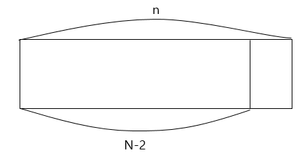

## 백준 11060번 문제 풀이

https://www.acmicpc.net/problem/11726

### 문제

*2×n 크기의 직사각형을 1×2, 2×1 타일로 채우는 방법의 수를 구하는 프로그램을 작성하시오.*

*아래 그림은 2×5 크기의 직사각형을 채운 한 가지 방법의 예이다.*


### 입력

*첫째 줄에 n이 주어진다. (1 ≤ n ≤ 1,000)*


### 출력

*첫째 줄에 2×n 크기의 직사각형을 채우는 방법의 수를 10,007로 나눈 나머지를 출력한다.*


### 풀이

다이나믹 프로그래밍의 가장 대중적인 스타일의 문제이다.

일단 베이스 케이스 부터 생각해 보겠다

n=1

l

한가지 경우

n=2

|| =

의 두가지 경우

n=3인 경우

||| , |=, =|

3가지 경우


점화식을 생각해 보면 간단한데

dp[n]이 되는 경우는


dp[i-1]에서 1*2형태인 |를 하나 더 해주는 방법과



dp[i-2] 에서 2*1 형태의 작대기 2개 '='를 더 해주는 방법을 구하면 된다

||를 더하지 않는 이유는 dp[i-1]에서 이미 더해 줬기 때문에 중복 되기 때문이다.


즉 점화식은

```sudo
dp[i] <- dp[i-1]+dp[i-2]
```


전체 코드를 슈도코드로 나타내면 이렇다

```sudocode
dp[1] <- 1
dp[2] <- 2

for i=3...n
	dp[i] <- dp[i-1]+dp[i-2]
```

가 된다.


### 전체 코드

```java
import java.util.Scanner;
import java.util.Arrays;

public class Main {

	public static void main(String[] args) {
		Scanner in = new Scanner(System.in);
		int n = Integer.parseInt(in.nextLine());

		int[] ai = new int[n];
		int[] dp = new int[n];

		Arrays.fill(dp, -1);

		String[] aList = in.nextLine().split(" ");

		for (int i = 0; i < n; i++) {
			ai[i] = Integer.parseInt(aList[i]);
		}

		dp[0] = 0;

		for (int i = 0; i < n - 1; i++) {
			if (dp[i] == -1)
				continue;
			for (int j = 1; j <= ai[i]; j++) {
				if (i + j >= n)
					break;
				if (dp[i + j] == -1)
					dp[i + j] = dp[i] + 1;
				else {
					dp[i + j] = Math.min(dp[i + j], dp[i] + 1);
				}

			}
		}
		System.out.print(dp[n - 1]);
	}

}
```

