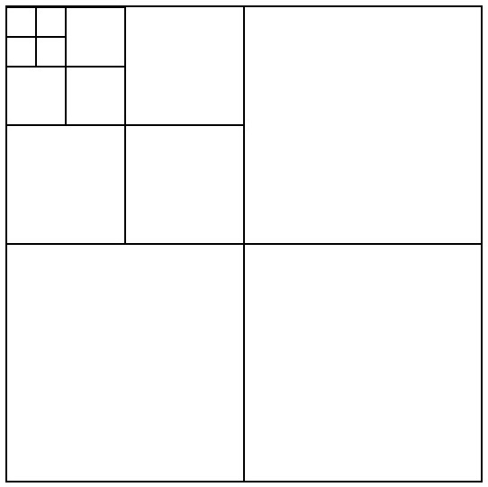
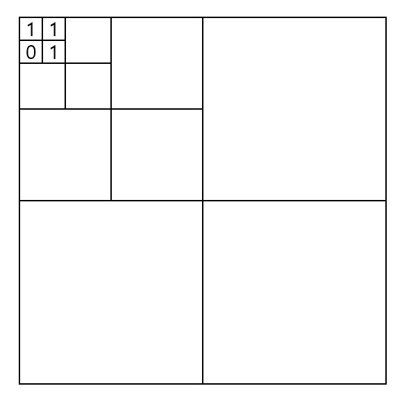
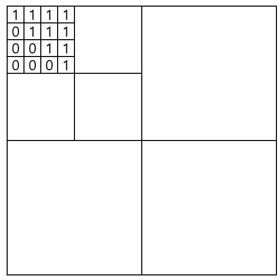

## 백준 1992번 풀이

https://www.acmicpc.net/problem/1992

### 문제

*흑백 영상을 압축하여 표현하는 데이터 구조로 쿼드 트리(Quad Tree)라는 방법이 있다. 흰 점을 나타내는 0과 검은 점을 나타내는 1로만 이루어진 영상(2차원 배열)에서 같은 숫자의 점들이 한 곳에 많이 몰려있으면, 쿼드 트리에서는 이를 압축하여 간단히 표현할 수 있다.*

*주어진 영상이 모두 0으로만 되어 있으면 압축 결과는 "0"이 되고, 모두 1로만 되어 있으면 압축 결과는 "1"이 된다. 만약 0과 1이 섞여 있으면 전체를 한 번에 나타내지를 못하고, 왼쪽 위, 오른쪽 위, 왼쪽 아래, 오른쪽 아래, 이렇게 4개의 영상으로 나누어 압축하게 되며, 이 4개의 영역을 압축한 결과를 차례대로 괄호 안에 묶어서 표현한다*


*위 그림에서 왼쪽의 영상은 오른쪽의 배열과 같이 숫자로 주어지며, 이 영상을 쿼드 트리 구조를 이용하여 압축하면 "(0(0011)(0(0111)01)1)"로 표현된다. N ×N 크기의 영상이 주어질 때, 이 영상을 압축한 결과를 출력하는 프로그램을 작성하시오.*


### 입력

*첫째 줄에는 영상의 크기를 나타내는 숫자 N 이 주어진다. N 은 언제나 2의 제곱수로 주어지며, 1≤N ≤64의 범위를 가진다. 두 번째 줄부터는 길이 N 의 문자열이 N 개 들어온다. 각 문자열은 0 또는 1의 숫자로 이루어져 있으며, 영상의 각 점들을 나타낸다.*

### 출력

*영상을 압축한 결과를 출력한다.*

***


### 풀이

 일단 공간 전체를 처리하는 것보다 보다 작은 공간으로 나눠서 처리하는 문제라고 생각했고,




이런 형식으로 정사각형은 보다 작은 정사각형 4개로 쪼개 질 수 있는 성질이 있었고,


즉, 작은 형태의 더 작은 문제로 분할해서 푸는 알고리즘.

분할 정복 문제이다.


그리고 x축 y축으로 4분면으로 나누는 문제이니 필요한 매개변수의 수는 4개이다.

```c++
string compression(int xs, int xe, int ys, int ye) {
    ...
}
```

각각 매개 변수는 x_start, x_end, y_start, y_end로써 이 각각 x선분 y선분을 기준으로써 나누게 된다

정사각형으로써 4개로 나누어야 했으므로 각각 시각점과 끝점을 더해서 반으로 나눠주면 선분의 절반 지점을 구한다.

```c++
int xmid = (xs + xe) / 2;
int ymid = (ys + ye) / 2;
```

그리고 각각 구한 중간 지점을 기준으로 쪼개서 부분 문제로 만들어준다.

```c++
string leftup = compression(xs, xmid, ys, ymid);
string rightup = compression(xs, xmid, ymid+1, ye);
string leftdown = compression(xmid+1, xe, ys, ymid);
string rightdown = compression(xmid+1, xe, ymid+1, ye);
```


하지만, 분할 정복은 어느 시점이 되면 반드시 더 이상의 분할을 중단하고 구한 점을 retrun 해야한다.

그리고 이것은 1/0의 두 가지 값만 들어가는 int형 이중 배열 이므로 이중 배열로써 값이 리턴 되는 부분은 분할 와중에 더이상 쪼개질 부분이 없는 부분에서 리턴해 준다.

```c++
if (xs  == xe && ys  == ye) {
		return to_string(matrix[xs][ys]);
	}
```

그럼 딱 한칸, 하나의 int 0/1 둘 중 하나가 되돌아 오게 된다. 하지만, 우리가 원하는 것은 int형이 아닌 스트링 배열이므로 toString 을 통해 변환 시켜서 반환 시킨다.



그러면 일단 이런 식으로 각각 딱 int 형 4개가 모여 있는 한칸짜리 쿼드 트리를 구했다.


그럼 이것을 기반으로 압축을 시작하면 되는데, 그렇다면 일단 반환된 4개의 값을 비교한다.

만약 같다면 하나의 값으로 압축 하면 되지만, 만약 하나라도 다르다면 압축하지 못하고 반환된 4개의 값을 ( )로 묶어서 리턴해야 한다.

```c++
if (leftup.compare(rightup) == 0 && leftdown.compare(rightdown) == 0 &&
    leftup.compare(leftdown) == 0) {
		return leftup;
}
else {
	string str = "(";
	str.append(leftup);
	str.append(rightup);
	str.append(leftdown);
	str.append(rightdown);
	str.append(")");
	return str;
}
```


그렇다면 이제 1칸짜리 값은 압축해서 리턴했지만 똑같이 1칸짜리 압축해서 retrun 된 것을 기반으로 다시 압축해야 한다.



이렇게 각각 4분면에서 압축된 것이 반환 되었다.

하지만, 위의 코드로 다시 압축 하려고 하면 문제가 생긴다.

압축되어서 0/1 둘중 하나의 값만 반환된 것은 그대로 다시 저 코드를 쓰면 되지만, 압축되지 못하고 ()로 묶여서 되돌아 온 것은 compare로 비교할 수 없기 때문이다


즉, 압축된 것과 압축되지 못한 것의 차이는 단독 값이 반환되었으냐, 아니면 스트링으로 묶여 다중값으로 반환 되었으냐의 차이이다. 즉, 차이는 길이이다.

더욱이 4분면중 하나라도 값이 다르다면 압축하지 못하므로, 그대로 다시 묶어주면 된다.

즉, 반환된 것을 압축하는 코드를 수정하면 반환값이 단독값이냐, 다중값이냐.를 구분해서 단독 값일 경우 위의 그대로 압축하고 아니라면 그냥 다시 묶어주는 코드를 설계하면 된다.

```c++
if (leftup.length() == 1 && rightup.length() == 1 && leftdown.length() == 1 &&
    rightdown.length() == 1) {
	if (leftup.compare(rightup) == 0 && leftdown.compare(rightdown) == 0 && 
        leftup.compare(leftdown) == 0) {
		return leftup;
	}
	else {
		string str = "(";
		str.append(leftup);
		str.append(rightup);
		str.append(leftdown);
		str.append(rightdown);
		str.append(")");
	return str;
	}
}
else {
	string str = "(";
	str.append(leftup);
	str.append(rightup);
	str.append(leftdown);
	str.append(rightdown);
	str.append(")");
	return str;
}
```


위의 코드를 전부 종합해서 분할 처리 하는 함수를 설계하면 이렇게 된다.

```c++
string compression(int xs, int xe, int ys, int ye) {
	if (xs  == xe && ys  == ye) {
		return to_string(matrix[xs][ys]);
	}
	int xmid = (xs + xe) / 2;
	int ymid = (ys + ye) / 2;

	string leftup = compression(xs, xmid, ys, ymid);
	string rightup = compression(xs, xmid, ymid+1, ye);
	string leftdown = compression(xmid+1, xe, ys, ymid);
	string rightdown = compression(xmid+1, xe, ymid+1, ye);

	if (leftup.length() == 1 && rightup.length() == 1 &&
        leftdown.length() == 1 && rightdown.length() == 1) {
		if (leftup.compare(rightup) == 0 && leftdown.compare(rightdown) == 0 && 
            leftup.compare(leftdown) == 0) {
			return leftup;
		}
		else {
			string str = "(";
			str.append(leftup);
			str.append(rightup);
			str.append(leftdown);
			str.append(rightdown);
			str.append(")");
			return str;
		}
	}
	else {
		string str = "(";
		str.append(leftup);
		str.append(rightup);
		str.append(leftdown);
		str.append(rightdown);
		str.append(")");
		return str;
	}
}
```


### 전체 코드

```c++
#include <iostream>
#include <sstream>

using namespace std;

int matrix[64][64];
string compression(int xs, int xe, int ys, int ye) {
	if (xs  == xe && ys  == ye) {
		return to_string(matrix[xs][ys]);
	}
	int xmid = (xs + xe) / 2;
	int ymid = (ys + ye) / 2;

	string leftup = compression(xs, xmid, ys, ymid);
	string rightup = compression(xs, xmid, ymid+1, ye);
	string leftdown = compression(xmid+1, xe, ys, ymid);
	string rightdown = compression(xmid+1, xe, ymid+1, ye);

	if (leftup.length() == 1 && rightup.length() == 1 &&
        leftdown.length() == 1 && rightdown.length() == 1) {
		if (leftup.compare(rightup) == 0 && leftdown.compare(rightdown) == 0 && 
            leftup.compare(leftdown) == 0) {
			return leftup;
		}
		else {
			string str = "(";
			str.append(leftup);
			str.append(rightup);
			str.append(leftdown);
			str.append(rightdown);
			str.append(")");
			return str;
		}
	}
	else {
		string str = "(";
		str.append(leftup);
		str.append(rightup);
		str.append(leftdown);
		str.append(rightdown);
		str.append(")");
		return str;
	}
}

int main(void)
{
	int n;
	cin >> n;

	string str;

	for (int i = 0; i < n; i++) {
		cin >> str;
		int j = 0;
		for (string::iterator iter = str.begin(); iter != str.end(); ++iter) {
			matrix[i][j++] = *iter -48;
		}

	}
	cout << compression(0, n-1, 0, n-1)<<endl;

	cin >> n;
}
```

