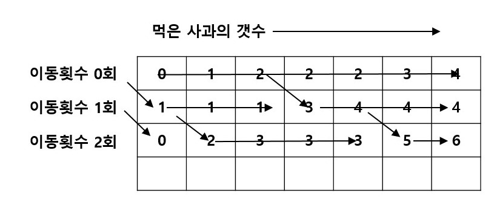

## 백준 2240번 풀이

### 문제

*자두는 자두를 좋아한다. 그래서 집에 자두나무를 심어두고, 여기서 열리는 자두를 먹고는 한다. 하지만 자두는 키가 작아서 자두를 따먹지는 못하고, 자두가 떨어질 때까지 기다린 다음에 떨어지는 자두를 받아서 먹고는 한다. 자두를 잡을 때에는 자두가 허공에 있을 때 잡아야 하는데, 이는 자두가 말랑말랑하여 바닥에 떨어지면 못 먹을 정도로 뭉개지기 때문이다.*

*매 초마다, 두 개의 나무 중 하나의 나무에서 열매가 떨어지게 된다. 만약 열매가 떨어지는 순간, 자두가 그 나무의 아래에 서 있으면 자두는 그 열매를 받아먹을 수 있다. 두 개의 나무는 그다지 멀리 떨어져 있지 않기 때문에, 자두는 하나의 나무 아래에 서 있다가 다른 나무 아래로 빠르게(1초보다 훨씬 짧은 시간에) 움직일 수 있다. 하지만 자두는 체력이 그다지 좋지 못해서 많이 움직일 수는 없다.*

*자두는 T(1≤T≤1,000)초 동안 떨어지게 된다. 자두는 최대 W(1≤W≤30)번만 움직이고 싶어 한다. 매 초마다 어느 나무에서 자두가 떨어질지에 대한 정보가 주어졌을 때, 자두가 받을 수 있는 자두의 개수를 구해내는 프로그램을 작성하시오. 자두는 1번 자두나무 아래에 위치해 있다고 한다.*


### 입력

*첫째 줄에 두 정수 T, W가 주어진다. 다음 T개의 줄에는 각 순간에 자두가 떨어지는 나무의 번호가 1 또는 2로 주어진다.*


### 출력

*첫째 줄에 자두가 받을 수 있는 자두의 최대 개수를 출력한다.*

***


### 풀이

예전부터 풀어보려고 했는데, 풀지 못하고 있다가 얼마전에 풀었던 출석 지각 문제를 보고 감을 잡았다.

처음에는 배열을 한개로 어떻게 푸는지 도저히 감을 안 잡히고 있다가,

개근상 문제에서 배열을 1차원 배열이 아닌 4차원 배열을 이용하는 것을 보앗던 적이 있어서 감을 잡았다.


지금까지 다차원 배열은 매트릭스 문제를 푸는데 사용하는 걸로만 생각했지만, 횟수를 세는 용도로 써도 되는 것이였다.

```python
dp = [[0 for _ in range(t+1)]for _ in range(w+1)]
```

즉, `dp[i][j]`라고 한다면 j는 t즉, 먹을 수 있는 자두의 갯수 i는 움직인 횟수가 된다.


베이스 케이스는 한번도 움직이지 않고 먹을 수 있는 자두의 갯수

```pseudocode
for i = 1....t 
	if plum[i] is equal 1 
		dp[0][i] <- dp[0][i-1] + 1
	else :
		dp[0][i] <- dp[0][i-1]
```


그럼 이제 점화식을 세워보자.

n초에 한번 움직여서 자두를 받아 먹을 수 있는 경우의 수는 2가지가 있다.

1. 이미 진즉에 움직여서 그 자리에서 계속 자두를 받아 먹고 있었던 경우
2. 방금 전에 움직여와서 자두를 받아 먹은 경우

일단, 어느 쪽이던 간에 움직이기 전까지 최대한 받아먹은 후 움직여야 한다. 즉, 이 자리에서 쭉 받아먹었을 경우랑 방금 내려와서 먹었을 경우의 수를 비교하고 더 큰 수를 넣으면 된다.


이해가 되지 않는다면 그림으로 보면 쉬운데



이동 횟수의 그림을 보면 각 배열의 제일 처음 부분은 자두를 아무것도 먹지 않고 움직인 경우들이다. 그리고 아무것도 받지 않은 상태에서 움직이는 경우 에서부터 점차 받아가는 과정으로 한다. 그렇게 쭉 진행해 나가는 와중에 만약 그 전 그 단계의 전 줄의 2개를 확인해 보고 만약 더 큰쪽에서 내려와서 진행 하는 것이 되어서 왼쪽에서부터 내오는 것을 대신해서 진행 되게 된다.

그러니까 점화식은 이렇게 된다.

```pseudocode
for i=1...w
	for j=1...t
		temp<-MAX(dp[i-1][j-1],dp[i][j-1])
		if(plum[i]==now_position)
			dp[i][j] <- temp+1
		else
			dp[i][j] <- temp
```


### 전체 코드

```python
import sys
input = sys.stdin.readline

if __name__ == "__main__" :

    t,w = input().strip().split()
    t = int(t)
    w = int(w)

    dp = [[0 for _ in range(t+1)]for _ in range(w+1)]

    plum =[0]

    for i in range(1,t+1) :
        plum.append(int(input().strip()))

    for i in range(1,t+1) :
        if plum[i]==1 :
            dp[0][i] = dp[0][i-1] + 1
        else :
            dp[0][i] = dp[0][i-1]

    for i in range(1,w+1) :
        if i%2 == 1 :
            pos = 2
        else :
            pos = 1
        for j in range(1,t+1) :
            temp = dp[i-1][j-1] if dp[i-1][j-1]>dp[i][j-1] else dp[i][j-1]
            if plum[j]==pos :
                dp[i][j] = temp + 1
            else :
                dp[i][j] = temp

    # for i in range(w+1) :
    #     print(dp[i]);

    max = 0
    for i in range(w+1) :
        max = dp[i][t] if dp[i][t]>max else max

    print(max)
```

