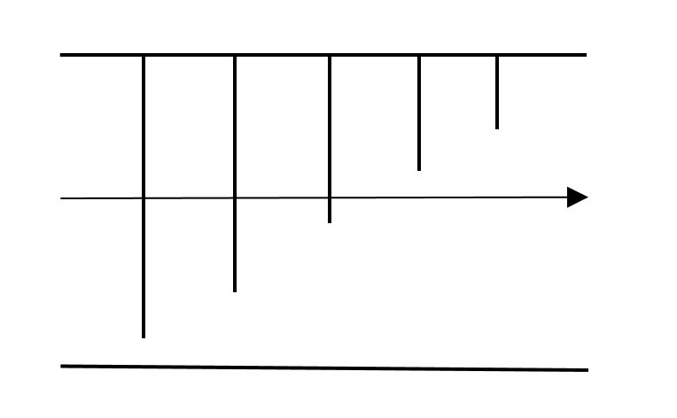

## 백준 2805번 풀이

### 문제

*개똥벌레 한 마리가 장애물(석순과 종유석)로 가득찬 동굴에 들어갔다. 동굴의 길이는 N미터이고, 높이는 H미터이다. (N은 짝수) 첫 번째 장애물은 항상 석순이고, 그 다음에는 종유석과 석순이 번갈아가면서 등장한다.*

*아래 그림은 길이가 14미터이고 높이가 5미터인 동굴이다. (예제 그림)*

**

*이 개똥벌레는 장애물을 피하지 않는다. 자신이 지나갈 구간을 정한 다음 일직선으로 지나가면서 만나는 모든 장애물을 파괴한다.*

*위의 그림에서 4번째 구간으로 개똥벌레가 날아간다면 파괴해야하는 장애물의 수는 총 여덟개이다. (4번째 구간은 길이가 3인 석순과 길이가 4인 석순의 중간지점을 말한다)*

**

*하지만, 첫 번째 구간이나 다섯 번째 구간으로 날아간다면 개똥벌레는 장애물 일곱개만 파괴하면 된다.*

*동굴의 크기와 높이, 모든 장애물의 크기가 주어진다. 이때, 개똥벌레가 파괴해야하는 장애물의 최솟값과 그러한 구간이 총 몇 개 있는지 구하는 프로그램을 작성하시오.*


### 입력

*첫째 줄에 N과 H가 주어진다. N은 항상 짝수이다. (2 ≤ N ≤ 200,000, 2 ≤ H ≤ 500,000)*

*다음 N개 줄에는 장애물의 크기가 순서대로 주어진다. 장애물의 크기는 H보다 작은 양수이다.*


### 출력

*첫째 줄에 개똥벌레가 파괴해야 하는 장애물의 최솟값과 그러한 구간의 수를 공백으로 구분하여 출력한다.*

***


### 풀이

일단 한번에 생각하면 복잡한 문제라서 일단 나눠서 생각하는 것이 좋다

그래서 고민해 본 결과 종유석과 석순의 배열을 마음대로 바꿔도 어짜피 부딪히는 것은 똑같다는 것을 생각했고, 일단 입력받은 종유석과 석순을 나눠서 서로 다른 배열에 보관한다

```java
int[] stalagmite = new int[n / 2];
int[] stalactite = new int[n / 2];
for (int i = 0; i < n; i++) {
	if (i % 2 == 0)
		stalagmite[i / 2] = in.nextInt();
	else
		stalactite[i / 2] = h - in.nextInt();
}
```

배열이 2미만이라면 OutOfIndex 에러가 발생하지만, 조건에 n이 최소한 2라고 명시되어 있기 때문에 2이하일 경우는 제외한다.


그리고 입력 받은 종유석과 석순을 배열을 바꿔도 부딪히는 석순과 종유석은 같기 때문에, 일단 알아보기 쉽게 정렬을 하고는

```java
Arrays.sort(stalagmite);
Arrays.sort(stalactite);
```


그러면, 이제 문제는 이런 모양이 된다.


즉, 개똥벌레가 부딪히는 석순은 i보다 큰 석순만 부딪히는 게 된다.

정렬된 배열일때 i보다 크거나 같은 위치의 값을 구하는 이분탐색 알고리즘이 있다.

```java
private static int lower_bound(int[] arr, int s, int e, int check) {

	int m;
	while (e - s > 0) {
		m = (s + e) / 2;
		if (m == e)
			return e;
		if (arr[m] < check)
			s = m + 1;
		else
			e = m;
	}
	return e + 1;
}
```

lower_bound를 쓰면 입력된 값보다 크거나 같은 위치의 값을 찾아준다.

고로 부딪히는 석순의 갯수는 n / 2 - lower_bound(stalagmite, 0, n / 2, i) +1이 된다.

그럼 똑같은 방식으로 종유석의 갯수를 세면 된다.


종유석은 석순과는 반대로 땅과의 길이가 가까운 순서대로 정렬이 되었는데



이 것도 lower_bound를 사용해서 처음으로 부딪히지 않는 위치를 찾으면 된다.

lower_bound(stalactite, 0, n / 2, i) - 1;


그렇게 얻은 부셔지는 석순의 갯수를 각 높이 별로 하나하나 구한다

```java
for (int i = 1; i <= h; i++) {
	breaker[i] = n / 2 - lower_bound(stalagmite, 0, n / 2, i) +
	lower_bound(stalactite, 0, n / 2, i);
}
```

그리고 이 구해진 배열을 정렬하면 가장 적게 부딪히는 수를 구할 수 있다.


하지만, 배열이 커지면 이 하나하나 탐색하면 너무 오래 걸리므로 정렬 된 것을 upper_bound로 원하는 값을 처음으로 초과하는 위치와, lower_bound로 원하는 값보다 최초로 같거나 초과하는 점을 찾아서 빼주면 가장 적은 수로 부딪히는 경우의 수를 알 수가 있다.

```java
Arrays.sort(breaker);
		
int temp = upper_bound(breaker, 0, n / 2, breaker[1]);
int temp2 = lower_bound(breaker, 0, n / 2, breaker[1]);
System.out.printf("%d %d", breaker[1],
                  upper_bound(breaker, 0, n / 2, breaker[1])-temp2);
```


### 전체 코드

```java
import java.util.Scanner;
import java.util.Arrays;

public class Main {

	public static void main(String[] args) {
		Scanner in = new Scanner(System.in);

		String[] line = in.nextLine().split(" ");
		int n = Integer.parseInt(line[0]);
		int h = Integer.parseInt(line[1]);
		line = null;

		int[] stalagmite = new int[n / 2];
		int[] stalactite = new int[n / 2];
		for (int i = 0; i < n; i++) {
			if (i % 2 == 0)
				stalagmite[i / 2] = in.nextInt();
			else
				stalactite[i / 2] = h - in.nextInt();
		}

		Arrays.sort(stalagmite);
		Arrays.sort(stalactite);

		int[] breaker = new int[h + 1];
		

		for (int i = 1; i <= h; i++) {
			breaker[i] = n / 2 - lower_bound(stalagmite, 0, n / 2, i) +
                lower_bound(stalactite, 0, n / 2, i);
		}

		Arrays.sort(breaker);
		
		if(n==0) 
			System.out.print(h);
		else {
			int temp = upper_bound(breaker, 0, n / 2, breaker[1]);
			int temp2 = lower_bound(breaker, 0, n / 2, breaker[1]);
			System.out.printf("%d %d", breaker[1], 
                              upper_bound(breaker, 0, n / 2, breaker[1])-temp2);
		}

	}

	static void printArray(int[] p2) {
		for (int data : p2)
			System.out.printf("%4d", data);
		System.out.printf("\n");
	}

	private static int upper_bound(int[] arr, int s, int e, int check) {

		int m;
		while (e - s > 0) {
			m = (s + e) / 2;
			if (arr[m] <= check)
				s = m + 1;
			else
				e = m;
		}
		return e + 1;
	}

	private static int lower_bound(int[] arr, int s, int e, int check) {

		int m;
		while (e - s > 0) {
			m = (s + e) / 2;
			if (m == e)
				return e;
			if (arr[m] < check)
				s = m + 1;
			else
				e = m;
		}
		return e + 1;
	}
}
```

