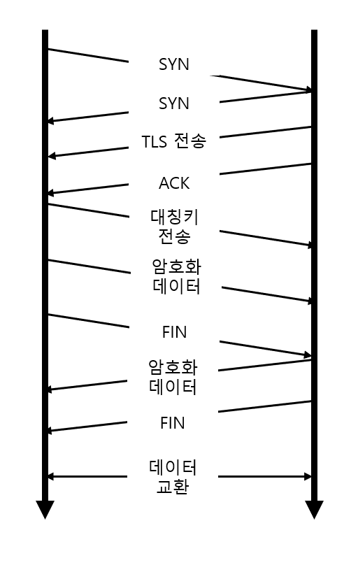

# HTTP와 HTTPS의 차이
## HTTP
### HTTP란?
- HyperText Transfer Protocol
- 인터넷에서 웹서버와 사용자 컴퓨터에 설치된 웹 브라우저 사이에 문서를 전송하기 위한 통신 규약.
- 기본적으론 80번 포트에서 사용
    - 클라이언트가 TCP 80 포트를 사용해 연결하면 응답하면서 텍스트로 주고 받는다.
    -> 즉 데이터 유출이 발생할 수 있다.

### HTTPS란?
- HTTPS는 HTTP에 소켓을 추가한 것이다.
- HTTP에서 모든 통신 내용을 암호화 하는 것
- 암호화 하기 위한 것 SSL(인증서)
    - 공개키 방식
- 보내는 패킷을 암호화 시킨다. 
    - TLS(Transport Layer Security)라고 부르며 Transport계층에서 이루어진다.

### TLS(Transport Layer Security)
- 전송 계층 보안
    - 클라이언트/서버 응용 프로그램이 네트워크로 통신하는 과정에서 도청, 간섭, 위조를 방지 하기 위해 설계되었다.
        - 기본적으로 **인증, 암호화, 무결성**을 지원한다
    - TCP/IP네트워크를 사용하는 통신에 적용되며, 통신 과정에서 **전송 계층**간 데이터 무결성을 확보한다.
    - 전송 계층의 암호화 방식이기 때문에 응용계층의 종류에 상관없이 사용할 수 있다.

#### TLS의 3단계 기본 절차
1. 지원 가능한 알고리즘 서로 교환
2. 키 교환, 인증
3. 대칭키 암호로 암호화하고 메세지 인증

##### TLS HandShake

- 이런식으로 공개키를 통해 대칭키를 교환한 다음에, 느린 공개키 대신 빠른 대칭키를 사용하여 데이터 교환을 한다.

