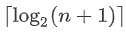
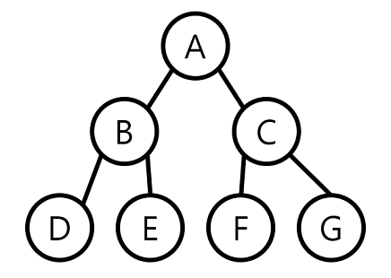
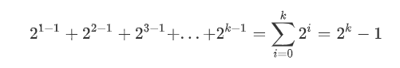
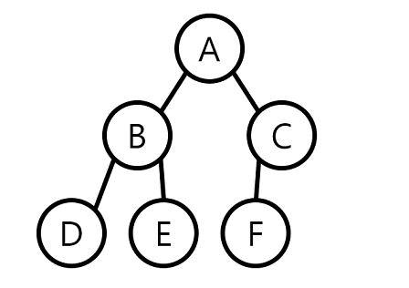
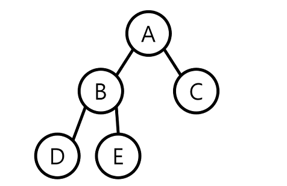
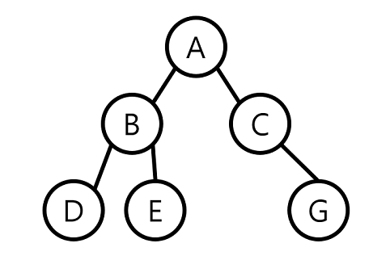
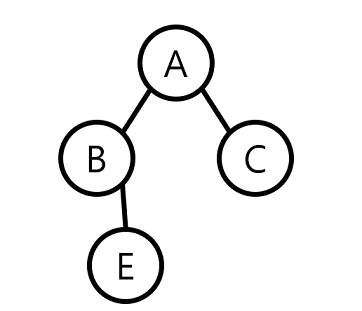
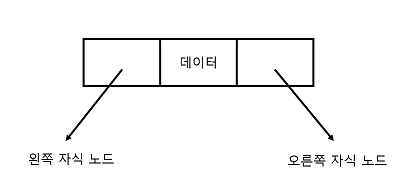
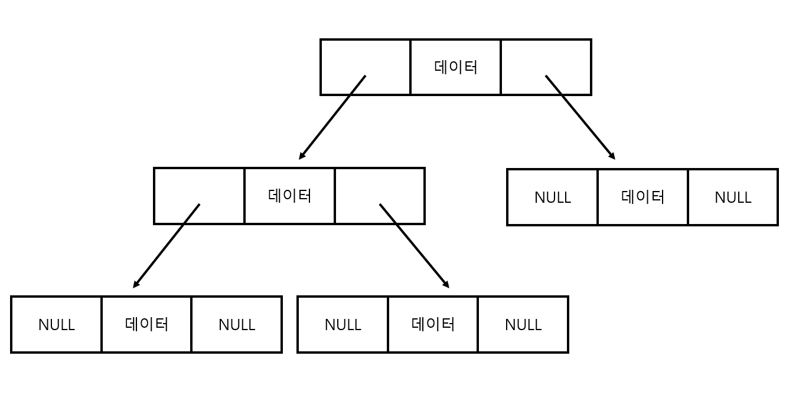
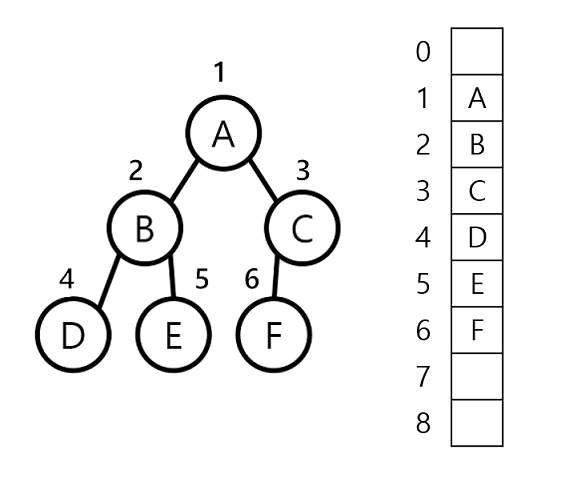

# Binary Tree

## 이진 트리란?

- 각각의 노드가 최대 두 개의 서브 트리를 가지고 있는 트리
  - 보통 각각 왼쪽, 오른쪽 자식 노드라고 한다.
- 모든 노드의 차수는 2 이하가 된다.
  - 공집합도 이진 트리다.
-  서브 트리 간에 순서가 존재한다. 즉, 왼쪽 서브 트리와 오른쪽 서브 트리를 구별한다.

## 이진 트리의 성질

- N개의 노드를 가진 이진 트리는 정확하게 n-1개의 간선을 가진다. 

  -> 이진 트리에서 노드는 루트를 제외하면 하나의 부모 노드를 가지고, 둘은 하나의 간선만 존재.

- 높이가 h인 이진 트리인 경우 최소 h개의 노드를 가지며 최대 2h-1개의 노드를 가진다.

  -> 이유 :  한 레벨에 적어도 하나의 노드는 존재해야 하므로 높이가 h인 이진 트리는 적어도 h개의 노드를 가진다.

- n개의 노드를 가지는 이진 트리의 높이는 최대 n이거나 최소 이 된다.

  - 레벨당 최소한 하나의 노드는 있어야 하므로 높이는 n이상 불가
  - 앞의 성질에서 이진 트리가 가질 수 있는 노드의 최댓값은 2h-1 이다. 따라서 n<= 2h-1가 되므로 각 변에 log를 취하면 h>log2(n+1)이 되는데 h는 정수 이므로 위의 공식이 성립한다.

  

## 이진 트리의 분류

### 포화 이진 트리

- 포화 이진 트리
  - 이름 그대로 각 레벨에 노드가 꽉 차 있는 이진 트리.
  - 높이 k인 포화 이진 트리는 정확하기 2k-1개의 노드를 가진다.
  - 포화 이진 트리에서 노드의 갯수

### 완전 이진 트리

- 완전 이진 트리
  - 높이가 k일 때 k-1까지는 노드가 모두 채워져 있고, 마지막 k에서는 **왼쪽부터 오른쪽**으로 노드가 순서대로 채워져 있는 이진 트리
  - 마지막 레벨에는 노드가 꽉 차 있지 않아도 되지만, 중간에 비어 있으면 안된다.

### 기타 이진 트리

- 위의 2경우 말고 그 의외의 경우

## 이진 트리의 표현

### 링크 표현법

노드가 구조체로 표현 되고, 각 노드가 포인터를 가지고 있어서 노드와 노드를 연결하는 방법.

#### 링크 표현법에서 노드의 구도

#### 이진 트리의 링크 표현법

### 배열 표현법

- 주로 포화 이진 트리나 완전 이진 트리에 자주 쓰이는 방법
  - 다른 방법에도 가능하지만, 메모리 낭비가 심하다.
- 높이가 k라면 최대 2k-1개의 공간을 연속적으로 할당한 다음에 완전 이진 트리의 번호대로 노드들을 저장한다

예를 들면 루트 노드의 번호는 1번 이므로 배열의 인덱스 1에 저장되고, 노드 b는 2에 저장 등등...

하지만 배열 0은 사용되지 않는다.

#### 배열 표현 법에서의 노드의 부모의 자식

- 노드 i의 부모 노드 인덱스
  - `int(i/2)`
- 노드 i의 왼쪽 자식 노드 인덱스
  - `2i`
- 노드 i의 오른쪽 자식 노드 인덱스
  - `2i+1`

