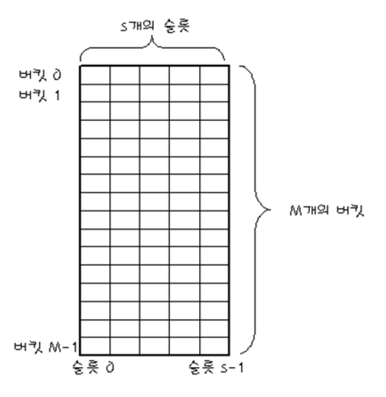
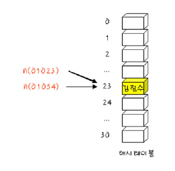
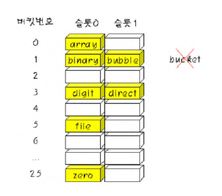
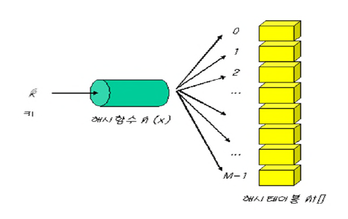
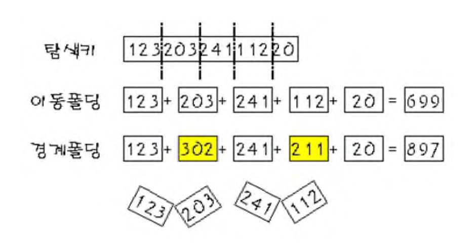
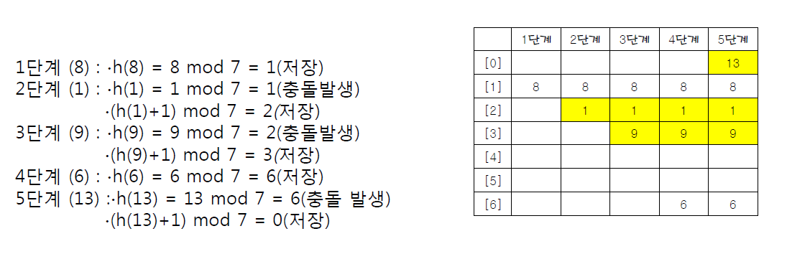
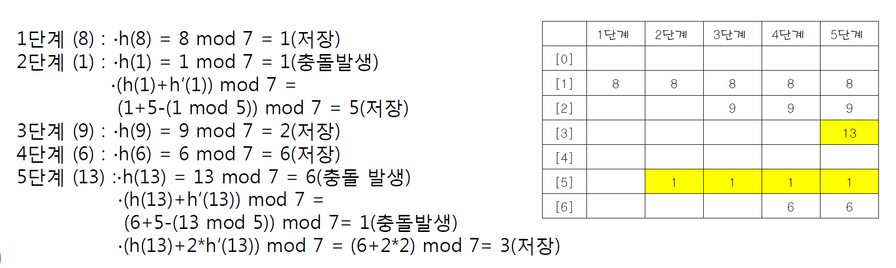
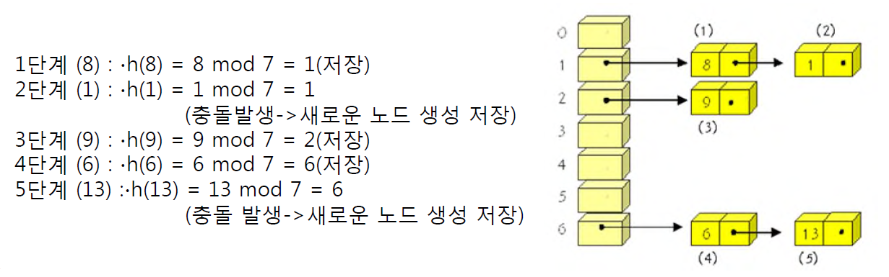

# 자료구조

## 해싱(Hashing)의 개념

### 해싱(Hashing)

- 키값에 직접 산술적인 연산을 적용
- 데이터가 저장되어 있는 기억공간의 주소를 계싼
- 원하는 데이터에 바로 접근 가능한 방법


### 해시 테이블(Hash Table)

- 해싱에 의해 직접 데이터 접근이 가능한 자료구조


### 해시 함수(Hash Function)

- 키를 입력으로  받아 해시 주소를 생성
- 해시 주소는 해시 테이블의 인덱스


## 해시 테이블의 구조

### 해시 테이블

- M캐의 버킷(bucket)으로 이루어지는 테이블
- ht[0],ht[1],...ht[M-1]의 원소를 가짐.
- 하나의 버켓은 S개의 슬롯을 가질 수 있다.


### 충돌
- 서로 다른 두개의 탐색키 k1과 k2에 대해 h(k1) = h(k2)인 경우

### 오버플로우
- 충돌이 버켓에 할당된 슬롯 수보다 더 많이 발생하여 버켓에 더 이상 데이터를 저장할 수 없게 되는 현상
- 오버 플로우를 해결하기 위한 방법이 반드시 필요

## 현실적인 해싱
- 현실적으로는 대부분 제한된 크기의 해시 테이블을 사용
- 해시 테이블의 크기 M을 고려한 해시 함수를 이용한다.
    - h(k) = k mod M
- 하나의 탐색 키당 하나의 기억공간(버킷)을 할당할 수 가 없다.
    - **충돌**과 **오버플로우** 발생



### 현실적인 해싱 방법
(예) 탐색 키가 알파벳 문자열인 경우
- 해시 함수는 탐색 키의 첫번째 문자를 숫자로 대응한다고 가정.
    h("array") = 0
    h("binary") = 1
- 버킷 크기2:
- 입력데이터 :
    (array, binary, bubble, file, digit, direct, zero, bucket)
- 충돌과 오버플로우 발생


## 해시 함수
### 좋은 해시 함수의 조건
- 충돌이 적어야 한다.
- 해시 함수 값이 해시 테이블의 주소 영역 내에 고르게 분포 되어야 한다.
- 계산이 빨라야한다.


## 해시 함수들
### 제산 함수
- mod연산자를 사용하여 탐색 키를 해시 테이블의 크리고 나눈 나머지를 주소로 사용하는 방법.
- 주로 테이블은 나누어 떨어지지 않는 수인 소수로 한다.
    - h(k) = k mod M
    - 해시 테이블의 크기 M은 소수(prime number)

#### M을 소수로 정하는 이유
예륻 들어 M이 짝수라면 k가 짝수라면 해싱은 짝수 홀수라면 홀수가된다. 만약 메모리 주소를 기준으로 해싱을 한다면 메모리 주소는 보통 2의 배수임으로 한쪽으로 편향된다.
-> 즉, M은 홀수여야한다.
만약 M이 소수라면, k mod M 은 0에서 M-1까지 골고루 사용하는 값을 만들어낸다.

```c
int hash_index(int key)
{
    int hash_index = key % M;
    if(hash_index < 0>) {
        hash_index += M;
        return_index += M;
    }
    return return_index;
}
```

### 폴딩 함수
- 탐색키를 여러부분으로 나누어 모두 더한 값을 해시 주소로 사용한다.
    - 이동 폴딩(shift folding)과 경계 폴딩(boundary folding)

#### 이동 폴딩(shift folding)
- 탐색 키를 여러 부분으로 나눈 값들을 더하여 해시 주소로 사용.

#### 경계 폴딩(boundary folding)
- 탐색 키의 이웃한 부분을 거꾸로 더하여 해시 주소를 얻는다.
    - hash_index = (short)(ksy ^ (key>>16))



#### 중간 제곱 함수
- 탐색 키를 제곱한 다음에, 중간의 몇 비트를 취해서 주소를 생성한다.

#### 비트 추출 함수
- 탐색 키를 이진수로 간주하여, 임의의 위치의 k개릐 비트를 해시 주소로 사용하는 것이다.

#### 탐색 키가 문자열인 경우
- 문자열 내의 모든 문자를 골고루 사용해야한다.
- 단순 아스키 코드 값을 모두 더하면 순서를 구분하지 못하고, 알파벳은 65~122이기 때문에 한곳에 집중
- u<sub>0</sub>g<sup>n-1</sup> + u<sub>1</sub>g<sup>n-2</sup> + ... u<sub>n-2</sub>g + u<sub>n-1</sub>
  - 계산량을 줄이기 위한 방법 **호너의 법칙**
  - (((u<sub>0</sub>g + u<sub>1</sub>)g + u<sub>2</sub>) + ... + u<sub>n-2</sub>)g + u<sub>n-1</sub>

```C
int hash_function(char *key)
{
    int hash_index = 0;
    while(*key)
        hash_index = g*hash_index + *key++;
    return hash_index;
}
```


### 충돌 해결책
1. 충돌이 일어난 항목을 테이블의 다른 위치에 저장한다.
    - 선형 조사법 -> 지금은 사용되지 않는다.
2. 해시 테이블의 하나의 위치가 여러개의 항목을 저장할 수 있도록 해시 테이블의 구조를 변경한다.
    - 체이닝 -> 가장 많이 쓰인다.
#### 개방 주소법(Open Addressing)
- 충돌이 일너난 데이터를 **해시 테이블 내에 비어있는 다른 버킷에 저장**한다.
- 구체적인 구현 방법들 : 선형 조사법, 이차조사법, 이중 해시법

#### 분리 체이닝
- 해시 테이블의 *각 버킷을 하나의 연결리스트로 구성*
- 각 버킬에 여러개의 데이터를 저장 가능


### 개방 주소법(Open Addressing)

#### 선형조사법
- 충돌이 ht[k]에서 충돌이 발생하였다면 ht[k+1]이 비어 있는지 조사
- 만약 비어 있지 않다면 ht[k+2]를 살펴본다.
- 이런식으로 **비어있는 공간이 나올 때까지 계속 조사하는 방법**
- 만약 테이블의 끝에 도달하게 되면, 다시 테이블의 처음으로 이동
- 만약 조사했던 곳으로 다시 돌아오게 된다면, 테이블이 *포화상태*
- **조사되는 위치**
    - h(k), h(k)+1 , h(k) +2 ...



#### 이차조사법

- 조사할 위치를 다음 식에 의해 결정한다.
  - (h(k)+i*i) moid M
- **조사되는 위치**는 다음과 같다.
- 선형 조사법의 **집중 문제를 크게 완화**


#### 이중 해싱법

- 이중 해싱법, 재해싱

  - 오버플로우가 일어나면, 원래 해시함수와 또 다른 <u>이차 해시 함수를 함께 이용</u>
  - **step = C (k mod C)**
  - **h(k), h(k)+step, h(k) + 2*step**

- 예) 해시 테이블의 크기 : 7

  - 일차 해시 함수 : k mod M
  - 이차 해시 함수 : step = 5 - (k mod 5)
  - 입력파일 (8, 1, 9, 6, 13)

  

  

### 분리 체이닝

- 각 버켓에 데이터 삽입과 삭제가 용이한 연결 리스트 할당
- 버켓 내에서는 원하는 항목을 찾을 때에는 연결리스트를 순차 탐색


- 예) 해시 테이블의 크기 7인 해시함수
  - 해시 함수 : h(k) = k mod 7
  - 입력 데이터 : 8, 1, 9, 6, 13




### 해싱의 성능 분석

- **적재 밀도, 적재 비율**

  - 저장되는 데이터의 개수 n과 해시 테이블의 크기 M의 비율

    = 현재 테이블이 채워져 있는 비율

  - a = 저장된 항목의 개수 / 해싱 테이블의 버킷의 개수

- **데이터 탐색**을 위한 **비교 연산의 수**

  - 선형 조사법
    - 실패한 탐색 : 1/2 {1 + 1/(1-a)^2}
    - 성공한 탐색 : 1/2 {1 + 1/(1-a)}
  - 분리 체이닝
    - 실패한 탐색 : a
    - 성공한 탐색 : 1 + a/2