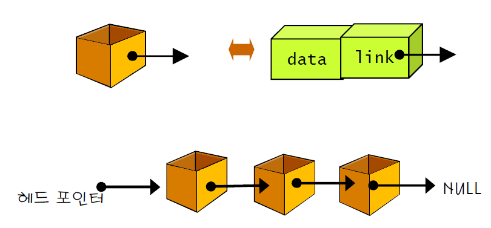
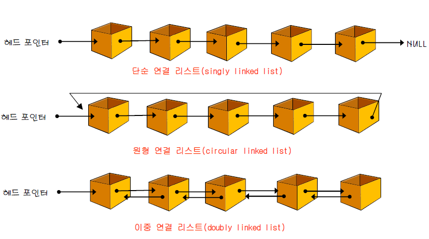
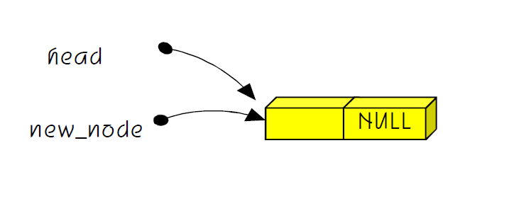
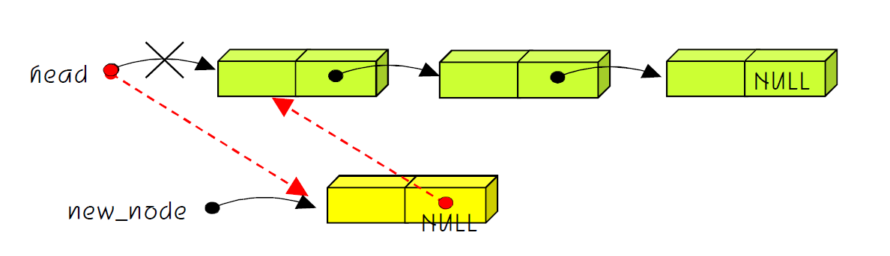
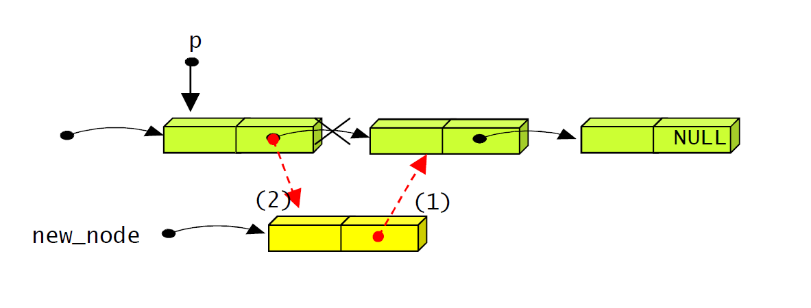
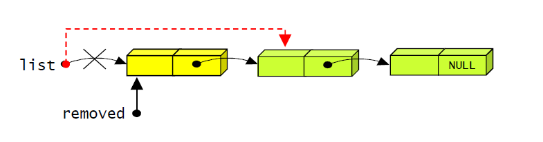

# Linked List

## 리스트란?

- 리스트(list), 선형리스트(linear list): 순서를 가진 항목들의 모임
- 집합: 항목간의 순서의 개념이 없음


## 연결 리스트란?

- 리스트의 항목들을 노드(node)라고 하는 곳에 분산하여 저장
- 다음 항목을 가리키는 주소도 같이 저장
- 노드 (node) : <항목, 주소> 쌍
  - 노드는 데이타 필드와 링크 필드로 구성
    - 데이타 필드 – 리스트의 원소, 즉 데이타 값을 저장하는 곳
    - 링크 필드 – 다른 노드의 주소값을 저장하는 장소 (포인터)

- 각 노드의 실제 메모리 안에서의 물리적 순서가 리스트 안에서의 논리
  적 순서와 반드시 일치할 필요 없음


## 연결 리스트의 장, 단점

### 장점

- 삽입, 삭제가 보다 용이하다.
- 연속된 메모리 공간이 필요없다
- 크기 제한이 없다

### 단점

- 구현이 어렵다.
- 오류가 발생하기 쉽다.


## 연결 리스트의 구조

노드 = 데이터 필드 + 링크 필드

- 헤드 포인터(head pointer): 리스트의 첫 번째 노드를 가리키는 변수
- 노드의 생성: 필요할 때마다 동적 메모리 할당 기능을 이용하여 노드를 생성




## 연결 리스트의 종류




## 단순 연결 리스트의 구현

### 노드

- 노드 : (데이터 필드, 링크 필드), 구조체로 정의
  - 클래스로 할 수도 있지만, 구조체는 값 형식이고, 클래스 형식은 참조 형석이라, 구조체가 더 빠르다.

```c++
template<typename T> struct Node {
public:
    T item;
    Node<T>* next;

    Node(int item) : item(item), next(nullptr) {}
};
```


- 두 노드를 연결한다.

```c++
int main() {
    Node<int>* newNode1 = new Node<int>(1);
    Node<int>* newNode2 = new Node<int>(2);
    
    newNode1->next = newNode2;
}
```


### 삽입연산

**헤드포인터가 함수 안에서 변경**되므로 헤드포인터의 포인터 필요


#### 삽입의 3가지 경우

1. head가 NULL인 경우: 공백 리스트에 삽입
2. p가 NULL인 경우: 리스트의 맨 처음에 삽입
3. 일반적인 경우: 리스트의 중간에 삽입

#### 삽입 연산

1. head가 NULL인 경우: head가 NULL이라면 현재 삽입하려는 노드가 첫 번째 노드가 된다. 따라서 head의 값만 변경하면 된다.

   

2. p가 NULL인 경우: 새로운 노드를 리스트의 맨 앞에 삽입한다.

   

3. head와 p가 NULL이 아닌 경우: 가장 일반적인 경우이다. new_node의 link에 p->link값을 복사한 다음, p->link가 new_node를 가리키도록 한다.

   

#### 삽입 연산의 코드

```c++
// 링크드 리스트의 마지막에 추가
    void AddLast(T item) {
        Node<T>* newNode = new Node<T>(item);

        // 만약 링크드 리스트가 비어 있다면 그냥 생성해서 헤드로 삼는다
        if (head == nullptr) {
            head = newNode;
            tail = newNode;
        }
        else {
            tail->next = newNode;
            tail = newNode;
        }
        length = length + 1;
    }

    // 루트 부분에 추가
    void AddFirst(T item) {
        
        Node<T>* newNode = new Node<T>(item);

        // 만약 링크드 리스트가 비어 있다면 그냥 생성해서 헤드로 삼는다
        if (head == nullptr) {
            head = newNode;
            tail = newNode;
        }
        else {
            newNode->next = head;
            head = newNode;
        }
        length = length + 1;
    }
```


## 삭제연산

#### 삭제 연산의 2가지 경우

1. p가 NULL인 경우: 맨 앞의 노드를 삭제
2. p가 NULL이 아닌 경우: 중간 노드를 삭제

#### 삭제 연산

1. p가 NULL인 경우: 연결 리스트의 첫 번째 노드를 삭제한다. 헤드 포인터 변경

   

2. p가 NULL이 아닌 경우: removed 앞의 노드인 p의 링크가 removed 다음 노드를 가리키도록 변경

   

```c++
	// 첫 번째 노드의 삭제
	void deleteFirst() {
        if (isEmpty()) {
            cout << "리스트가 비어있습니다." <<endl;
            return;
        }

        Node<T>* ptr = head;

        head = head->next;
        length = length - 1;

        delete ptr;
    }
	// 해당 위치의 요소 삭제 
    void deletePos(int pos) {
        if (isEmpty()) {
            cout << "리스트가 비어있습니다." << endl;
            return;
        }
        else if (pos == 0) {
            deleteFirst();
        }
        else if (pos == length - 1) {
            deleteLast();
        }
        else {
            Node<T>* parent = head;
            Node<T>* child = head;

            for (int i = 0; i < pos; i++) {
                // 원하는 위치만큼 간다.
                parent = child;
                child = child->next;
            }

            // 노드를 삭제하기 전에 부모의 다음을 삭제하려는 노드의 다음으로 지정한다.
            parent->next = child->next;
            length = length - 1;

            delete child;
        }
    }
```


## 방문 연산 코드
- 방문 연산: 리스트 상의 노드를 순차적으로 방문
- 반복과 순환기법을 모두 사용가능

### 반복 버전

```c++
// 모든 요소 출력 
	void display() {
        Node<T>* ptr = head;

        while (ptr!=nullptr)
        {
            cout << ptr->item << endl;
            ptr = ptr->next;
        }
    }
```

### 순환 버전

```c++
    // 재귀의 모든 요소 출력 , 초기 값으로 head를 준다.
    void recuitdisplay() {
        Node<T>* ptr = head;
        redisplay(ptr);
    }

   
    void redisplay(Node<T>* ptr) {
        
        if (ptr != nullptr)
        {
            cout << ptr->item << endl;
            redisplay(ptr->next);
        }
    }
```


## 탐색 연산 코드

```c++
    // 리스트 안에 값이 있는지 찾는다. 
    bool is_in_list(int item) {
        Node<T>* ptr = head;

        while (ptr != nullptr) {
            if (ptr>item == item) {
                break;
            }
            else {
                ptr = ptr->next;
            }
        }
        if (ptr == nullptr) {
            return false;
        }
        else {
            return true;
        }

    }
```


