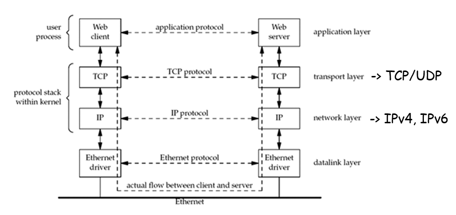
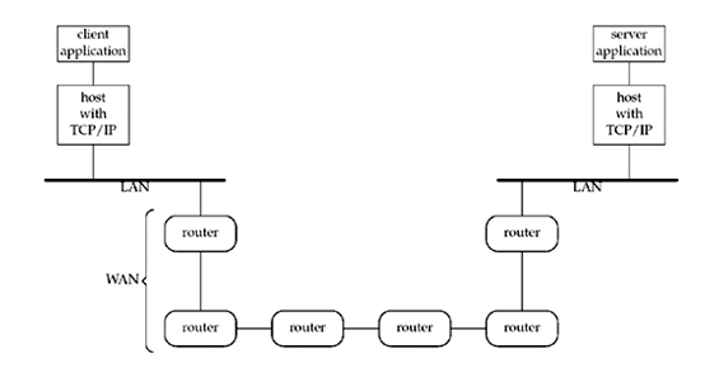
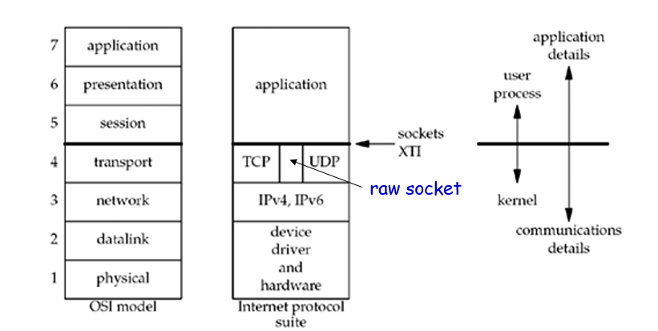

# 컴퓨터 네트워크
## Ch02. UNIX Network Programming
### Introduction
#### Network application : client and Server
- Client : 메세지를 서버에 보낸다.
- Server : 클라이언트로 보내진 메세지에 응답한다.
- Protocol : 클라이언트와 서버 간에 교환되는 메시지의 형식과 순서, 그리고 메시지의 전송 및 수신에 대해 취한 조치

#### TCP/IP protocol suite(internet protocol suite)
- 클라이언트와 서버는 일반적으로 사용자 프로세스이다.
- TCP 와 IP 프로토콜은 일반적으로 커널 내의 프로토콜 스택의 일부분이다.



#### Client and server on different LANs connected through a WAN 
- WAN[^WAN]을 통해 연결된 서로 다른 LAN[^LAN]의 클라이언트 및 서버



### A Simple Daytime Client
```c
//intro/daytimetcpcli.c

#include "unp.h"

int main(int argc, char **argv) {
    int sockfd, n;
    char recvline[MAXLINE + 1];
    struct sockaddr_in servaddr;

    if(argc!=2)
        err_quit("usage : a out <IPaddress>");
    
    if((sockfd = sockfd(AF_INET,SOCK_STREAM,0))<0)
        err_sys("socket error");
    
    bzero(&servaddr,sizeof(servaddr));
    servaddr.sin_family = AF_INET;
    servaddr.sin_port = htons(13);  // daytime server posrt number

    if(inet_pton(AF_INET,argv[1],&servaddr.sin_addr)<=0)
        err_quit("inet_pton error for %s",argv[1]);

    if(connect(sockfd,(SA *)&servaddr,sizeof(servaddr))<0)
        err_sys("connet error");
    
    while ( (n=read(sockfd,recvline,MAXLINE))>0) { //Read and display server's reply
        recvline[n] = 0;    // null terminate
        if(fputs(recvline,stdout)==EOF)
            err_sys("fputs error");
    }

    if(n<0)
        err_sys("read error");
    
    exit(0);    // Terminate program

}
```
요청 방법

```bash
$ ./a.out 206.168.112.96
Mon May 26 20:58:40 2003
```
- 자체 헤더 사용.
    - unp.h : 부록 D.1
- TCP 소켓을 생성한다.
- 서버의 IP주소와 포트를 확인
    - inet_pton : 숫자로 인터넷 표시
    - err_ : error 출력함수, 부록 D.3
- 서버와의 연결 설립
    - SA : 소켓주소 주소
- 서버 응답 읽기 및 표시
- 프로그램을 종료한다.


### Protocol Independence
#### Version of IPv6
```c
//intro/daytimetcpcliv6.c
# include "unp.h"

int main(int argc, char **argv)
{
    int sockfd, n;
    char revline[MAXLINE + 1];
    struct sockaddr_in6 servaddr;

    if(argc != 2)
        err_quit("usage: a.out <IPaddress>");

    if( (sockfd = socket(AF_INET6,SOCK_STREAM,0))<0)
        err_sys("socket error");
    
    bzero(&servaddr, sizeof(servaddr));
    servaddr.sin_family = AF_INET6;
    servaddr.sin_port = htons(13) // daytimeserver

    if(inet_pton(AF_INET6, argv[1], &servaddr.sin6_addr)<=0)
        err_quit("inet_pton error for %s", argv[1]);

    if(connect(sockfd,(SA *)&servaddr,sizeof(servaddr))<0)
        err_sys("connect error");

    while ( (n= read(sockfd,revline,MAXLINE))>0) {
        revline[n] = 0;
        if(fputs(revline,stdout)==EOF)
            err_sys("fputs error");
    }

    if(n < 0)
        err_sys("read error");

    exit(0);
}
```

### Error Handing
#### wrapper function
- 실제 기능 호출을 수행하고, 반환 값을 테스트한 후 오류 발생 시 종료
- 함수의 이름을 대문자로 쓴다.

```c
sockfd = Socket(AF_INET, SOCK_STREAM,0);
```

```c
// lib/wrapsock.c

int Socket(int family, int type, int protocol)
{
    int n;
    if( (n = socket(family, type, protocol)) < 0 )
        err_sys("socket error");
    return (n);
}
```
#### Unix errno Value
- 유닉스 함수에서 오류가 발생하면, 전역변수 *errno*은 오류 유형을 나타내는 양수로 설정되고, 함수는 일반적으로 -1을 반환한다.
- *errno* 값은 "E"로 시작되는 대문자 이름이다.
    - 보통 *<sys/errno.h>*에 정의된다.
    - 값이 0인 오류는 존재하지 않는다.
- *errno*은 멀티 쓰레드와 함께 작동되지 않는다.
- 연결 함수는 *ECONNREFUSED*를 반환한다.
    - 함수는 지정된 *errno*을 error(-1)로 반환한다. 

### A Simple Daytime Server
```c
// intro/daytimecpsrv.c

#include "unp.h"
#include <time.h>

int main(int argc, char **argv)
{
    int listenfd, connfd;
    struct sockaddr_in servaddr;
    char buff[MAXLINE];
    time_t ticks;

    listenfd = Socket(AF_INET, SOCK_STREAM,0);

    bzero(&servaddr, sizeof(servaddr));
    servaddr.sin_family = AF_INET;
    servaddr.sin_addr.s_addr = htonl(INADDR_ANY);
    servaddr.sin_port = htons(13);

    Bind(listenfd, (SA *)&servaddr, sizeof(servaddr));

    Listen(listenfd,LISTENQ);

    for(;;) {
        connfd = Accept(listenfd,(SA *)NULL,NULL);

        ticks = time(NULL);
        snprint(buff, sizeof(buff), "%.25s\r\n",ctime(&ticks));
        Write(connfd,buff,strlen(buff));

        Close(connfd);
    }
}
```
- TCP소켓을 생성한다.
    - listening descriptor (*listenfd*)
- 잘 알려진 포트를 소켓에 바인딩
    - *INADDR_ANY*는 서버가 임의 인터페이스의 클라이언트 연결을 받는 것을 사용한다.
- 소켓을 listening socket으로 변환
    - 들어오는 연결은 kernel에 의해 받아들여질 것이다.
    - *LISENQ*는 최대 연결 수를 지정한다.
- 클라이언트 연결 수락
    - 서버 프로세스는 *accept*이 호출 될때까지 sleep한다.
    - connected descriptor (connfd)
- Send reply
    - *time*은 현재 시간(초)를 반환한다.
    - *ctime*은 이것의 integer값을 사람이 읽을 수 있는 stringㅎㅇ으로 변환한다.
        Mon May 26 20:58:40 2003 
    - *snprintf*에 버퍼 오버플로우를 검사가 추가된다.
    - *Write*에 의해 메세지가 전송된다.
- Terminate connection
    - close connected descriptor

#### 요점
- 힌 클라이언트의 서비스를 다른 클라이언트와 중복할 수 있는 어떤 방법이 필요하다.
    - 우리 서버는 한번에 하나의 클라이언트만 처리한다.(iterative server)
    - 동시 서버는 여러 클라이언트를 동시에 처리한다.
        - 포크 또는 스레드 함수 사용
- 시스템이 가동되는 동안 서버를 실행해야한다.
    - daemon : 터미널에 없는 백그라운드에서 실행할 수 있는 프로세스

### OSI Model
#### 인터넷 프로토콜에서의 OSI 7 Layers


1. 1계층 - 물리 계층

전기적, 기계적, 기능적인 특성을 사용해서 통신 케이블로 데이터를 전송한다.
단지 데이터를 전송할 뿐 **무슨 데이터인지, 무슨 에러가 있는지 등에 전혀 신경 쓰지 않는다.**
통신 케이블, 리피터, 허브 등이 속해 있는 계층

2. 2계층 - 데이터 링크 계층

물리 계층을 통해 송수신 되는 정보의 오류와 흐름을 관리하여 안전한 **정보의 전달을 수행**할 수 있도록 도와주는 역활을 한다.
주소값은 물리적으로 할당 ->**맥 주소**

- 프레임에 주소 부여(MAC-물리적주소)
- 에러 검출/재전송/흐름 제어

3. 3계층 - 네트워크 계층

이 계층에서 가장 중요한 기능은 **데이터를 목적지까지 가장 안전하고 빠르게 전달하는 기능(라우팅)**이다.

이 계층은 경로를 선택하고 주소를 정하고 경로에 따라 패킷을 전달해주는 역활.

네트워크 계층은 여러개의 노드를 거칠때마다 경로를 찾아주는 역활을 하는 계층.

- 주소부여(IP)
- 경로 설정

    1. IP 계층

    TCP/IP 상에서 IP 계층이란 네트워크 주소(IP 주소)를 정의하고, **IP 패킷의 전달 및 라우팅을 담당하는 계층**

    


### Test Networks and Hosts 


-----
[^WAN]: LAN과 LAN사이를 광범위한 지역 단위로 구성하는 네트워크.
[^LAN]: 사용자가 포함된 지역 네트워크를 의미한다. 공유기나 스위치를 이용해서 연결하게 된다.