# 컴퓨터 네트워크
## Ch05. TCP Client/Server Example
### Introduction
- Simple echo client and server
  - 클라이언트는 표준 입력에서 텍스트 줄을 읽고 서버에 쓰기
  - 서버는 네트워크 입력을 읽고 다시 클라이언트로 반환한다.
  - 클라이언트는 표준 출력에 대해 반환된 것을 읽고, 표준 출력한다.
    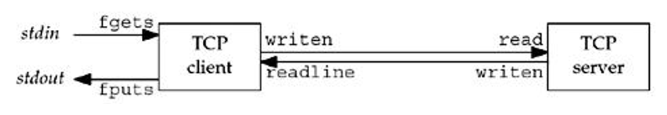

### TCP Echo Server
```C
#include "tcp.h"

int main(int srgc, char **argv)
{
    int listenfd, connfd;
    pid_t childpid;
    socklen_t childlen;
    struct sockaddr_in cliaddr, servaddr;

    listenfd = Socket(AF_INEF, SOCK_STREAM, 0);

    bzero(&servaddr, sizeof(servaddr));
    servaddr.sin_familly = AF_INET;
    servaddr.sin_addr.s_adrr = htonl(INADDR_ANY);

    Bind(listenfd, LISTENQ);

    for(;;) {
        clilen = sizeof(cliaddr);
        connfd = Accept(listenfd, (SA *) &cliaddr, &cliaddr);

        if( (childpid = Fork()) == 0)   // child process
        {
            Close(listenfd);    // 리스팅 소켓을 닫는다.
            str_echo(connfd);   // 리퀘스트를 진행한다.
            exit();
        }
        Close(connfd);  // 부모의 연결 소켓을 닫는다.
    }
}
```

### TCP Echo Client
```c
#inlcude "unp.h"

#define MAXLINE 1000000

void str_cli(FILE *fp, int sockfd)
{
    char sendline[MAXLINE], recvline[MAXLINE];

    while ( fgets(sendline, MAXLINE, fp) != NULL)
    {
        Writen(sockfd, sendline, strlen (sendline));

        if(Readline(sockfd, recvline, MAXLINE) == 0)
            err_quit("str_cli; server terminateed permaturely");
        Fputs(recvline, stdout)
    }
    
}

int main(int argc, char **argv)
{
    int sockfd;
    struct sockaddr_in servaddr;

    if (argc != 2)
        err_quit("usage: tcpli <IPaddress>");
    
    sockfd = Socket(AF_INET, SOCK_STREAM, 0);

    bzero(&servaddr, sizeof(servaddr));
    servaddr.sin_family = AF_INET;
    servaddr.sin_port = htons(SERV_PORT);
    inet_pton(AF_INET, argv[1], &servaddr.sin_addr);

    Connect(sockfd, (SA *) &servaddr, sizeof(servaddr));

    str_cli(stdin, sockfd);
    exit(0);
}
```
### Normal Startup
- before starting client in a server

    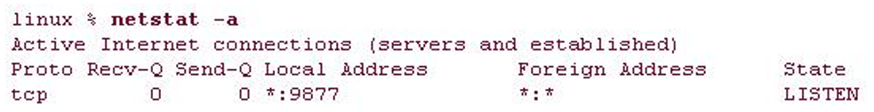

- after starting the client in a server

    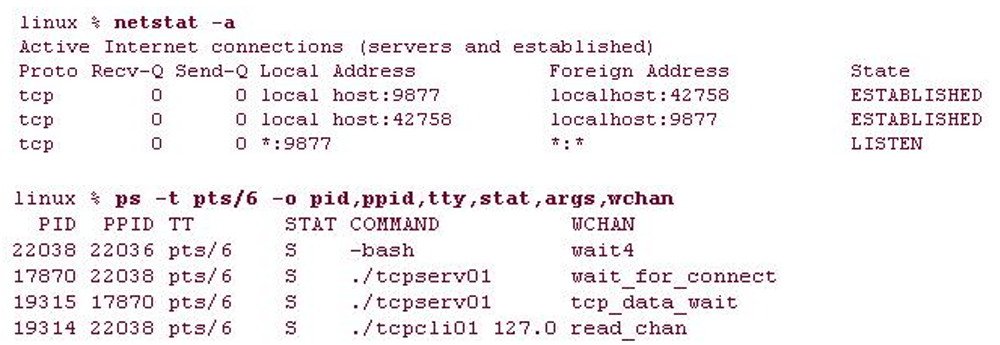

### Normal Termination
- closing client in a server

    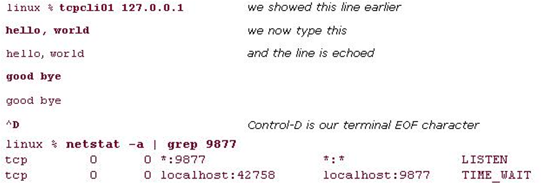

- 상위 서버 프로세스가 하위 서버 프로세스를 종료한 후 SIGCHLD 신호를 처리하지 않을 경우 하위 서버 프로세스는 좀비 상태로 이동한다.

    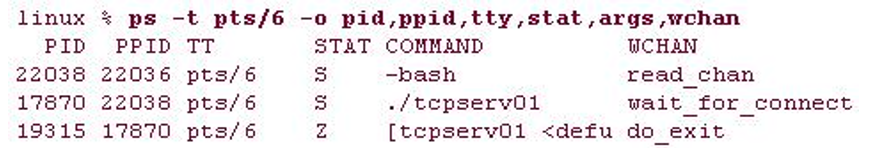

### POSIX Signal Handling
- signal은 이벤트가 발생한 프로세스에 대한 알림
  - 비동기식 소프트웨어 인터럽트
  - signal들은 프로세스나 커널에 의해 보내진다.
- signal handler
  - 신호가 도착하면 호출되는 함수
  - sigaction()은 signal handler 와 signal를 매핑한다.
  - 그러나 편의를 위해, 이 책은 그림 5.6에 설명된 신호를 사용한다.
    - Sigfunc *signal(into, Sigfunc *func);
    - void sig_child(in signo);
    - 예: signal handler(SIGCHLD, sig_child);

### Handling SIGCHLD Signals
- Zombie state
  - 좀비 프로세스는 PID, 종료 상태, 리소스 활용률에 대한 정보를 유지한다.
  - 좀비 프로세스는 커널에서 공간을 차지하며 부모 프로프를 종료한 후 삭제될 것이다.
- 좀비 프로세스를 청소하기 전에 부모 프로세스를 wait()나 waitpid()를 호출해 정리해야한다.
- SIGCHLD signal handler ver.1 and output

    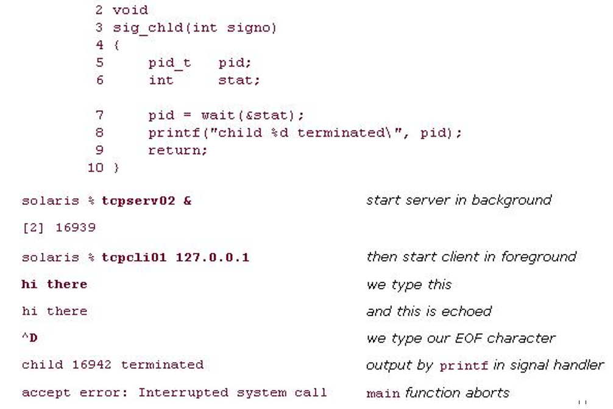

- handling Interrupted System Call in server
  - 느린 시스템콜은 영원히 차단할 수 있는 시스템함수이다.
    
    - accept(), read(), ...
  - 프로세스가 signal을 감지하면, 느린 시스템 콜로 EINTR 오류를 반환할 수 있다.
- 그래서, 우리는 이 문제를 해결해야 한다.
  
    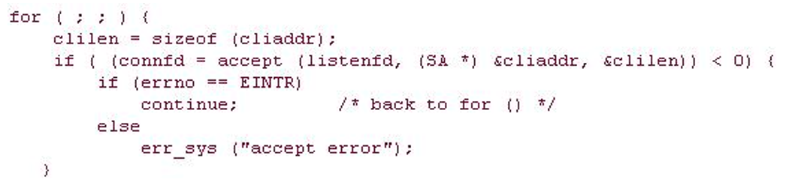

### wait and waitpid Functions
- child 의 좀비 process를 정리한다.
  ```C
  #include<sys/wait.h>
  pid_t wait(int *statioc);
  pid_t waitpid(pid_t pid, int *statioc, int options);
  // Both return:process ID if OK, 0 or -1 on error
  ```
    - **wait()** 는 존재하는 children 이 종료될때까지 block 한다.
    - **waitpid()** gives us more control
      - 어떤 프로세스를 wait시킬 것인가(pid; -1은 첫번째 child)
      - 옵션의 WNOHANG: 종료된 하위 항목이 없는 경우 차단하지 않음
- 5개의 연결이 있는 TCP 클라이언트
  ```c
  for(i=0; i<5; i++) {
      sockfd[i] = Socket(AF_INET, SOCK_STREAM, 0);
      
      bzero(&servaddr, sizeof(servaddr));
      servaddr.sin_family = AF_INET;
      servaddr.sin_port = htons(SERV_PORT);
      Inet_pton(AF_INET, argv[1], &servaddr.sin_addr);

      Connect(sockfd[i], (SA *) &servaddr, sizeof(servaddr));
  }

  str_cli(stdin, sockfd[0]);    // do it all

  exit(0);
  ```

- exit()가 호출되고 클라이언트가 종료되는 경우, 5개의 연결을 모두 닫음, 5명의 children을 모두 종료

  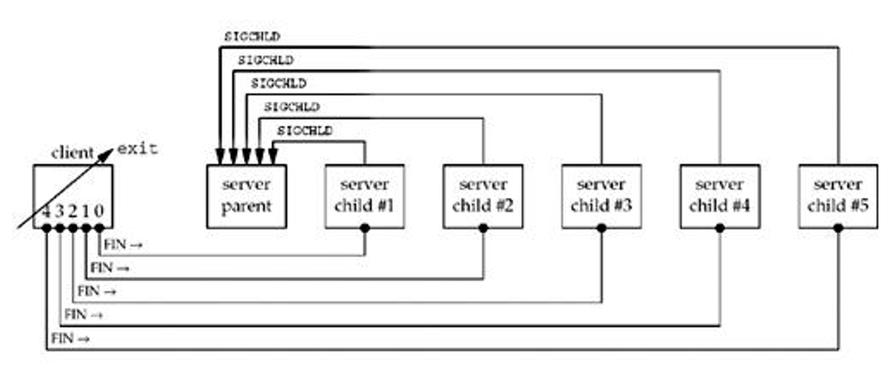

- 새로운 클라이언트의 실행 예

  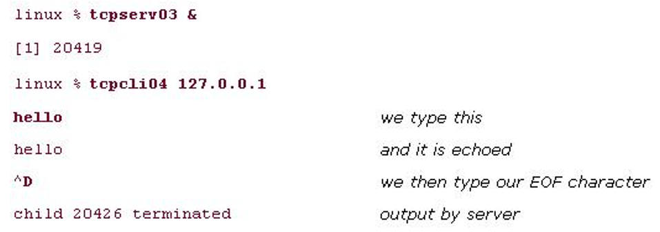

- ps 결과 - 4개의 좀비 프로세스가 남아 있다.

  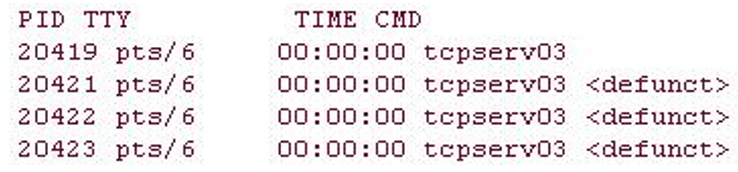

- 좀비 프로세스가 남아 있는 이유.
  
- 5 SIGCHLD 신호는 생성되지만 신호는 일반적으로 대기열에 있지 않기 때문에 신호 핸들러는 한 번만 실행된다.
  
- waitpid()를 호출하는 옳은 방법
  ```C
  void sig_chld(int signo)
  {
    pid_t pid;
    int stat;

    while((pid = waitpid(-1, &stat, WNOHANG)) > 0) {
      printf("child %d terminated\n", pid);
    }
    return;
  }
  ```
- final version of TCP server
  ```C
  Bind(listenfd, (SA *) &serveraddr, sizeof(servaddr));
  Listen(listenfd, LISTENNQ);
  Signal(SIGCHLD, sig_chld);    // must call waitpid()

  for(;;) {
    clilen = sizeof(cliaddr);
    if ( (connfd = accept(listenfd, (SA *) & cliaddr, &clilen)) < 0 ) {
      if(errno == EINTR)
        continue;           // back to for()
      else
        err_sys("accept error");
    }

    if ( (childpid = Fork()) == 0 ) {   //child process
      Close(listenfd);          // clse listening socket
      str_echo(connfd);         // process the request
      exit(0);
    }
    Close (connfd);             // parent closes connected socket
  }
  ```

### Conn Abort before accept Returns
- receiving an RST before accept is called

  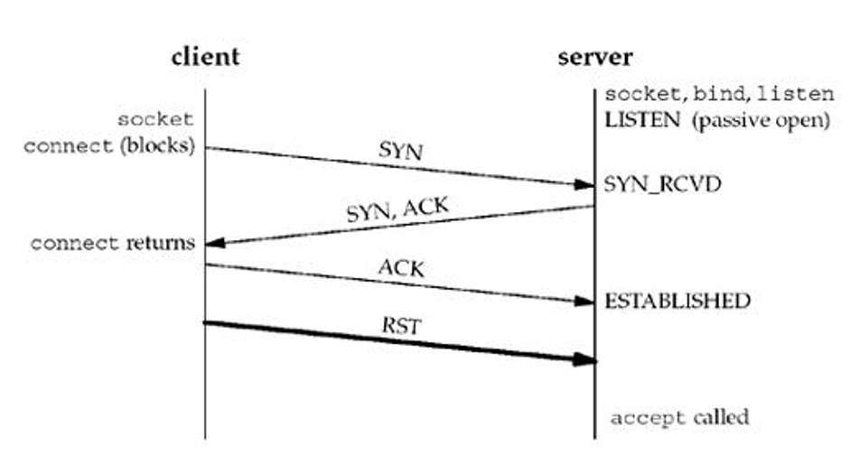

- 담당해서 실행하던 연결이 종료된 이후의 이벤트
  - BSD는 커널 안에서 종료된 이벤트를 다룬다.
    - server process never see it
  - 대부분의 SVR4는 에러 번호 EPROTO(protocol error)를 반환한다.
  - POSIX는 리턴이 반드시 ECONNABORED여야 함을 명시한다.(S/W가 연결 종료를 초래하였을 때)
    - 서버는 에러를 무시하고, 그냥 다시 accept()를 다시 호출 할 수 있다.

### Terminatation of Server Process
- 서버 프로세스 충돌의 예시
  1. 서버와 클라이언트에서 프로세스를 실행
  2. child 서버 프로세스는 kill 커멘트에 의해서 종료된다.
  3. SIGCHLD는 부모 서버 프로세스로 전송되어 처리된다.
  4. 클라이언트에겐 아무 일도 일어나지 않는다.
     - 클라이언트는 FIN을 받고 ACK을 보내지만, fgets() 호출에서 클라이언트 proc가 차단됨
  5. 그 시점에서 **netstat**를 실행하였을 때
      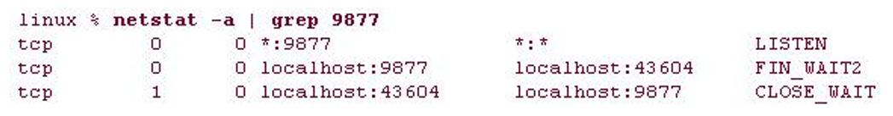
  6. 클라이언트 단에서 또다른 줄을 타이핑 한다.
      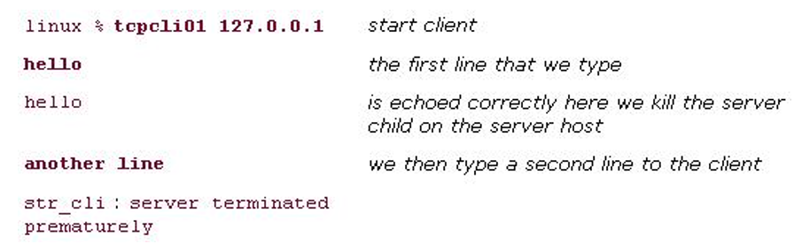
    - FIN의 수신은 클라이언트 TCP에게 serv proc가 종료되었음을 알려주지 않는다. 그래서 클라이언트가 msg를 보낸다.
    - 서버 호스트가 msg를 수신할 때, 서버의 자식 프로세스는 이미 닫혀있다. 그래서 서버 커널은 RST를 응답한다.
  7. 클라이언트 프로세스는 RST를 보지 못한다. 왜냐하면 클라이언트 프로세스는 **writen()**이후에 이미 **readline()**를 호출하고, FIN()이 이미 수신되었기 때문에 **readline()**은 0(EOF)를 반환했기 때문이다.
  8. 우리의 클라이언트 프로세스는 이 시점에서 EOF를 받을 것을 예상하지 못했고, 그래서 "서버의 조기 종료"때문에 클라이언트 프로세스를 종료한다.
  9. 클라이언트가 종료되면 열려있는 모든 설명자가 닫힌다.
  10. 이 문제는 FIN이 도착하면 클라이언트가 차단되기 때문이다.(이것은 **select()**와 **poll()**함수로 처리 가능하다)

### SIGPIP Signal
- 만약 클라이언트 프로세스가 readline의 오류를 무시하고 더 많은 데이터를 서버에 쓰면 어떻게 되는가
  - 프로세스가 RST수신 소켓에 쓰일 때, SIGPIPY신호가 프로세스로 전달된다.
  - SIGPIPY의 기본 동적은 프로세스를 종료하는 것.
  - 프로세스가 SIGPIPY를 처리한 후, **write()**가 EPIPE를 반환한다.
- writen()을 2번 호출하는 str_cli()
  ```C
  while (Fgets(sendline, MAXLINE, fp) != NULL) {
    Writen(sockfd, sendline, 1);
    sleep(1);
    Writen(sockfd, sendline + 1, strlen(sendline) - 1);

    if (Readline(sockfd, recvline, MAXline) == 0 )
      err_quit("str_cli: server terminated prematurely");
    Fputs(recvline, stdout);
  }
  ```
- result of writen twice client (in bash)
  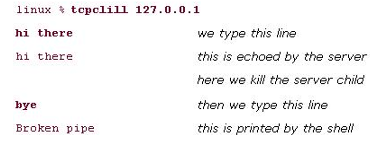
  - 첫번째 writen이 RST를 도출하고, 두번째 writen에서 SIGPIPE를 생성한다.
  - SIGPIPE의 핸들링은 App에 따라 달라진다.
    - SIGPIPE가 무시되어도, 다음 write는 EPIPE 에러를 발생시켜 프로세스를 종료한다.

### Crashing of Server Host

- 서버 호스트가 충돌이 생겼을 때 무슨 일이 생기는 가?
  - 서버가 충돌이 생겼을때, 아무것도 보내지 않는다.
  - 클라이언트는 연속해서 데이터 시그널을 보내, 서버로부터 ACK을 붇기 위해 시도한다.
    - BSD 는 12번 재송신하고, 포기까지까지 9분까지 걸린다.
  - 클라이언트가 마침내 포기했을때 에러를 리턴한다.
    (ETIMEOUT, EHOSTUNREADH or ENETUNREACH)
- 서버 호스트가 크래싱 이후에 서버를 리스타트 하면 무슨 일이 일어나는가.
  1. 서버 프로세스와 클라이언트 프로세스를 시작한다.
  2. 네트워크로부터 서버 호스트를 분리하고, 서버 호스트를 셧다운 하고 리부트 한다.
  3. 클라이언트단에서 라인을 타이핑해서 입력한다.
     - 그때 그 라인 데이터는 리부트된 서버에 전송된다.
  4. 서버가 리부트 된 이후에, 이것의 TCP 연결 정보는 잃어버리고, 서버는 ㄱRST를 클라이언트 프로세스에 전달한다.
  5. 클라이언트단에서  `readline()` 은 `ECONNRESET` 을 리턴한다.

- 서버 호스트가 서버 프로세스가 run하는 동안 셧다운 되면 무슨 일이 일어나는가?
  - 유닉스 시스템이 리부트 됬을 때, the init 된 프로세스들은 `SIGTERM` 를 모든 프로세스에 보낸다, 그때 수정 시간 이후에 `SIGKILL`을 여전히 작동되고 있는 모든 프로세스에 전송한다.
    - clean up과 terminate 프로세스 하기 위한 시간을 준다.
  - 프로세스가 종료된 이후에, 모든 열려있는 설명자는 닫히고, 종료 시퀸스를 따른다.
  - 서버 프로세스 ASAP의 종료를 찾기 위해서,  `select()` 과 `poll()` 함수를 사용한다.

