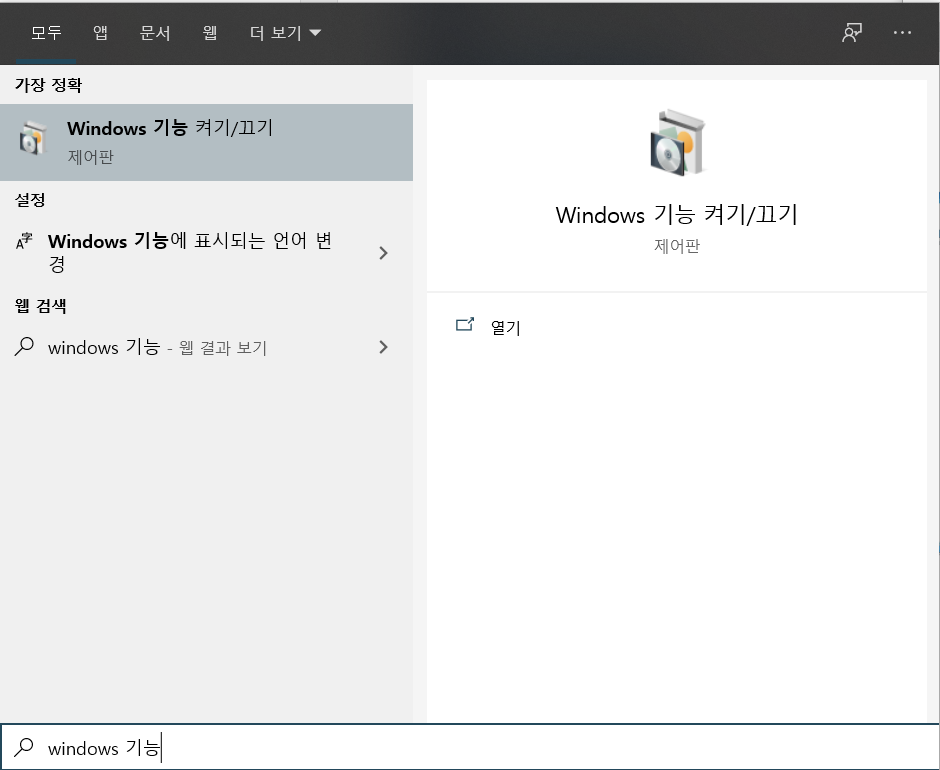
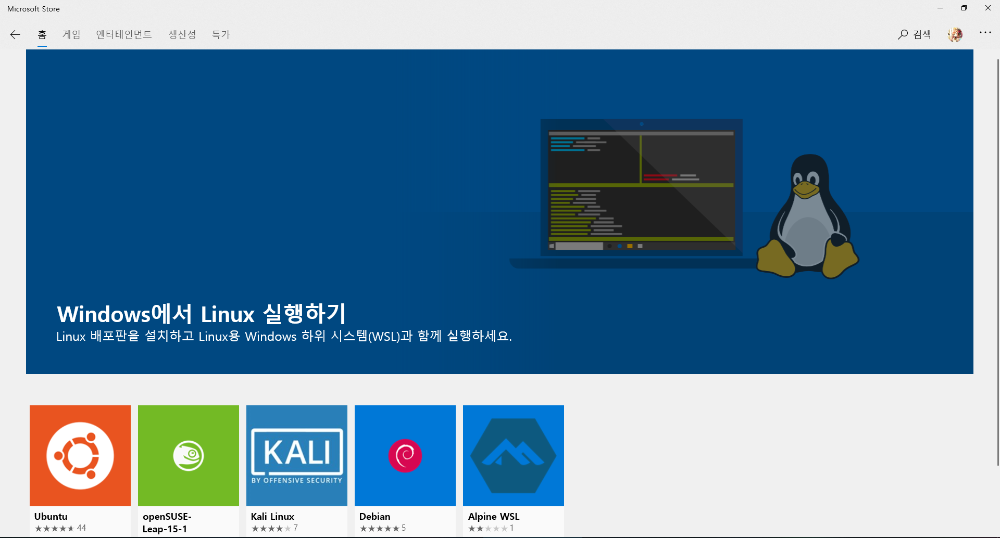

# Window에 bash 설치법

요즘 docker나 등등을 쓰려면 bash가 거의 반 필수 이길래 찾아본 bash 설치 방법

## 설치 순서

1. 

   windows 기능 켜기/끄기를 검색한다.

   

2. 

   나온 항목 중에 linux용 windows 하위 시스템을 킨다.

   그 이후에 시스템 재시작.

3. 

   cmd창으로 가서 bash 명령어를 치면 저 주소로 가서 설치하라는 권고 사항이 나온다

4. 

   인터넷 주소창에 검색하면 스토어로 리다이렉트 되는데 이중에서 ubuntu를 설치했다. 이유는 익숙했기 때문에....

5. 

   그리고 cmd창으로 가서 다시 bash를 입력하면 id와 비밀번호를 입력하고 나면 bash를 사용할 수 있다.