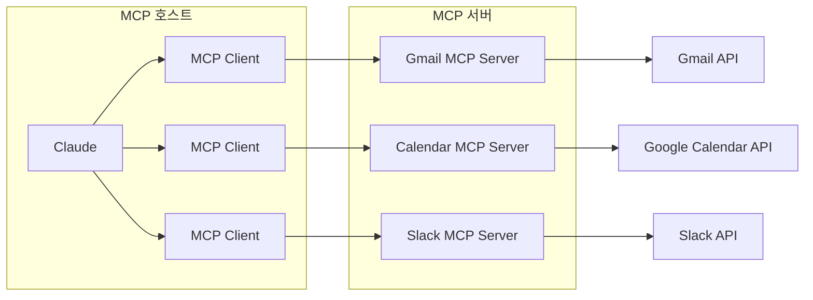

# MCP

## MCP란?

> AI 애플리케이션을 외부 시스템에 연결하기 위한 오픈 소스 표준으로, AI 모델이 외부 서비스나 도구와 표준화된 방식으로 통신할 수 있게 해주는 프로토콜입니다.

즉, MCP는 AI 어플리케이션을 외부 시스템에 연결하는 표준화된 방법을 제공하는 것을 말한다.

## MCP가 필요한 이유

AI 모델은 근본적으로 학습 시점까지 익힌 데이터로 밖에 대답하지 못하고, 외부 세계와 상호작용을 처리해달라는 요청을 해결하지는 못한다.

그래서, AI 모델을 외부 서비스와 연동하려면, 서비스마다 별도의 연동 코드를 작성해야했지만, MCP로 하나의 표준 프로토콜을 정해놓고, 모든 서비스가 이 규격에 맞춰 MCP 서버를 만들면 어떤 AI 모델이든 동일한 방식으로 연결할 수 있도록 한다.

## MCP 아키텍처 및 구성요소

### MCP 호스트

AI 애플리케이션 자체입니다. Claude.ai, Claude Desktop, 또는 API를 사용하는 앱이 여기에 해당합니다. 일반적으로 사용자의 상호작용 지점이며, MCP 호스트는 LLM을 사용하여 외부 데이터나 도구가 필요할 수 있는 요청을 처리합니다.

### MCP 클라이언트

호스트 안에서 각 MCP 서버와 1:1로 연결을 유지하는 중간 계층입니다. 하나의 호스트가 여러 클라이언트를 가질 수 있다. MCP 클라이언트는 LLM과 MCP 서버가 서로 통신하도록 도와줍니다. MCP에 대한 LLM의 요청을 변환하고 LLM에 대한 MCP의 대답을 변환합니다. 또한 사용 가능한 MCP 서버를 찾아 사용합니다.

### MCP 서버

실제 외부 서비스를 감싸는 경량 프로그램입니다. Gmail MCP 서버, Google Calendar MCP 서버 등이 각각 존재하며, 표준화된 방식으로 자신이 제공하는 기능을 노출한다. 데이터베이스 및 웹 서비스와 같은 외부 시스템에 연결하여 LLM이 이해할 수 있는 형식으로 변환함으로써 개발자가 다양한 기능을 제공할 수 있도록 LLM을 지원한다.

## 참고 문헌

- [https://modelcontextprotocol.io/docs/getting-started/intro](https://modelcontextprotocol.io/docs/getting-started/intro)
- [https://cloud.google.com/discover/what-is-model-context-protocol?hl=ko](https://cloud.google.com/discover/what-is-model-context-protocol?hl=ko)