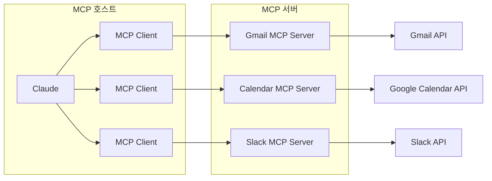
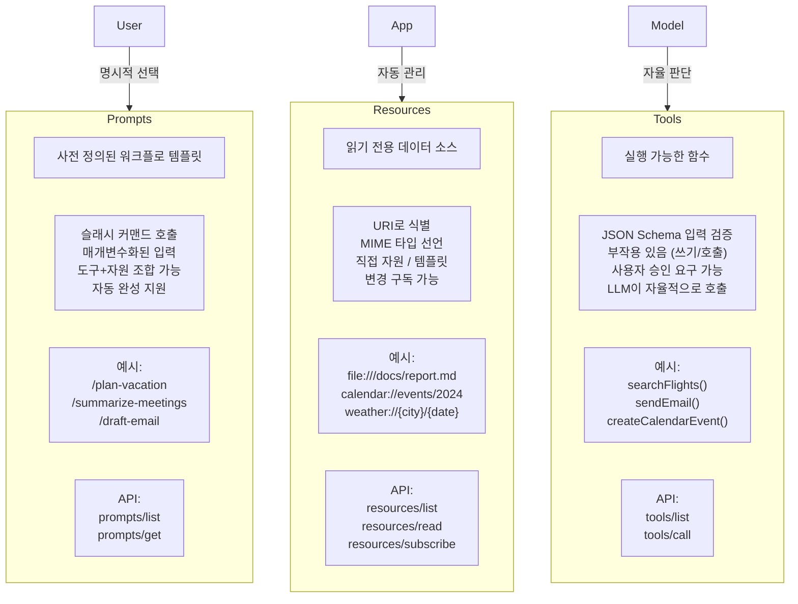

# MCP

## MCP란?

> AI 애플리케이션을 외부 시스템에 연결하기 위한 오픈 소스 표준으로, AI 모델이 외부 서비스나 도구와 표준화된 방식으로 통신할 수 있게 해주는 프로토콜입니다.

즉, MCP는 AI 어플리케이션을 외부 시스템에 연결하는 표준화된 방법을 제공하는 것을 말한다.


## MCP가 필요한 이유

AI 모델은 근본적으로 학습 시점까지 익힌 데이터로 밖에 대답하지 못하고, 외부 세계와 상호작용을 처리해달라는 요청을 해결하지는 못한다.

그래서, AI 모델을 외부 서비스와 연동하려면, 서비스마다 별도의 연동 코드를 작성해야했지만, MCP로 하나의 표준 프로토콜을 정해놓고, 모든 서비스가 이 규격에 맞춰 MCP 서버를 만들면 어떤 AI 모델이든 동일한 방식으로 연결할 수 있도록 한다.


## MCP 아키텍처 및 구성요소



### MCP 호스트

AI 애플리케이션 자체입니다. Claude.ai, Claude Desktop, 또는 API를 사용하는 앱이 여기에 해당합니다. 일반적으로 사용자의 상호작용 지점이며, MCP 호스트는 LLM을 사용하여 외부 데이터나 도구가 필요할 수 있는 요청을 처리합니다.


### MCP 클라이언트

호스트 안에서 각 MCP 서버와 1:1로 연결을 유지하는 중간 계층입니다. 하나의 호스트가 여러 클라이언트를 가질 수 있다. MCP 클라이언트는 LLM과 MCP 서버가 서로 통신하도록 도와줍니다. MCP에 대한 LLM의 요청을 변환하고 LLM에 대한 MCP의 대답을 변환합니다. 또한 사용 가능한 MCP 서버를 찾아 사용합니다.


### MCP 서버

실제 외부 서비스를 감싸는 경량 프로그램입니다. Gmail MCP 서버, Google Calendar MCP 서버 등이 각각 존재하며, 표준화된 방식으로 자신이 제공하는 기능을 노출한다. 데이터베이스 및 웹 서비스와 같은 외부 시스템에 연결하여 LLM이 이해할 수 있는 형식으로 변환함으로써 개발자가 다양한 기능을 제공할 수 있도록 LLM을 지원한다.


### 전송 계층

클라이언트와 서버 간의 데이터 교환을 가능하게 하는 통신 메커니즘과 채널을 정의한다. 전송 계층은 JSON-RPC 2.0 메시지를 사용하여 클라이언트와 서버 간에 통신하며, 주로 다음 두 가지 전송 방법을 사용합니다.

- **표준 입력/출력(stdio):** 로컬 리소스에 적합하며 빠른 동기식 메시지 전송을 제공합니다.
- **Streamable HTTP** : treamable HTTP는 단일 HTTP 엔드포인트를 통해 요청/응답과 스트리밍을 모두 처리하며, 권장되는 방식


## MCP의 작동 방식

> Model Context Protocol의 핵심은 LLM이 외부 도구에 도움을 요청하여 쿼리에 답변하거나 작업을 완료할 수 있도록 한다.

1. **요청 및 도구 탐색:** LLM는 자체적으로 데이터 베이스에 액세스 하거나 이메일을 보낼 수 없다. 그 대신 MCP 클라이언트를 사용하여, 사용 가능한 도구를 검색하고, MCP 서버에 등록된 관련 도구(database_query, email_sender)를 찾습니다.
2. **도구 호출:** LLM이 이러한 도구를 사용하기 위한 구조화된 요청을 생성합니다. 먼저 보고서 이름을 지정하여 database_query 도구를 호출합니다. 그러면 MCP 클라이언트가 이 요청을 적절한 MCP 서버로 보냅니다.
3. **외부 작업 및 데이터 반환:** MCP 서버는 요청을 수신하고 이를 회사의 데이터베이스에 대한 보안 SQL 쿼리로 변환하여 판매 보고서를 검색합니다. 그런 다음 이 데이터를 포맷하여 LLM에 다시 보냅니다.
4. **두 번째 작업 및 응답 생성:** 이제 보고서 데이터를 확보한 LLM은 email_sender 도구를 호출하여 관리자의 이메일 주소와 보고서 콘텐츠를 제공합니다. 이메일이 전송된 후 MCP 서버는 작업이 완료되었음을 확인합니다.
5. **최종 확인:** LLM이 최종 응답을 제공합니다. '최신 판매 보고서를 찾아서 관리자에게 이메일로 보냈습니다.'


## MCP의 장점

1. **할루시네이션 감소** : LLM은 본질적으로 실시간 정보가 아닌 학습 데이터를 기반으로 대답을 예측하기 때문에 때로는 사실을 꾸며내거나 그럴듯하지만 잘못된 정보인 할루시네이션 현상이 발생하는데, 외부의 신뢰할 수 있는 데이터 소스에 액세스 함으로써 줄일 수 있다.
2. **AI 유용성 및 자동화 향상** : 외부 도구에 직접 연결함으로써 LLM은 더 이상 단순한 채팅 프로그램이 아니라 독립적으로 행동할 수 있는 스마트 에이전트가 되며, 이는 훨씬 더 많은 작업을 자동화할 수 있다.
3. **AI를 위한 간편한 연결** : 기존에 AI 모델이 외부 서비스와 연동하려면, 각 서비스마다 별도의 통합 코드를 작성해야 했고, 그로 인해 서비스가 N개이고 AI 모델이 M개라면, N×M개의 연동을 만들어야 하는 비효율이 발생했습니다. MCP는 이러한 연결을 공통형 개발 표준을 제공함으로써 생상성을 향상 시킬 수 있다.


# MCP 서버




## 핵심 서버 기능

| Feature   | Explanation                                                  | 예시                                                 | 제어의 주체 |
| --------- | ------------------------------------------------------------ | ---------------------------------------------------- | ----------- |
| Tools     | LLM이 호출할 수 있는 함수                                    | 검색 항공편<br/>메시지 보내기<br/>캘린더 이벤트 생성 | 모델        |
| Resources | LLM의 읽을 수 있는 데이터 소스. 파일, 데이터베이스 레코드, API 응답 등이 해당됩니다. URI 형태로 식별되며, AI의 컨텍스트에 포함될 수 있다. | 문서 검색<br/>지식 기반 접근<br/>달력 읽기           | 어플        |
| Prompts   | 특정 작업에 최적화된 프롬프트 템플릿. 서버가 미리 정의한 워크플로우를 사용자가 쉽게 활용할 수 있게 한다. | 휴가 계획하기<br/>제 회의 요약<br/>이메일 초안 작성  | 사용자      |

### Tools

도구를 사용하면 AI 모델이 작업을 수행할 수 있습니다. 각 도구는 입력과 출력을 입력하여 특정 작업을 정의합니다. 모델은 컨텍스트를 기반으로 도구 실행을 요청합니다.

#### **Tool 작동 방식**

JSON 스키마로 이루어진 LLM이 호출할 수 있는 스키마 정의 인터페이스. 각 도구는 정의된 입력과 출력으로 단일 작업을 수행한다.

**프로토콜 작업:**

| Method       | 목적                   | Retrun                          |
| :----------- | :--------------------- | :------------------------------ |
| `tools/list` | 사용 가능한 tools 발견 | 스키마가 포함된 tools 정의 배열 |
| `tools/call` | 특정 tools 실행        | 도구 tools 결과                 |

**비행 검색 tools 정의 예시:**

```json
{
  name: "searchFlights",
  description: "Search for available flights",
  inputSchema: {
    type: "object",
    properties: {
      origin: { type: "string", description: "Departure city" },
      destination: { type: "string", description: "Arrival city" },
      date: { type: "string", format: "date", description: "Travel date" }
    },
    required: ["origin", "destination", "date"]
  }
}
```

```
searchFlights(origin: "NYC", destination: "Barcelona", date: "2024-06-15")
```

### Resources

리소스는 AI 애플리케이션이 검색하여 모델에 제공할 수 있는 정보에 대한 구조화된 접근을 제공한다.

#### Resources 작동 방식

리소스는 AI가 맥락을 이해하는 데 필요한 파일, API, 데이터베이스 또는 기타 소스의 데이터를 노출한다. 애플리케이션은 이 정보에 직접 액세스하여 관련 부분을 선택하거나 임베딩으로 검색하거나 모델에 모두 전달하는 등 사용 방법을 결정할 수 있습니다.


리소스는 두 가지 발견 패턴을 지원합니다:

- 직접 리소스 - 특정 데이터를 가리키는 고정 URI
  - `calendar://events/2024` - 2024년 캘린더 이용 가능 여부 반환
- 리소스 템플릿 - 유연한 쿼리를 위한 매개변수가 있는 동적 URI. 예:
  - `travel://activities/{city}/{category}` - 도시 및 카테고리별 활동 반환
  - `travel://activities/barcelona/museums` - 바르셀로나의 모든 박물관을 반환


**프로토콜 작업 :** 

| Method                     | 목적                         | Retrun                            |
| :------------------------- | :--------------------------- | :-------------------------------- |
| `resources/list`           | 사용 가능한 직접 리소스 나열 | 리소스 설명자 배열                |
| `resources/templates/list` | 리소스 템플릿 검색           | 리소스 템플릿 정의 배열           |
| `resources/read`           | 리소스 콘텐츠 검색           | 메타데이터가 포함된 리소스 데이터 |
| `resources/subscribe`      | 리소스 변경 모니터링         | 구독 확인                         |

### Prompts

프롬프트는 재사용 가능한 템플릿을 제공하고, MCP 서버 작성자는 도메인에 대해 매개변수화된 프롬프트를 제공할 수 있다.


#### Prompts 작동 방식

프롬포트는 예상 입력과 상호작용 패턴을 정의하는 탬플릿으로, 가장 큰 차이점은 사용자가 명시적으로 호출을 한다. 그리고 Prompts는 단순 텍스트가 아니라 구조화된 입력을 받음으로써, 자연어로 설명하는 것보다 일관된 결과를 얻을 수 있습니다.

Prompts의 Tools와 Resources를 조합하는 오케스트레이션 역할입니다.


**프로토콜 작업:**

| Method         | 목적                      | Retrun                           |
| :------------- | :------------------------ | :------------------------------- |
| `prompts/list` | 사용 가능한 프롬프트 검색 | 프롬프트 설명자 배열             |
| `prompts/get`  | 프롬프트 세부 정보 검색   | 인수를 포함한 전체 프롬프트 정의 |


## 예시

이해를 위해 Claude를 통해 예시를 생성해보았다.


1. 서버 등록 (claude_desktop_config.json)

MCP 서버 자체를 클라이언트에 연결한다.

```json
{
    "mcpServers": {
        "travel": {
            "command": "python",
            "args": [
                "travel_server.py"
            ]
        }
    }
}
```

2. 서버 코드 내부 — 여기서 셋 다 정의

```python
# Tool 정의 예시 (Python)
# LLM이 실제 API를 자율적으로 호출
@mcp.tool() 
async def search_flights(origin: str, dest: str, date: str): 
    """항공편을 검색합니다"""
    return await airline_api.search(origin, dest, date) 

@mcp.tool() 
async def send_email(to: str, subject: str, body: str): 
    """이메일을 발송합니다""" 
    return await smtp.send(to, subject, body)
```

```python
# Resources
# 앱이 관리 → 읽기 전용 데이터 반환 
@mcp.resource("travel://history/{trip_id}") 
async def get_trip_history(trip_id: str): 
    """과거 여행 기록을 조회합니다""" 
    return db.query(f"SELECT * FROM trips WHERE id={trip_id}") 

@mcp.resource("travel://preferences")
async def get_preferences():
    """사용자 여행 선호도를 반환합니다""" 
    return user_prefs.load()
```

```python
# Prompt 
# 사용자가 /plan-vacation 으로 명시적 호출 
@mcp.prompt() 
async def plan_vacation(destination: str, days: int, budget: int): 
    """휴가 계획 워크플로""" 
    return [ 
      UserMessage(f"{destination}으로 {days}일, 예산 ${budget}로 여행 계획해줘. 기존 선호도와 캘린더를 확인하고, 항공편 검색 후 호텔을 예약해줘.") 
    ]
```


## 참고 문헌

- [https://modelcontextprotocol.io/docs/getting-started/intro](https://modelcontextprotocol.io/docs/getting-started/intro)
- [https://cloud.google.com/discover/what-is-model-context-protocol?hl=ko](https://cloud.google.com/discover/what-is-model-context-protocol?hl=ko)