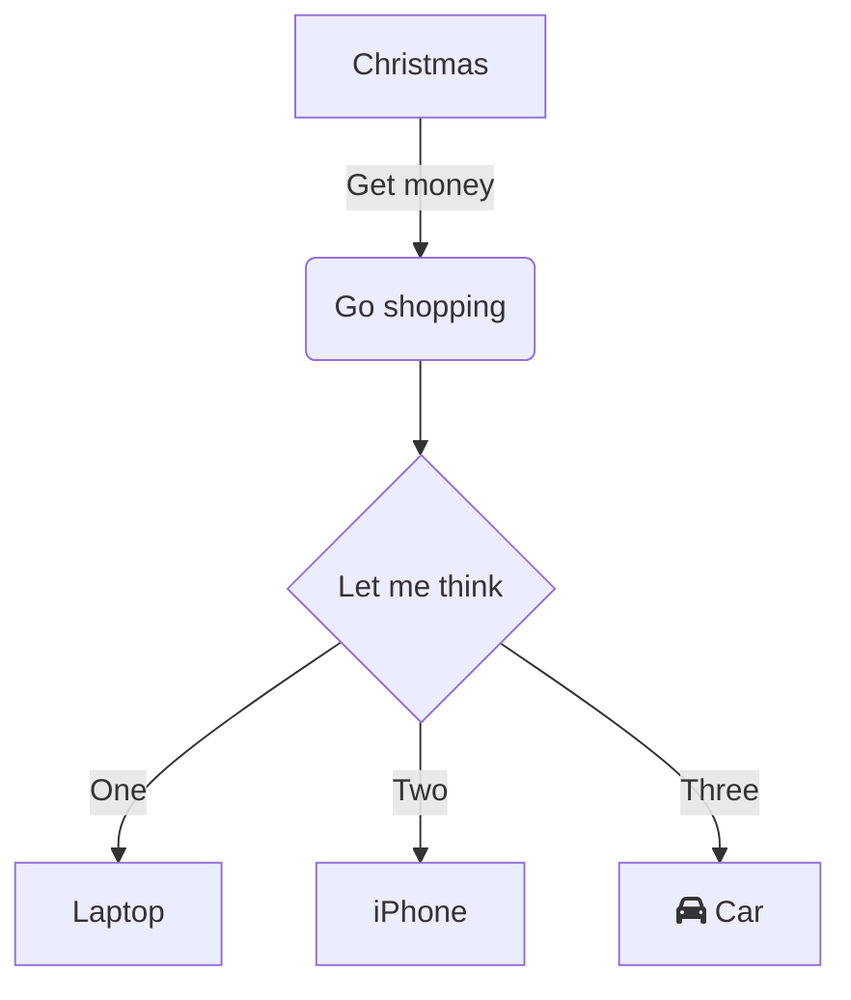
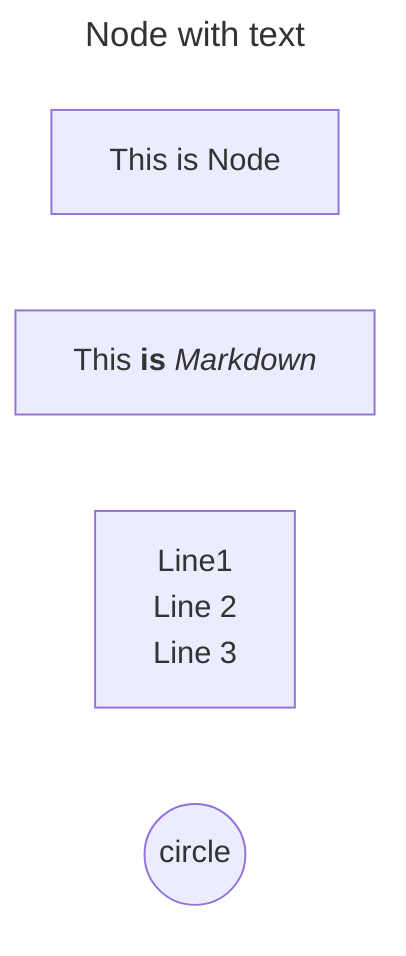
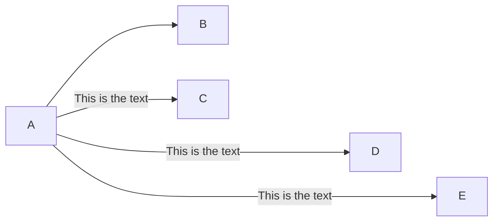
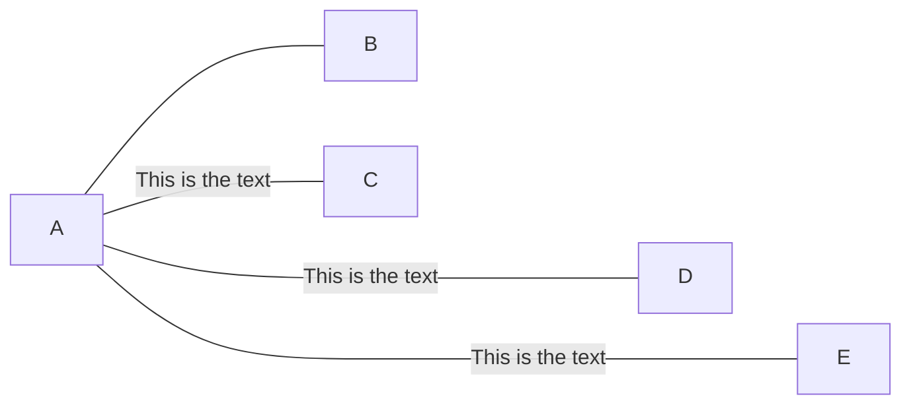
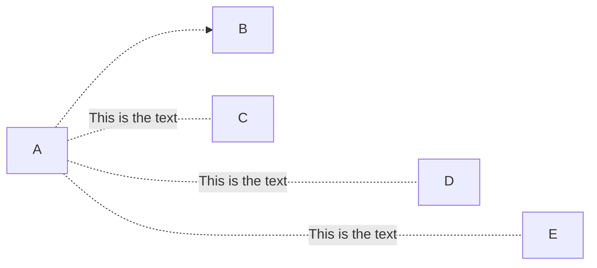
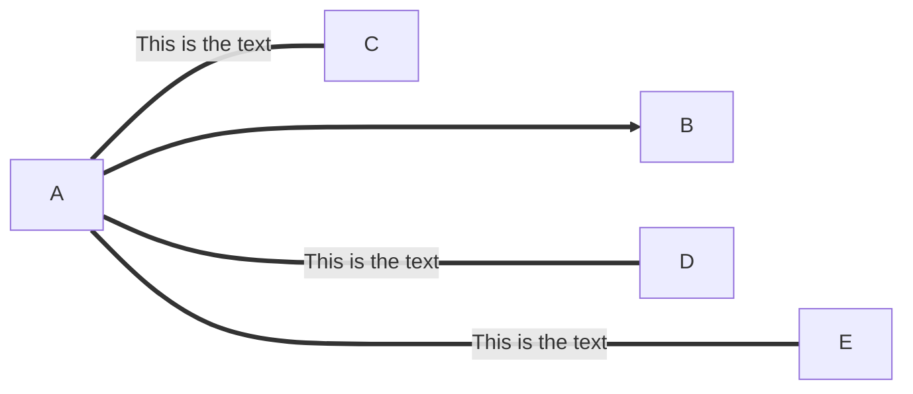
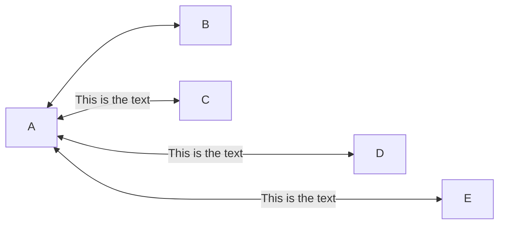
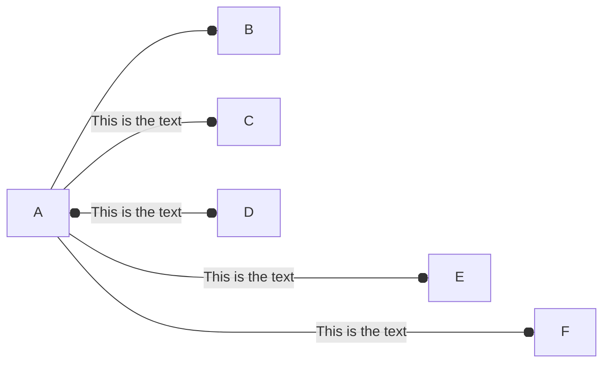
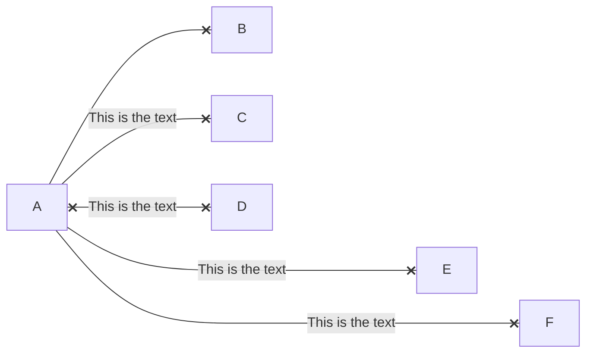
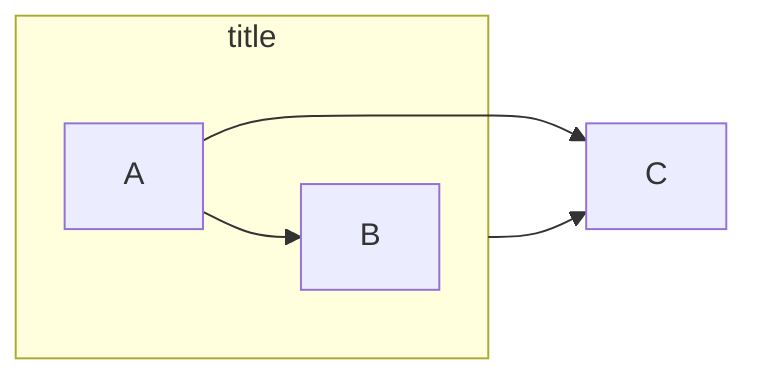

# Mermaid - Flowchart 문법

## 플로우차트란?

> 프로세스나 알고리즘의 흐름을 시각적으로 표현한 다이어그램
>
> 어떤 일을 어떤 순서로 수행하는지를 도식화 한 차트


## 기본구조

```
flowchart TD
    A[Christmas] -->|Get money| B(Go shopping)
    B --> C{Let me think}
    C -->|One| D[Laptop]
    C -->|Two| E[iPhone]
    C -->|Three| F[fa:fa-car Car]
```




## Direction

플로우차트의 흐름이 어디로 흘러갈지에 대한 정의

| 코드 | 의미                         |
| ---- | ---------------------------- |
| `TD` | Top → Down (위에서 아래로)   |
| `BT` | Bottom → Top (아래에서 위로) |
| `LR` | Left → Right (왼쪽 → 오른쪽) |
| `RL` | Right → Left (오른쪽 → 왼쪽) |


## Node

| 형태            | 예시 코드     | 설명                   |
| --------------- | ------------- | ---------------------- |
| 사각형          | `A[텍스트]`   | 기본 프로세스 박스     |
| 둥근 사각형     | `A(텍스트)`   | 시작/종료 노드         |
| 원형            | `A((텍스트))` | 연결점/상태            |
| 다이아몬드형    | `A{텍스트}`   | 조건 분기              |
| 사다리꼴        | `A[/텍스트/]` | 입력/출력 (I/O)        |
| 병렬 다이아몬드 | `A{{텍스트}}` | 서브프로세스 또는 모듈 |
| 텍스트 박스     | `A>"텍스트"]` | 링크/참조용 노드       |

```
---
title: Node with text
---
flowchart LR
    id[This is Node]
    markdown["`This **is** _Markdown_`"]
    newLines["`Line1
    Line 2
    Line 3`"]
    circle((circle))
   
```



## Links between nodes

흐름도의 방향을 나타낸다.

그리고 중간에 들어가는 요소의 갯수로 선의 길이를 조절할 수 있다.


### 화살표 직선

```
flowchart LR
    A-->B
    A-->|This is the text|C
    A--->|This is the text|D
    A---->|This is the text|E
```



### 직선

```
flowchart LR
    A---B
    A---|This is the text|C
    A----|This is the text|D
    A-----|This is the text|E
```



### 화살표 점선

```
flowchart LR
   A-.->B
   A -.- |This is the text|C
   A -..- |This is the text|D
   A -...- |This is the text|E
```



### 굵은 직선

```
flowchart LR
   A===>B
   A === |This is the text|C
   A ==== |This is the text|D
   A ===== |This is the text|E
```




### 양방향 화살표

```
flowchart LR
   A<-->B
   A<-->|This is the text|C
   A <---> |This is the text|D
   A <----> |This is the text|E
```



### 동그라미를 가진 직선

```
flowchart LR
    A --o B
    A --o|This is the text|C
    A o--o|This is the text|D
    A ---o|This is the text|E
    A ----o|This is the text|F
```



### X를 가진 직선

```
flowchart LR
    A--xB
    A--x|This is the text|C
    Ax--x|This is the text|D
```



## Subgraphs

### Subgraphs

```
flowchart LR
	subgraph title
   	 A-->B
	end
	
	title --> C
	A --> C
```



## 참고 문헌

- [https://mermaid.js.org/syntax/flowchart.html](https://mermaid.js.org/syntax/flowchart.html)
- [https://sanghee01.tistory.com/154](https://sanghee01.tistory.com/154)