# Mermaid - Sequence Diagram 문법

## 기본구조

```
sequenceDiagram
    Alice->>+John: Hello John, how are you?
    Alice->>+John: John, can you hear me?
    John-->>-Alice: Hi Alice, I can hear you!
    John-->>-Alice: I feel great!
```


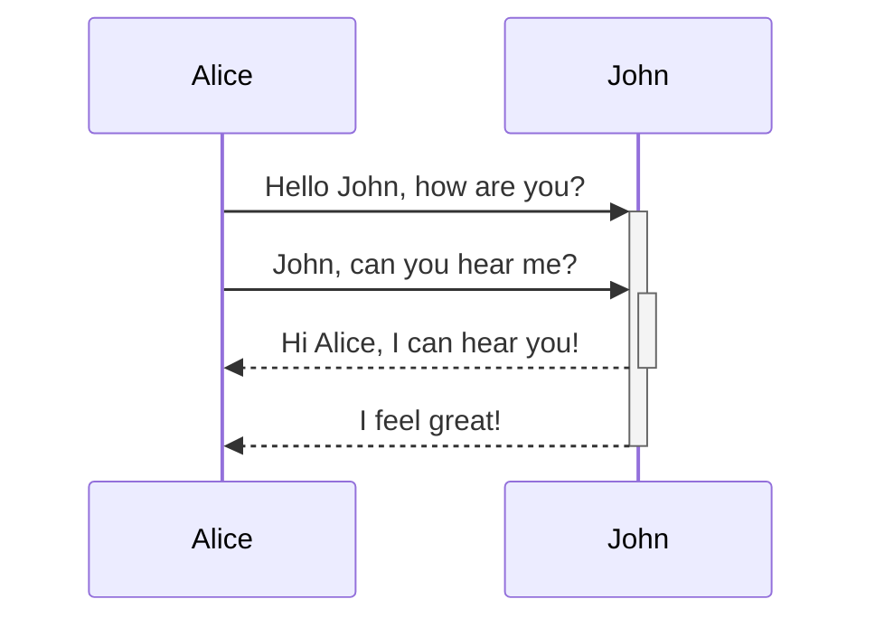

## Participant / Actor

해당 다이어그램의 참여자를 뜻하는 뜻이다.

시퀸스 다이어그램에서 객체들을 뜻하는 것이다.

| Type        | Description                     |
| ----------- | ------------------------------- |
| participant | Name을 가진 객체를 생성한다.    |
| actor       | 유저 즉, 사용자를 나타내는 표기 |

```
sequenceDiagram
		actor User as 유저
		participant ServiceFirst
		participant KrSevice as 서비스
		
		User->>ServiceFirst:
		ServiceFirst->>KrSevice:
```

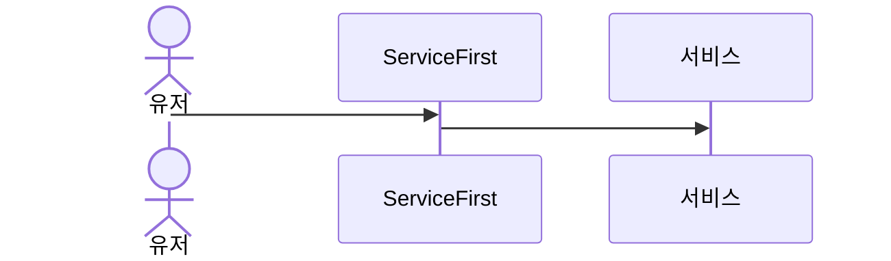

## Grouping / Box

| Type               | Description             |
| ------------------ | ----------------------- |
| box [color] [Name] | 색깔과 이름을 가진 그룹 |

```
sequenceDiagram
  box Aqua Group
		participant A
  end
  box Group
  	participant B
  end
  box rgb(33,66,99)
  	participant C
  end
  box rgba(33,66,99,0.5)
	  participant D
  end
```

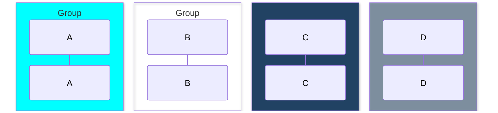


## Message

각 객체들 끼리 요청을 나타내는 화살표

| Type | Description                   | purpose                     |
| ---- | ----------------------------- | --------------------------- |
| ->   | 실선                          | 단순 연결                   |
| -->  | 점선                          | 보조적인 흐름, 서브프로세스 |
| ->>  | 화살표가 있는 실선            | 요청                        |
| -->> | 화살표가 있는 점선            | 응답, 결과 반환             |
| -x   | 화살표 끝이 X로 표시되는 실선 | 에러 응답                   |
| --x  | 화살표 끝이 X로 표시되는 점선 | 비동기 에러 응답            |
| -)   | 화살표 끝이 열린 실선         | 비동기 요청                 |
| --)  | 화살표 끝이 열린 점선         | 비동기 응답                 |

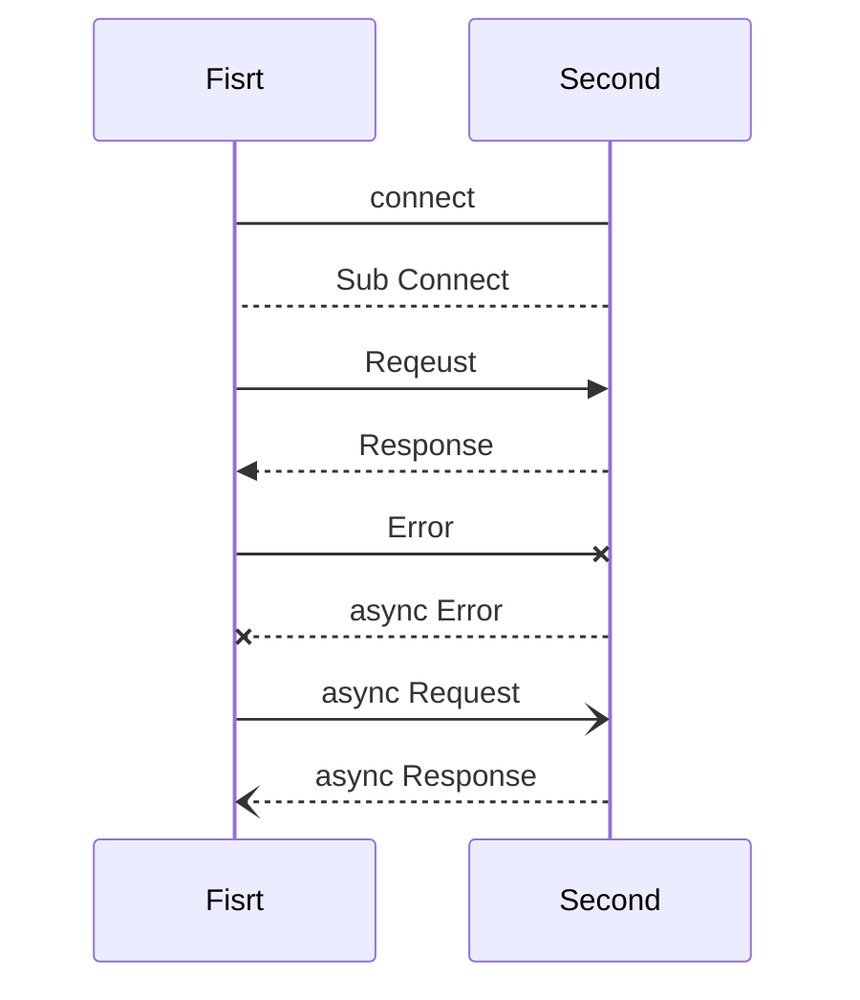

## Activations

행위자를 활성화하거나 비활성화할 수 있습니다.

두가지 방법으로 활용이 가능한데

- activate 키워드

```
sequenceDiagram
    Alice->>John: Hello John, how are you?
    activate John
    John-->>Alice: Great!
    deactivate John
```

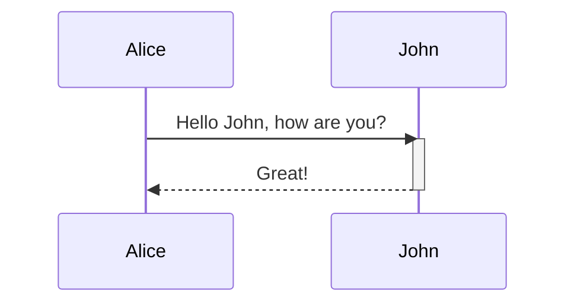

- `+/-` : 키워드

```
sequenceDiagram
    Alice->>+John: Hello John, how are you?
    Alice->>+John: John, can you hear me?
    John-->>-Alice: Hi Alice, I can hear you!
    John-->>-Alice: I feel great!
```


## Notes

참여자(Actor)나 메시지에 대한 추가 설명을 붙일 때 사용한다. 해당 이벤트나 메세지에 대한 보충 설명을 나타낸다.

**표현법**

```
Note [over|left_of|right_of] [Actor...]
```

**예시**

```
sequenceDiagram
    participant John
    Note right of John: Text in note
```

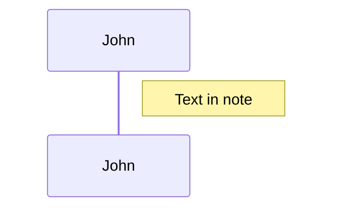

```
sequenceDiagram
    Alice->John: Hello John, how are you?
    Note over Alice,John: A typical interaction
```

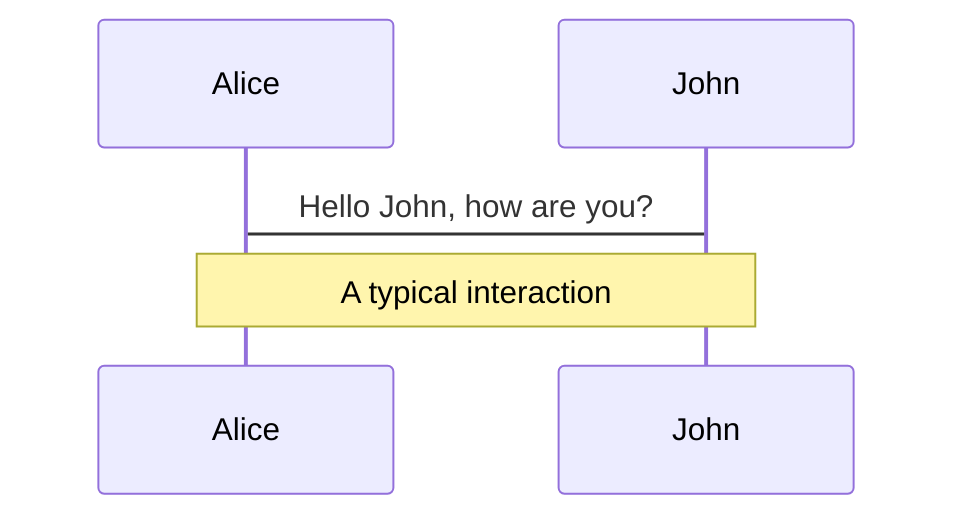

```
sequenceDiagram
    Alice->John: Hello John,<br/>how are you?
    Note over Alice,John: A typical interaction<br/>But now in two lines
```

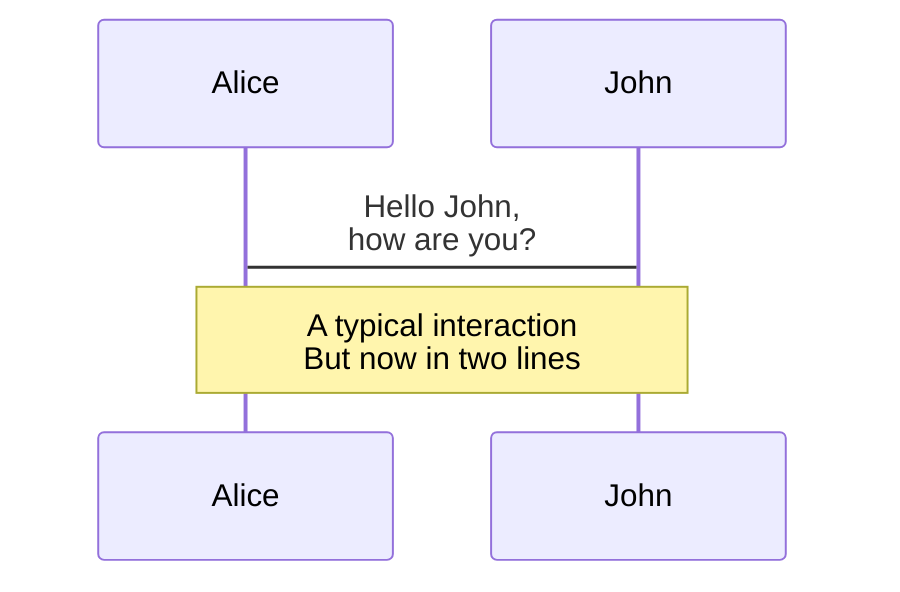


## Controll

| Operator   | Description                                                  |
| ---------- | ------------------------------------------------------------ |
| `alt`      | switch or if else 문, 조건에 만족하는 경로를 선택한다.       |
| `opt`      | else가 없는 if문, 조건을 만족하면 실행된다.                  |
| `loop`     | 메시지 반복 여부를 나타낸다.                                 |
| `par`      | 병렬적으로 실행되는 메시지를 나타낸다.                       |
| `break`    | 조건을 만족하면 Box를 빠져나간다. Box가 없다면 시나리오가 종료된다. |
| `critical` | 상호 배제를 보장하는 임계 영역을 정의한다. (atomic)          |

### alt

```
alt Describing text
... statements ...
else
... statements ...
end
```

```
opt Describing text
... statements ...
end
```

**Example**

```
sequenceDiagram
    Alice->>Bob: Hello Bob, how are you?
    alt is sick
        Bob->>Alice: Not so good :(
    else is well
        Bob->>Alice: Feeling fresh like a daisy
    end
    opt Extra response
        Bob->>Alice: Thanks for asking
    end
```

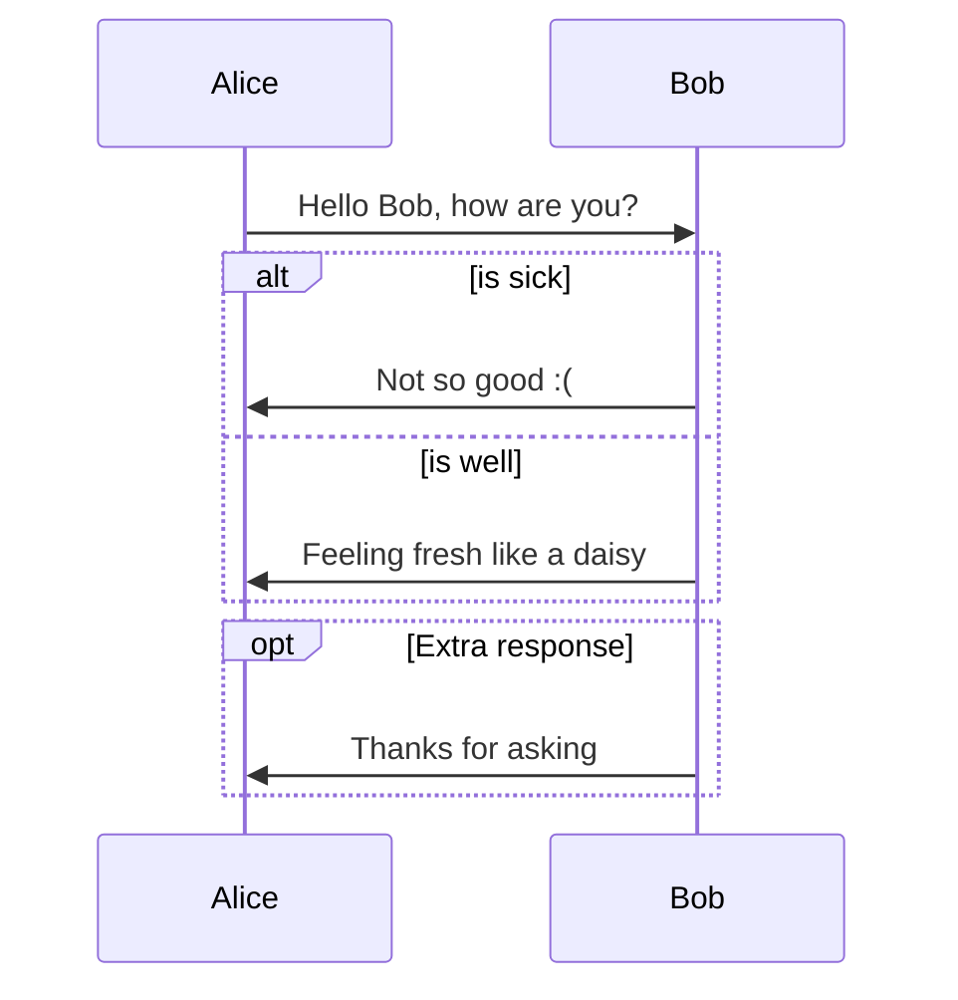

### Loop

```
loop Loop text
... statements ...
end
```

```
sequenceDiagram
    Alice->John: Hello John, how are you?
    loop Every minute
        John-->Alice: Great!
    end
```

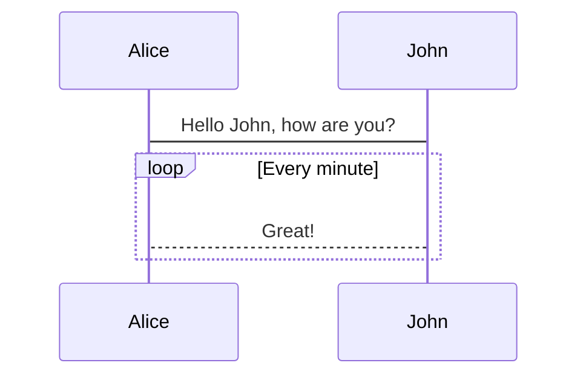

- par

```
par [Action 1]
... statements ...
and [Action 2]
... statements ...
and [Action N]
... statements ...
end
```

**Example**

```
sequenceDiagram
    par Alice to Bob
        Alice->>Bob: Hello guys!
    and Alice to John
        Alice->>John: Hello guys!
    end
    Bob-->>Alice: Hi Alice!
    John-->>Alice: Hi Alice!
```

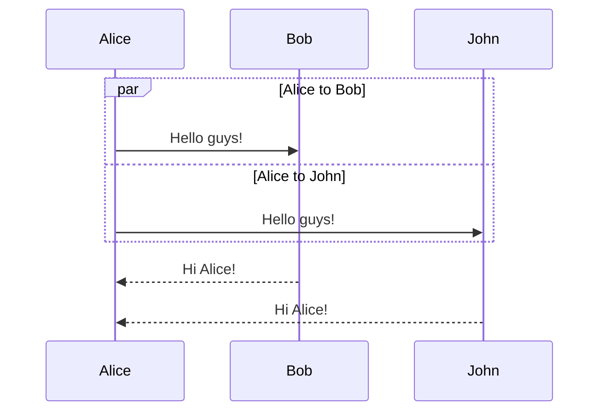

### break

```
break [something happened]
... statements ...
end
```

**Example**

```
sequenceDiagram
    Consumer-->API: Book something
    API-->BookingService: Start booking process
    break when the booking process fails
        API-->Consumer: show failure
    end
    API-->BillingService: Start billing process

```

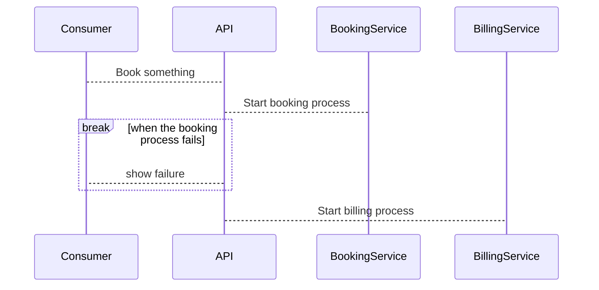

## Background Highlighting

색상의 배경 작업을 설정할 수 있다.

```
rect COLOR
... content ...
end
```

Example

```
sequenceDiagram
    participant Alice
    participant John

    rect rgb(191, 223, 255)
    Alice->>+John: Hello John, how are you?
    Alice->>+John: John, can you hear me?
    John-->>-Alice: Hi Alice, I can hear you!
    John-->>-Alice: I feel great!
```

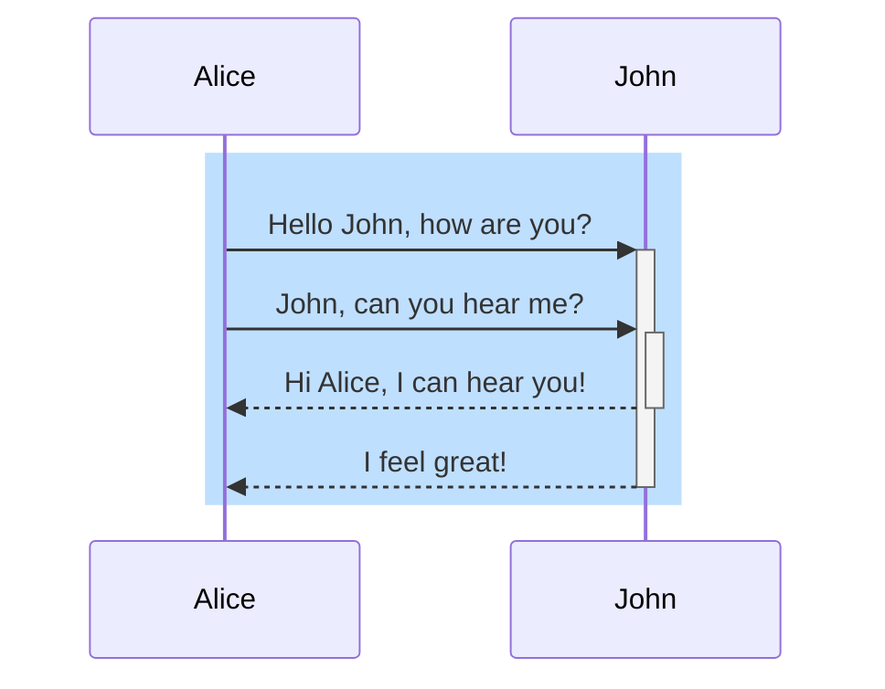

## sequenceNumbers

각 화살표에 시퀸스 번호를 추가할 수 있다.

```
sequenceDiagram
    autonumber
```

**Example**

```
sequenceDiagram
    autonumber
    Alice->>John: Hello John, how are you?
    loop HealthCheck
        John->>John: Fight against hypochondria
    end
    Note right of John: Rational thoughts!
    John-->>Alice: Great!
    John->>Bob: How about you?
    Bob-->>John: Jolly good!
```

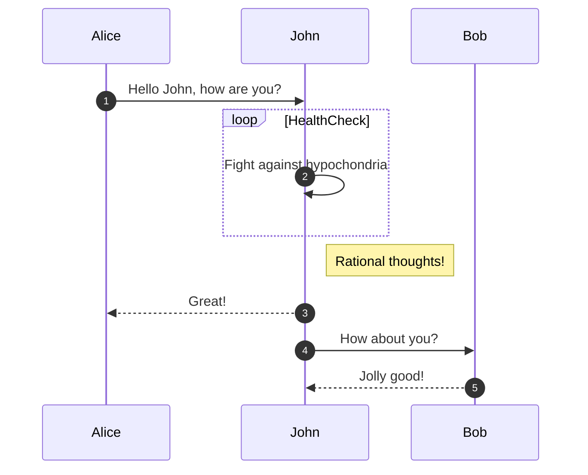

## Actor Menus

Actor에 Link를 추가해서 Drop Down 메뉴를 추가할 수 있다.

```
links <actor>: <json-formatted link-name link-url pairs>
```


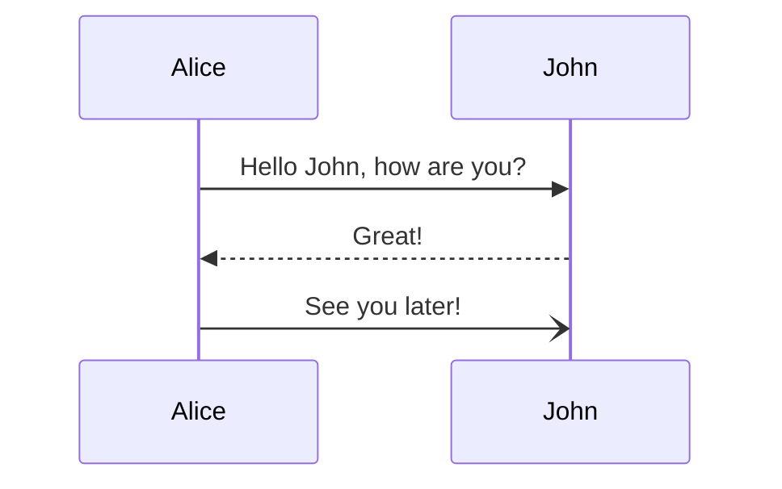


## 참고 문헌

- [https://velog.io/@qhflrnfl4324/Mermaid를-이용한-시퀀스-다이어그램](https://velog.io/@qhflrnfl4324/Mermaid를-이용한-시퀀스-다이어그램)
- [https://mermaid.js.org/syntax/sequenceDiagram.html](https://mermaid.js.org/syntax/sequenceDiagram.html)
- [https://bloodstrawberry.tistory.com/1391](https://bloodstrawberry.tistory.com/1391)