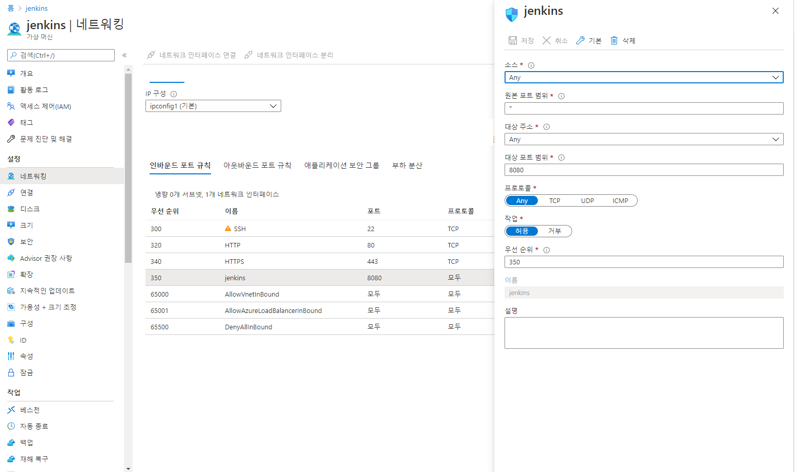
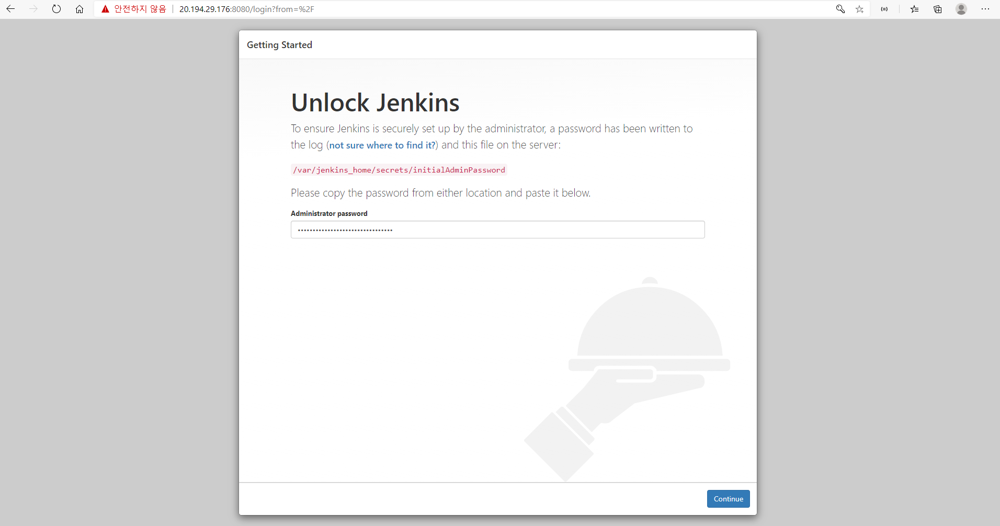
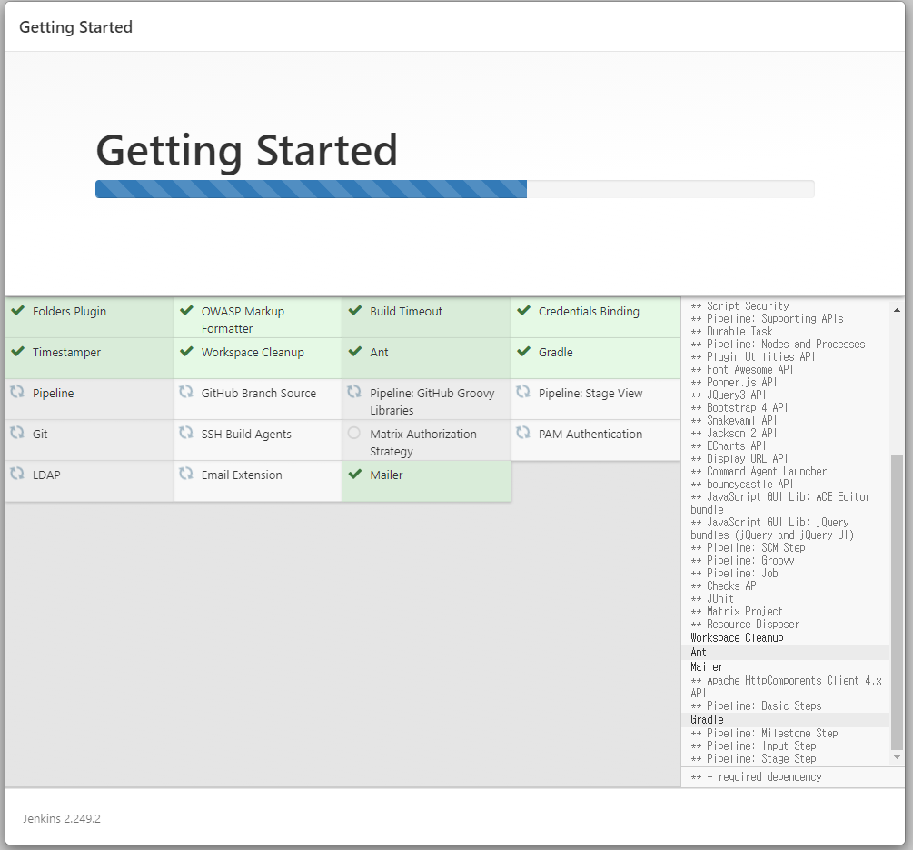
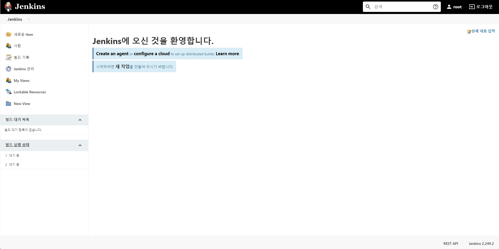
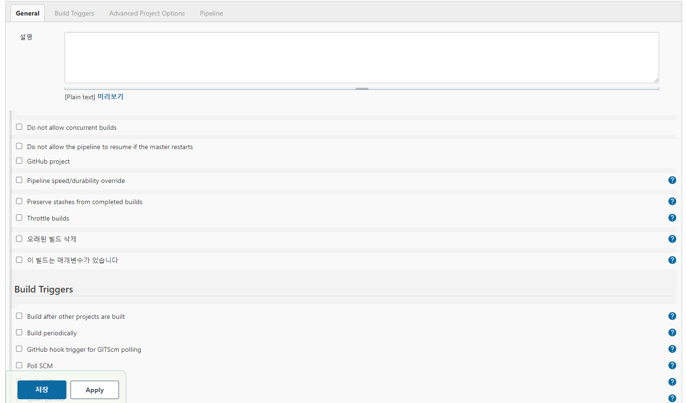
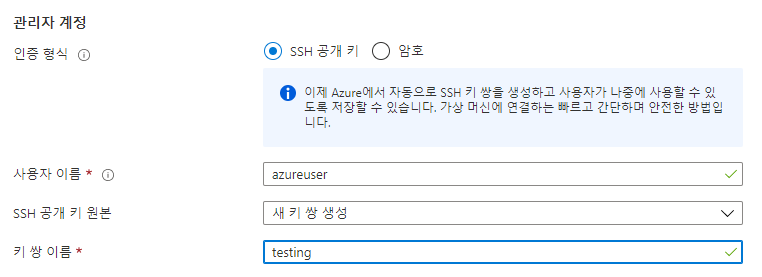
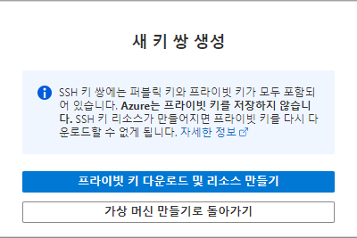
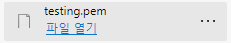

# CI

## 가상머신

### 1. 가상 머신에 Docker 설치

```bash
# 우분투는 apt 패키지 관리자를 사용, 먼저 패키지 목록 업데이트
sudo apt update -y
# 도커CE는 몇가지 패키지에 의존하므로, 아래 4가지 패키지를 설치한다
sudo apt install -y apt-transport-https ca-certificates curl software-properties-common
# 도커 패키지 저장소를 apt에 등록한다. 
curl -fsSL https://download.docker.com/linux/ubuntu/gpg | sudo apt-key add -
sudo add-apt-repository "deb [arch=amd64] https://download.docker.com/linux/ubuntu bionic stable"
# 다시 한 번 apt 패키지 목록을 업데이트
sudo apt update -y
# 도커CE를 설치한다
sudo apt install -y docker-ce
# 도커를 시작한다
sudo systemctl start docker
# 도커 상태 확인
sudo systemctl status docker
# 도커 버전 확인
docker version
```

### 2. docker-compose 설치

```bash
sudo curl -L "https://github.com/docker/compose/releases/download/[최신 버전]/docker-compose-$(uname -s)-$(uname -m)" -o /usr/local/bin/docker-compose
```

내가 할때 기준으로 최신 버전은 1.27.4

- 버전 확인은 https://github.com/docker/compose/releases로 가서 한다.

```bash
sudo curl -L "https://github.com/docker/compose/releases/download/1.27.4/docker-compose-$(uname -s)-$(uname -m)" -o /usr/local/bin/docker-compose
# 도커 컴포즈에 권한을 설정.
sudo chmod +x /usr/local/bin/docker-compose
# 심볼릭 링크 설정 (설정을 안해주면 아래와 같은 path에러 발생)
sudo ln -s /usr/local/bin/docker-compose /usr/bin/docker-compose
# 설치 된 도커컴포즈 버전 확인
docker-compose -version
```


## 우분투

### 1. 우분투 내에 docker 파일 생성
```dockerfile
# dockerfile
FROM jenkins/jenkins:lts
USER root
# 젠킨스 내부에도 Docerk 설치
RUN apt-get update && apt-get install -y make && apt-get autoclean && apt-get clean && apt-get autoremove
RUN apt-get install -y curl
RUN curl -fsSL https://get.docker.com/ | sh
RUN usermod -aG docker jenkins
# jenkins 안에 Dokcer-compose를 최신 버전으로 설치
RUN curl -L "https://github.com/docker/compose/releases/download/1.27.4/docker-compose-$(uname -s)-$(uname -m)" -o /usr/local/bin/docker-compose
RUN chmod +x /usr/local/bin/docker-compose
RUN apt-get update USER jenkinsv
```

### 2. 만들어진 docker 파일을 build 및 실행

   ```bash
# dockerfile
FROM jenkins/jenkins:lts
USER root
# 젠킨스 내부에도 Docerk 설치
ARG DEBIAN_FRONTEND=noninteractive
RUN apt-get update
RUN apt-get install -y --no-install-recommends apt-utils
RUN apt-get install -y make
RUN apt-get autoclean
RUN apt-get clean
RUN apt-get autoremove
RUN apt-get install sudo
RUN apt-get install sshpass
RUN apt-get install -y curl
RUN apt-get -y update
RUN apt-get -y upgrade
# sudo 명령어와 sshpass명령어 설치
RUN curl -fsSL https://get.docker.com/ | sh
RUN usermod -aG docker jenkins
# jenkins 안에 Dokcer-compose를 최신 버전으로 설치
RUN curl -L "https://github.com/docker/compose/releases/download/1.27.4/docker-compose-$(uname -s)-$(uname -m)" -o /usr/local/bin/docker-compose
RUN chmod +x /usr/local/bin/docker-compose
# RUN apt-get update USER jenkinsv
   ```

### 3. Azure 네트워킹 규칙에 가서 8080 port를 열어준다
   

## 젠킨스   

1. 위의 `docker exec myjenkins cat /var/jenkins_home/secrets/initialAdminPassword`을통해 얻은 비밀 번호를 입력하고 들어간다.

   

2. 그리고 `intall sugested plugin` 클릭
   설치가 완료 되는 것을 기다린다.

   

4. 계정을 만들고 next -> next
   이 화면이 나오면 새로운 item을 클릭해서 새로운 pipline항목을 클릭.

   
   
5. 이 화면이 나오면 항복 차례로 체크

   1. `GitHub project`를 해서 원하는 github 주소 입력
   2. `GitHub hook trigger for GITScm polling`
   3. 소 주제 `Pipeline` 안의 `pipline script`를 `pipline script from SCM`으로 변경
      1. `SCM`항목을 `GIT`으로 변경
         1. `Repository URL`을 위에 입력한 URL과 동일하게 입력
         2. `Credentials`을 ADD 
            1. Kind항목에서 `Username with password` 선택
            2. `Username`은 github ID
            3. `password `는 github ID
            4. ID는 크리덴샬 이름이다.
         3. `Branches to build` 는 github내의 빌드되길 원하는 메인 브렌치를 선택(보통 master or main)
      2. `Script Path`는 `Jenkinsfile`을 그대로 둔다

   

6. Github내의 해당 프로젝트의 `setiings`항목의 `Webhooks`를 선택
   1. `Payload URL` : `http://[해당 젠킨스 서버 IP]:8080/github-webhook/
   2. `Secret`은 토큰 쓰면 필요
   3. `Which events would you like to trigger this webhook?`는 `Just the push event.` 클릭


## 간단한 젠킨스 파일

1. github에서 repository를 pull 해온다

2. 해당 repo 안에 jenkinsfile을 생성

   ```Jenkinsfile
   # Jenkinsfile
   pipeline{
       agent any
       stages{
           stage('test echo2'){
               steps{
                   sh 'sh test.sh'
               }
           }
       }
   }
   ```

   그리고 test.sh작성

   ```sh
   #!/bin/bash
   echo "suceess!!"
   ```

3. 그리고 git push 하면 빌드 log에 suceess!!가 뜨는 것을 볼 수가 있다.


# CD

## 새 가상 머신

### 새  가상 머신을 생성

1. 이번엔 SSH 공개키로 생성한다.



2. 그럼 가상머신을 생성 버튼 까지 클릭하면 이런 팝업이 나오는는데

   
   프라이빗 키 다운로드 클릭

   
   개인 키가 pem 형식으로 다운로드 된다.

3. 새로운 가상 머신에 접속

   1. 새로운 폴더 안에 개인 키를 넣는다.
   2. 그 폴더에서 cmd창을 연다.
   3. ```ssh -i [pivatekey].pem [유저명]@[서버 ip]```
   4. 위에 도커 설치를 다시 그대로 따라한다.

### 젠킨스에서

1. `Jenkins 관리` 항목의 `플러그인 관리` 에서 `SSH Agent Plugin`  설치
2. `Jenkins 관리` 항목의 `manage Credentials`에서 키 2개 추가
   1. SSH 키
      - `ssh username with private key` 선택
        - ID : 젠킨스 파일에서 쓸 ID
        - Username : 연결할 서버의 User명(예: auzreuser)
        - Private Key : ` Enter directly` 체크 후, 프라이빗 키 입력 - 키 보는 법 -> 키가 있는 폴더에서 cat명령어
   2. Azure cr 크리덴셜
      - 유저 네임이랑 비밀 번호는 azure cr안에 엑세스 키 탭 안에 있다.


## 젠킨스 파일 작성

```jenkinsfile
pipeline{
    environment{
        SERVERIP = '52.231.76.110'
        SERVERUSER = 'azureuser'
        SERVERSSH = 'azureuser@52.231.76.110'
        // SERVERSSH = '$SERVERUSER@$SERVERIP'
        LOCALIMAGE = 'test:latest'
        AZURECR = '$AZURECR'
    }
    agent any
    stages{
        stage('test build'){
            steps{
                sh 'docker build -t $LOCALIMAGE .'
                sh 'echo $SERVERSSH'
            }
        }
        stage('docker push to azurecr'){
            steps {
                script{
                    // 작성해둔 젠킨스 크리덴셜 ID를 넣는다
                    withCredentials([usernamePassword( credentialsId: 'cwleeazurecr', usernameVariable: 'USER', passwordVariable: 'PASSWORD')]){
                        sh "docker login -u $USER -p $PASSWORD $AZURECR"
                        sh "docker tag $LOCALIMAGE $AZURECR/$LOCALIMAGE"
                        sh "docker push $AZURECR/$LOCALIMAGE"
                    }
                }
            }
        }
        stage('ssh deploy') {
            steps{
                sshagent (credentials: ['SSH_private_key']) {
                    sh 'ssh -o StrictHostKeyChecking=no -l $SERVERUSER $SERVERIP uname -a'
                    script{
                        withCredentials([usernamePassword( credentialsId: 'cwleeazurecr', usernameVariable: 'USER', passwordVariable: 'PASSWORD')]) {
                            sh 'ssh $SERVERSSH "sudo docker login -u $USER -p $PASSWORD $AZURECR"'
                        }
                    }
                    // sh 'ssh $SERVERSSH "cd cicd_test && git pull"'
                    sh 'ssh $SERVERSSH "sudo docker pull $AZURECR/$LOCALIMAGE"'
                    sh 'ssh $SERVERSSH "sudo docker stop test"'
                    sh 'ssh $SERVERSSH "sudo docker run -p 8000:8000 -d --name test --rm $AZURECR/$LOCALIMAGE"'
                    // sh 'ssh $SERVERSSH "cd cicd_test && sudo docker-compose up --build -d"'
                }
            }
        }
    }
}

```


