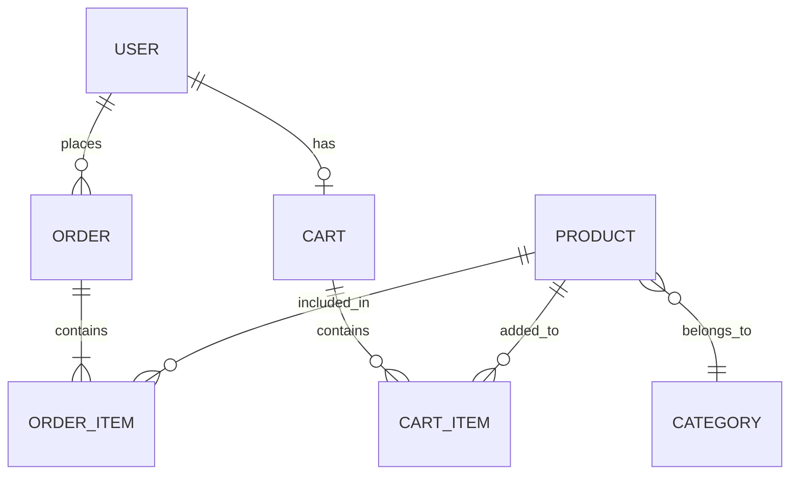
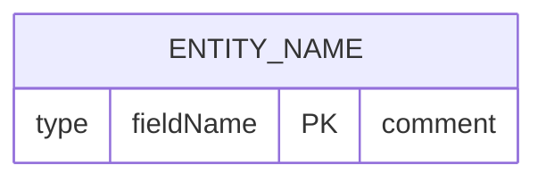
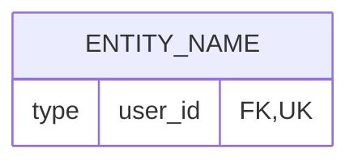
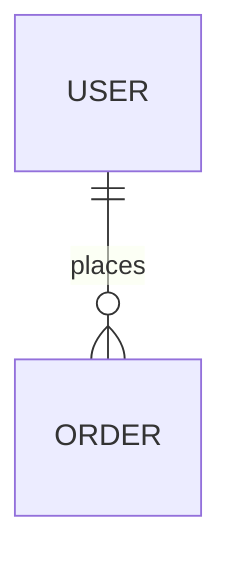
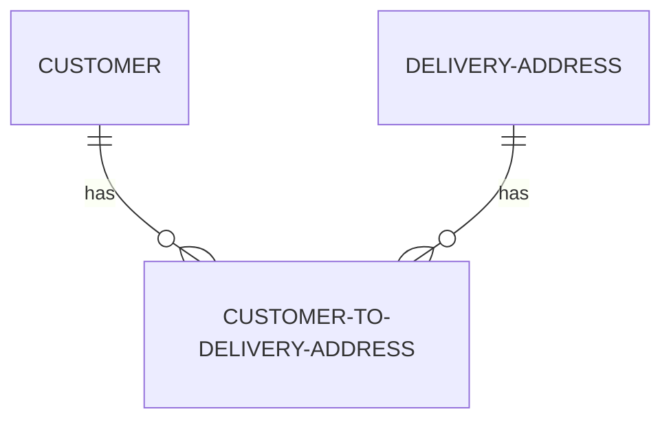
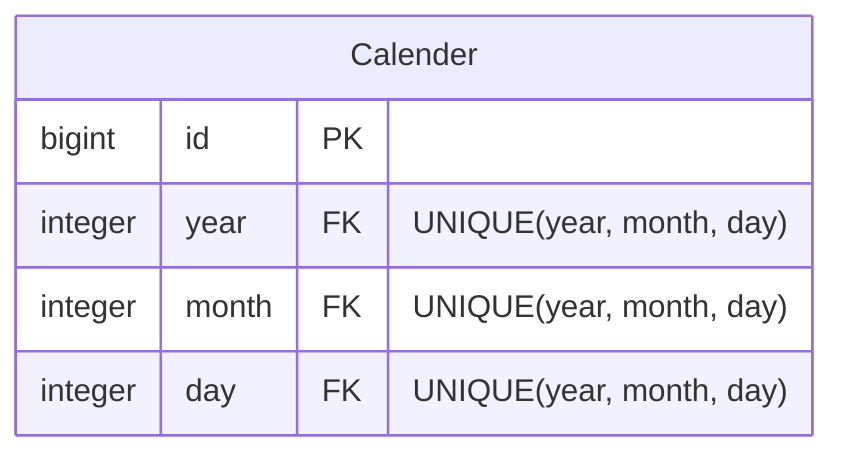

# Er다이어그램

## Er 다이어그램의 관계 기호

### 기본 기호

각 기호가 양 끝의 카디널리티(개수)를 나타내고, 바깥쪽 글자가 최대 개수, 안쪽 글자가 최소 개수를 말한다

| 기호 | 의미 | Nullable |
|------|------|------|
| `\|o` or `o\|` | 0 ~ 1 | NULL |
| `\|\|` | 1 | NOT NULL |
| `}o` or `o{` | 0 ~ n | Null |
| `}\|` or `\|{` | 1 ~ n | Not Null |

> [!NOTE] 읽는 방법, ~ 의 왼쪽 카디널리티의 하한, ~의 오른쪽 카디널리티의 상한
> 0 ~ n -> 해당 카디널리티가 최소 0부터 n(다수)개까지 지정될 수 있다.

### 자주 쓰는 조합

| Mermaid 문법 | 관계 | 예시 | 설명 |
|--------------|------|------|------|
| `A \|\|--\|\| B` | 1 : 1 | User — UserProfile | 1명의 유저는 1개의 프로필을 가진다.|
| `A \|\|--o{ B` | 1 : 0..N | User — Order  | 주문이 없을 수도 있음 |
| `A \|\|--\|{ B` | 1 : 1..N | Product — ProductItem | 상품은 최소 1개의 상품 아이템(SKU)를 가진다.|
| `A }\|--\|{ B` | N : M (양쪽 필수) | User — Authorization | 권한은 여러명의 유저를 가질 수 있지만, 반대도 그러하다. |
| `A }o--o{ B` | N : M (양쪽 선택) | Product — Category | 상품은 카테고리를 가질 수 있지만, 카테고리도 여러 상품을 가질 수 있다. 서로 없을 수도 있다. |
| `A \|\|--o\| B` | 1 : 0..1 | User — PremiumMembership | 유저는 프리미엄 멤버십을 가진 유저와 가지지 못한 유저가 있을 수 있다. |

### 선의 종류

- `--` **실선**: Identifying relationship (식별 관계). 자식이 부모 없이는 존재할 수 없다. ProductItem은 Product없이 존재할 수 없다.
- `..` **점선**: Non-identifying relationship (비식별 관계). 독립적으로 존재 가능


#### 선의 종류에 따른 관계

| 관계 | 카디널리티 | 선 | 핵심 비즈니스 규칙 |
|------|-----------|-----|-------------------|
| `CUSTOMER — ORDER` | 1 : 0..N | 실선 | 주문 없는 고객 OK, 고객 없는 주문 NG |
| `ORDER — LINE-ITEM` | 1 : 1..N | 실선 | 빈 주문 NG, 항목 없는 주문 생성 불가 |
| `CUSTOMER — DELIVERY-ADDRESS` | 1..N : 1..N | 점선 | N:M 공유 가능, 양쪽 독립 존재 가능 |

### 예제



## Attributes

### 기본 문법


> [!NOTE] 타입 -> 필드명 -> 키(선택) -> 코멘트(선택)

- 데이터 타입은 타입 표기에 제한이 없이 때문에 사실상 모든 문자열이 가능하다
  - 타입이 숫자로 시작하면 에러가 난다
  - 버전에 따라 type에 `()`를 쓰면 에러가 나는 경우가 있으니 `varchar(255)` 대신 `varchar_255` 같은 형태로 쓰는게 안전하다.


### Constraint

| 키워드 | 의미 |
|--------|------|
| PK | Primary Key, 기본 키 |
| FK | Foreign Key, 외래 키 |
| UK | Unique Key, 고유 키  |

- 아래와 같이 2키를 동시에도 사용 가능하다



### 작성 Tip

**코멘트는 큰따옴표로 표시한다.**
```
bigint user_id FK "USER 참조"   // OK
bigint user_id FK 'USER 참조'   // Error
```

**필드명에 공백 불가**
```
varchar first_name              // OK
varchar "first name"            // Error
```

**빈 엔티티도 가능**



```
erDiagram
    USER {}
    USER ||--o{ ORDER : "places"
```
위에서 사용한것 처럼 내부 내용은 구현하지 않고, 관계도만 작성해도 된다.


### 추천 작성 순서
1. PK(기본키)
2. FK(외래키) : 어떤 엔티티를 참조하는지 코멘트로 명시
3. 비즈니스 필드 (이름, 금액, 상태 등)
4. 상태 플래그 (is_active, is_deleted)
5. 타임스탬프 (created_at, updated_at)

즉, 중요도에 따라 적는걸 추천한다.


## 참고 사항


### 자기 참조 관계


```
erDiagram
    CATEGORY ||--o{ CATEGORY : "parent_of"
```

### N:M 관계

N:M 관계도 무조건 풀어서 작성한다.
개념적으로는 직접 잇는것도 맞지만, 실제 DB에는 중간 테이블이 들어가니 ERD에서도 풀어서 그린다.
만약, 중간 테이블에도 데이터가 들어가면 추가할 수도 있다.



```
erDiagram
CUSTOMER ||--o{ CUSTOMER-TO-DELIVERY-ADDRESS : "has"
DELIVERY-ADDRESS  ||--o{ CUSTOMER-TO-DELIVERY-ADDRESS : "has"
```

### 복합 키 표현



복합키를 나타내는 문법이 없기 때문에, 그냥 comment에 명시하는게 좋다.