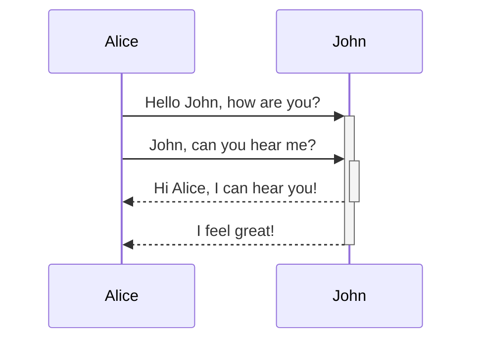
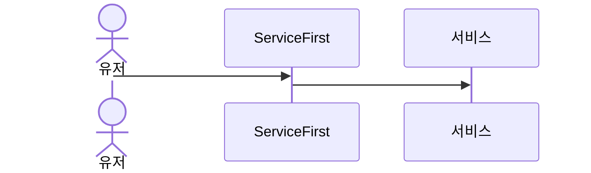
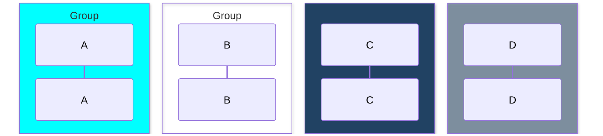
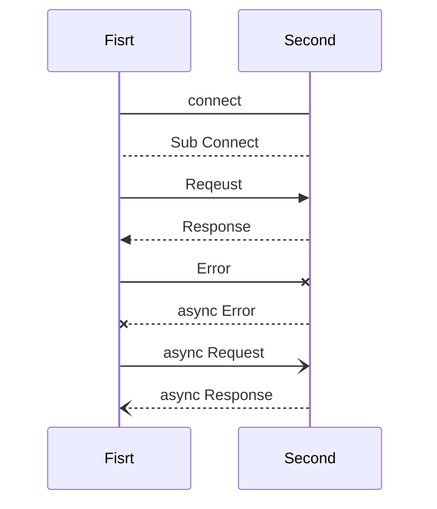

# Mermaid 문법

## Mermaid란?

> Mermaid은 텍스트 기반으로 다이어그램을 생성할 수 있는 오픈소스 문법
> 주로 Markdown 문서에서 시각적인 다이어그램을 코드처럼 작성할 때 사용됩니다.

요약하자면 다이어그램을 텍스트로 생성하는 문법이라는는 뜻이다.


## Sequence Diagram

### 기본구조

```
sequenceDiagram
    Alice->>+John: Hello John, how are you?
    Alice->>+John: John, can you hear me?
    John-->>-Alice: Hi Alice, I can hear you!
    John-->>-Alice: I feel great!
```




### Participant / Actor

해당 다이어그램의 참여자를 뜻하는 뜻이다.

시퀸스 다이어그램에서 객체들을 뜻하는 것이다.

| Type        | Description                     |
| ----------- | ------------------------------- |
| participant | Name을 가진 객체를 생성한다.    |
| actor       | 유저 즉, 사용자를 나타내는 표기 |

```
sequenceDiagram
		actor User as 유저
		participant ServiceFirst
		participant KrSevice as 서비스
		
		User->>ServiceFirst:
		ServiceFirst->>KrSevice:
```



### Grouping / Box

| Type               | Description             |
| ------------------ | ----------------------- |
| box [color] [Name] | 색깔과 이름을 가진 그룹 |

```
sequenceDiagram
  box Aqua Group
		participant A
  end
  box Group
  	participant B
  end
  box rgb(33,66,99)
  	participant C
  end
  box rgba(33,66,99,0.5)
	  participant D
  end
```




### Message

각 객체들 끼리 요청을 나타내는 화살표

| Type | Description                   | purpose                     |
| ---- | ----------------------------- | --------------------------- |
| ->   | 실선                          | 단순 연결                   |
| -->  | 점선                          | 보조적인 흐름, 서브프로세스 |
| ->>  | 화살표가 있는 실선            | 요청                        |
| -->> | 화살표가 있는 점선            | 응답, 결과 반환             |
| -x   | 화살표 끝이 X로 표시되는 실선 | 에러 응답                   |
| --x  | 화살표 끝이 X로 표시되는 점선 | 비동기 에러 응답            |
| -)   | 화살표 끝이 열린 실선         | 비동기 요청                 |
| --)  | 화살표 끝이 열린 점선         | 비동기 응답                 |




### Controll

| Operator   | Description                                                  |
| ---------- | ------------------------------------------------------------ |
| `alt`      | switch or if else 문, 조건에 만족하는 경로를 선택한다.       |
| `opt`      | else가 없는 if문, 조건을 만족하면 실행된다.                  |
| `loop`     | 메시지 반복 여부를 나타낸다.                                 |
| `par`      | 병렬적으로 실행되는 메시지를 나타낸다.                       |
| `break`    | 조건을 만족하면 Box를 빠져나간다. Box가 없다면 시나리오가 종료된다. |
| `critical` | 상호 배제를 보장하는 임계 영역을 정의한다. (atomic)          |


## 참고 문헌

- [https://velog.io/@qhflrnfl4324/Mermaid를-이용한-시퀀스-다이어그램](https://velog.io/@qhflrnfl4324/Mermaid를-이용한-시퀀스-다이어그램)
- [https://mermaid.js.org/syntax/sequenceDiagram.html](https://mermaid.js.org/syntax/sequenceDiagram.html)
- [https://bloodstrawberry.tistory.com/1391](https://bloodstrawberry.tistory.com/1391)