------

## 2. 흐름도 (Flowchart)

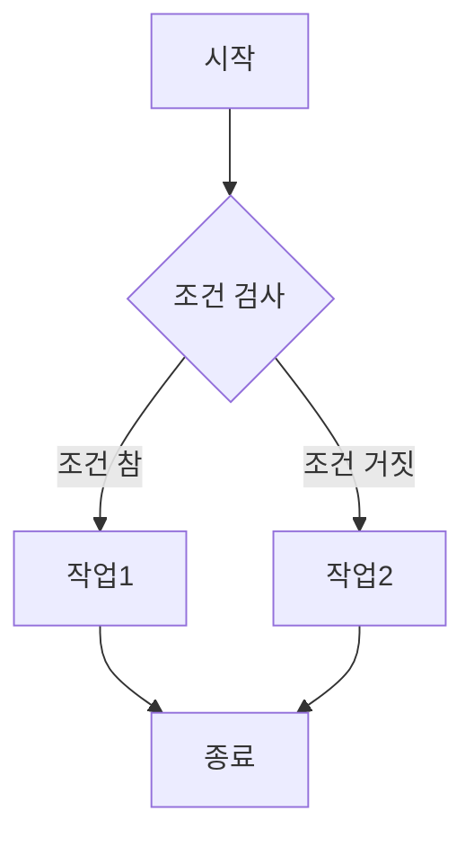
```mermaid
flowchart TD
    A[시작] --> B{조건 검사}
    B -->|조건 참| C[작업1]
    B -->|조건 거짓| D[작업2]
    C --> E[종료]
    D --> E
```

- `TD`: 위에서 아래(Top Down)
- `LR`: 왼쪽에서 오른쪽(Left → Right)
- 노드 모양
  - `[텍스트]` → 네모
  - `(텍스트)` → 동그라미
  - `{텍스트}` → 마름모(조건)

------

## 3. 시퀀스 다이어그램 (Sequence Diagram)

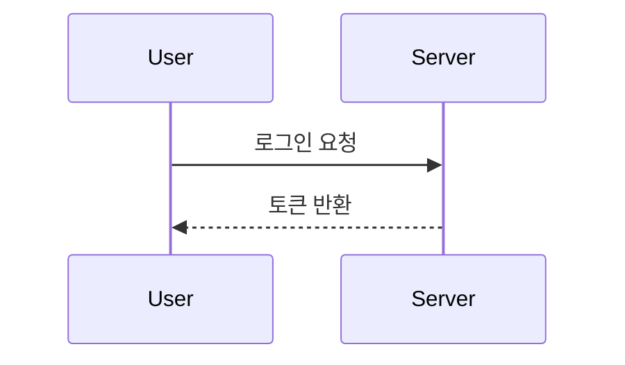
```mermaid
sequenceDiagram
    participant User
    participant Server
    User->>Server: 로그인 요청
    Server-->>User: 토큰 반환
```

- `->>` : 동기 호출
- `-->>` : 응답
- `participant` : 객체/주체 정의

------

## 4. 클래스 다이어그램 (Class Diagram)

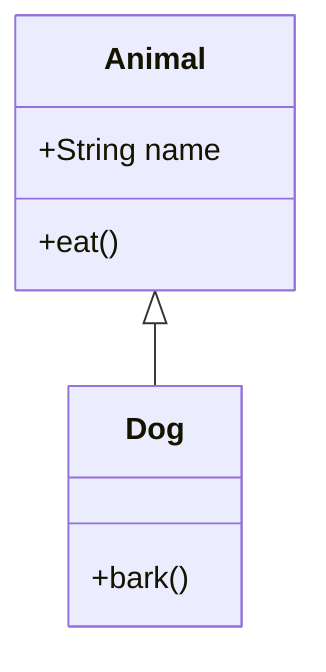
```mermaid
classDiagram
    class Animal {
      +String name
      +eat()
    }
    class Dog {
      +bark()
    }
    Animal <|-- Dog
```

- `<|--` : 상속 관계
- `+` : public
- `-` : private

------

## 5. 상태 다이어그램 (State Diagram)

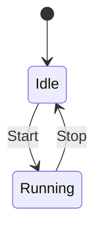
```mermaid
stateDiagram-v2
    [*] --> Idle
    Idle --> Running : Start
    Running --> Idle : Stop
```

- `[*]` : 시작/종료 상태
- `-->` : 상태 전이

------

## 6. 간트 차트 (Gantt Chart)

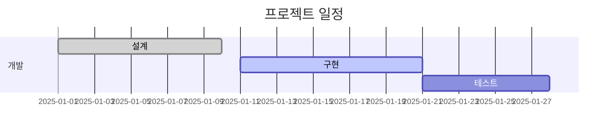
```mermaid
gantt
    title 프로젝트 일정
    dateFormat  YYYY-MM-DD
    section 개발
    설계           :done,    des1, 2025-01-01,2025-01-10
    구현           :active,  dev1, 2025-01-11, 10d
    테스트         :         test1, after dev1, 7d
```

- `done`, `active` → 상태 표시
- `10d` → 기간(10일)
- `after dev1` → 선행 작업 이후 시작

## 1. **Flowchart (흐름도)**

사용자 로그인 처리 로직 예시:

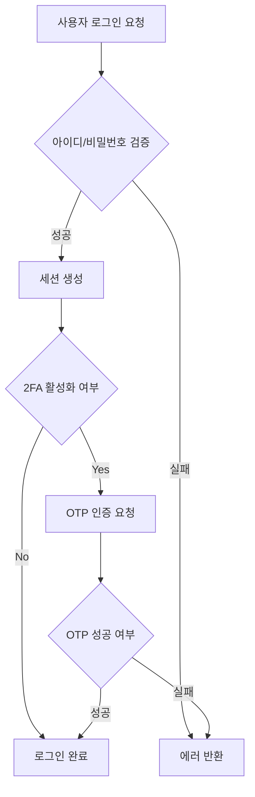
```mermaid
flowchart TD
    A[사용자 로그인 요청] --> B{아이디/비밀번호 검증}
    B -->|성공| C[세션 생성]
    B -->|실패| D[에러 반환]
    C --> E{2FA 활성화 여부}
    E -->|Yes| F[OTP 인증 요청]
    E -->|No| G[로그인 완료]
    F --> H{OTP 성공 여부}
    H -->|성공| G
    H -->|실패| D
```

------

## 2. **Sequence Diagram (시퀀스 다이어그램)**

클라이언트 ↔ 서버 ↔ DB의 요청-응답 흐름:

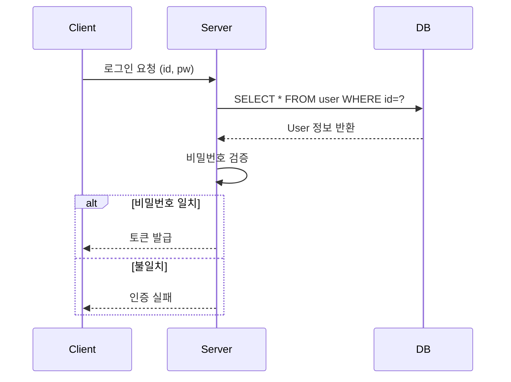
```mermaid
sequenceDiagram
    participant Client
    participant Server
    participant DB

    Client->>Server: 로그인 요청 (id, pw)
    Server->>DB: SELECT * FROM user WHERE id=?
    DB-->>Server: User 정보 반환
    Server->>Server: 비밀번호 검증
    alt 비밀번호 일치
        Server-->>Client: 토큰 발급
    else 불일치
        Server-->>Client: 인증 실패
    end
```

------

## 3. **Class Diagram (클래스 다이어그램)**

Spring 프로젝트에서 흔히 볼 수 있는 구조 예시:

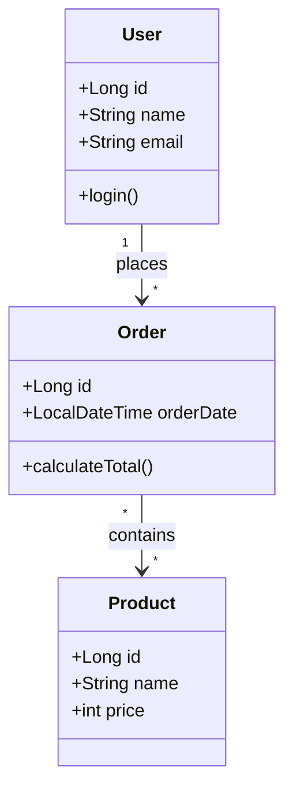
```mermaid
classDiagram
    class User {
        +Long id
        +String name
        +String email
        +login()
    }

    class Order {
        +Long id
        +LocalDateTime orderDate
        +calculateTotal()
    }

    class Product {
        +Long id
        +String name
        +int price
    }

    User "1" --> "*" Order : places
    Order "*" --> "*" Product : contains
```

------

## 4. **State Diagram (상태 다이어그램)**

상품 주문 상태 예시:

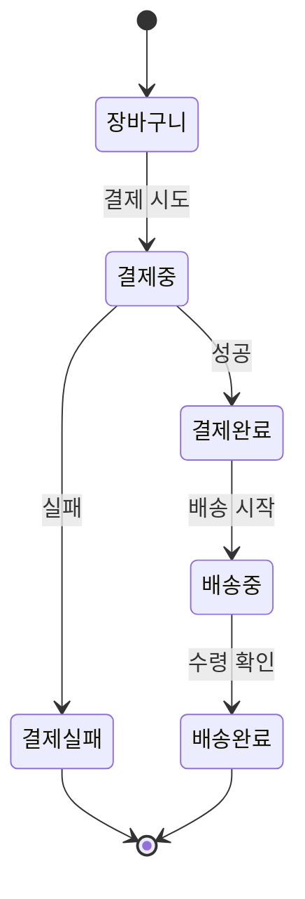
```mermaid
stateDiagram-v2
    [*] --> 장바구니
    장바구니 --> 결제중 : 결제 시도
    결제중 --> 결제완료 : 성공
    결제중 --> 결제실패 : 실패
    결제완료 --> 배송중 : 배송 시작
    배송중 --> 배송완료 : 수령 확인
    결제실패 --> [*]
    배송완료 --> [*]
```

------

## 5. **Gantt Chart (간트 차트)**

프로젝트 일정 관리 예시:

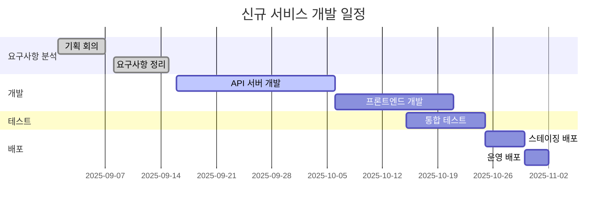
```mermaid
gantt
    title 신규 서비스 개발 일정
    dateFormat  YYYY-MM-DD
    section 요구사항 분석
    기획 회의         :done,    a1, 2025-09-01,2025-09-07
    요구사항 정리     :done,    a2, 2025-09-08,2025-09-15
    section 개발
    API 서버 개발     :active,  b1, 2025-09-16, 20d
    프론트엔드 개발   :         b2, after b1, 15d
    section 테스트
    통합 테스트       :         c1, 2025-10-15, 10d
    section 배포
    스테이징 배포     :         d1, after c1, 5d
    운영 배포         :         d2, after d1, 3d
```

------

## 6. **ERD 비슷하게 (Flowchart 응용)**

DB 테이블 관계를 Mermaid로 표현:

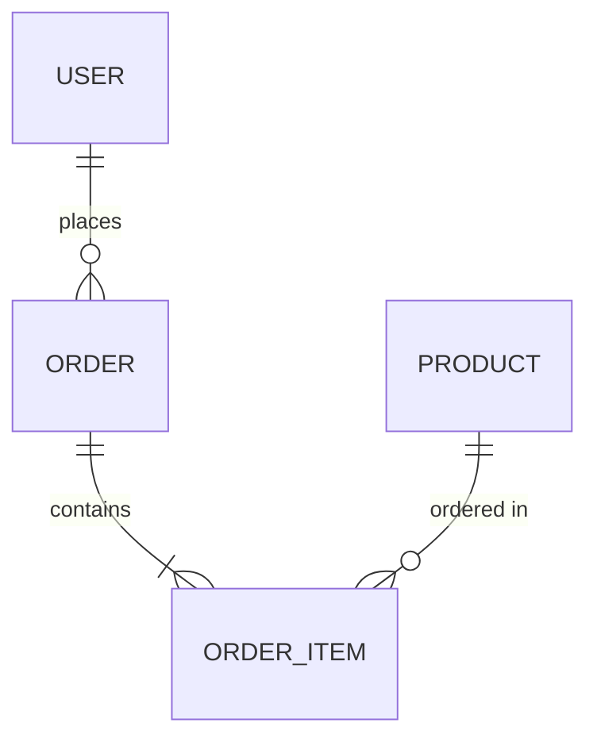
```mermaid
erDiagram
    USER ||--o{ ORDER : places
    ORDER ||--|{ ORDER_ITEM : contains
    PRODUCT ||--o{ ORDER_ITEM : "ordered in"
```

------

------

## 1. 기본 아키텍처 예시 (웹 서비스)

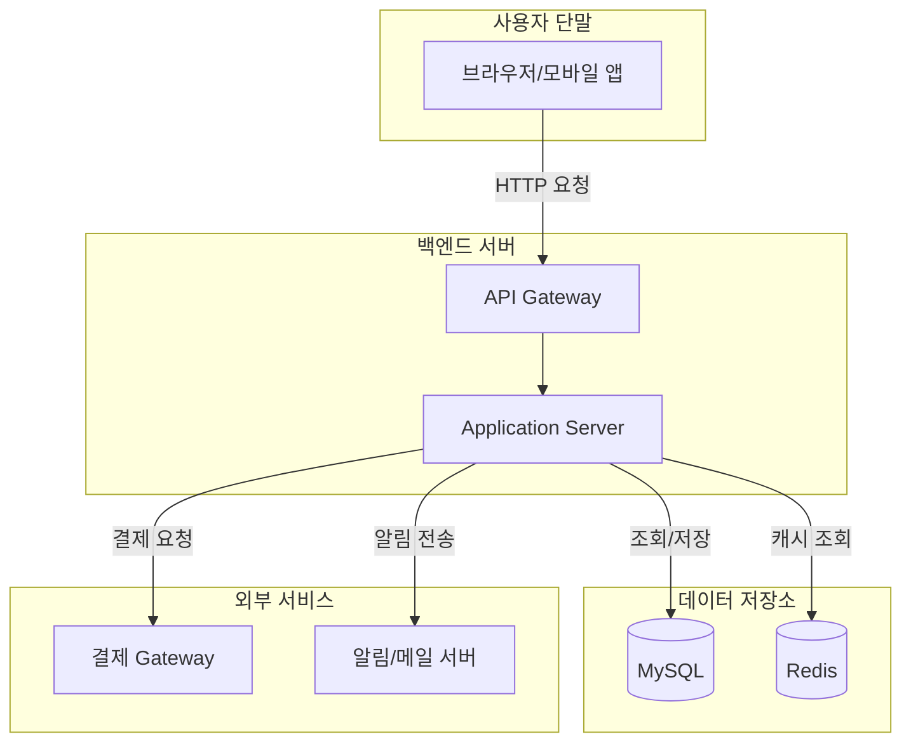
```mermaid
flowchart TD
    subgraph Client["사용자 단말"]
        A[브라우저/모바일 앱]
    end

    subgraph Backend["백엔드 서버"]
        B[API Gateway]
        C[Application Server]
    end

    subgraph Data["데이터 저장소"]
        D[(MySQL)]
        E[(Redis)]
    end

    subgraph External["외부 서비스"]
        F[결제 Gateway]
        G[알림/메일 서버]
    end

    A -->|HTTP 요청| B --> C
    C -->|조회/저장| D
    C -->|캐시 조회| E
    C -->|결제 요청| F
    C -->|알림 전송| G
```

------

## 2. MSA 구조 예시 (Microservices)

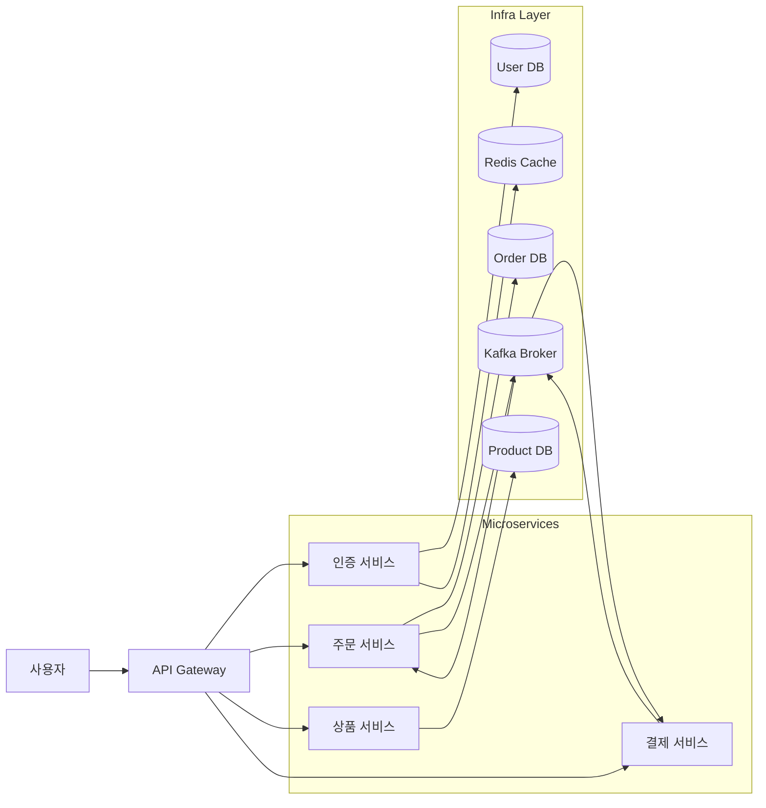
```mermaid
flowchart LR
    Client[사용자] --> API[API Gateway]

    subgraph Service["Microservices"]
        Auth[인증 서비스]
        Order[주문 서비스]
        Product[상품 서비스]
        Payment[결제 서비스]
    end

    subgraph Infra["Infra Layer"]
        DB1[(User DB)]
        DB2[(Order DB)]
        DB3[(Product DB)]
        Redis[(Redis Cache)]
        Kafka[(Kafka Broker)]
    end

    API --> Auth
    API --> Order
    API --> Product
    API --> Payment

    Auth --> DB1
    Order --> DB2
    Product --> DB3
    Order --> Kafka
    Payment --> Kafka
    Kafka --> Order
    Kafka --> Payment
    Auth --> Redis
```

------

## 3. 이벤트 기반 아키텍처 (Kafka 활용)

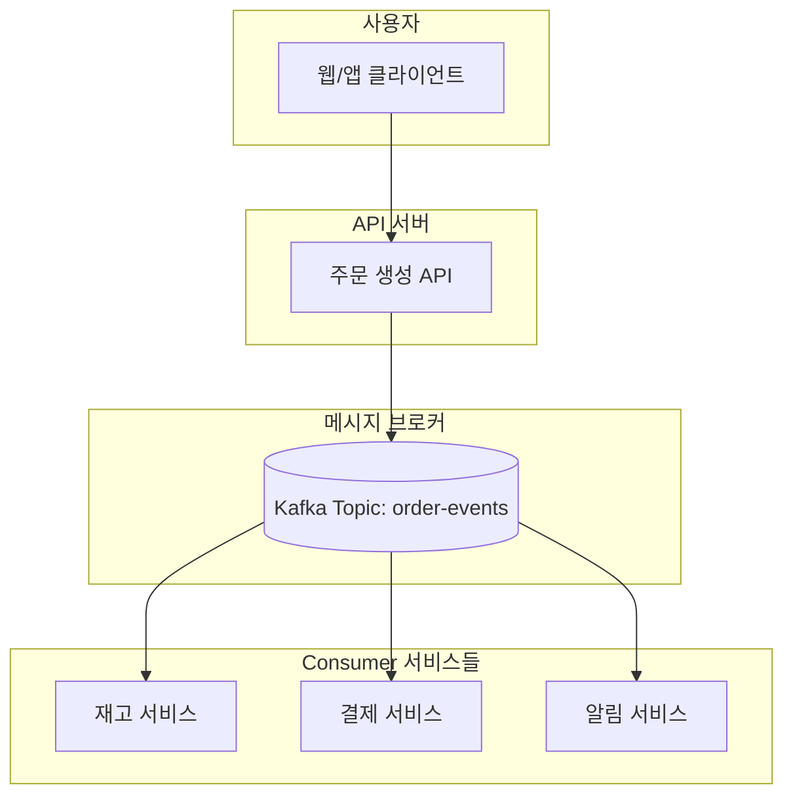
```mermaid
flowchart TD
    subgraph User["사용자"]
        U[웹/앱 클라이언트]
    end

    subgraph API["API 서버"]
        A[주문 생성 API]
    end

    subgraph MQ["메시지 브로커"]
        K[(Kafka Topic: order-events)]
    end

    subgraph Consumers["Consumer 서비스들"]
        I[재고 서비스]
        P[결제 서비스]
        N[알림 서비스]
    end

    U --> A --> K
    K --> I
    K --> P
    K --> N
```

------

## 4. 배포 구조 예시 (Kubernetes)

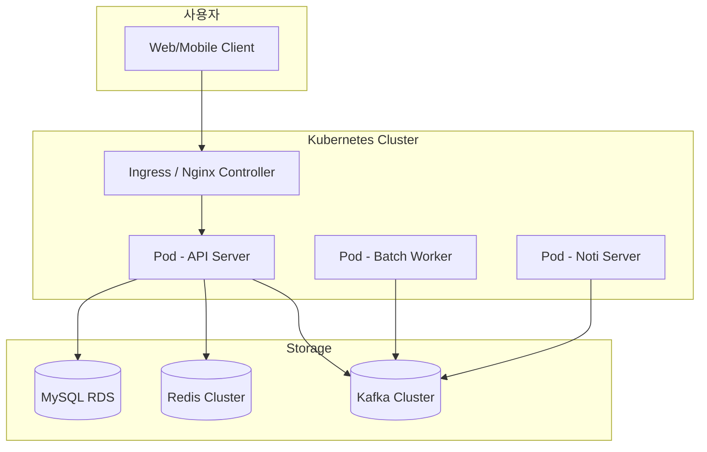
```mermaid
flowchart TB
    subgraph User["사용자"]
        U[Web/Mobile Client]
    end

    subgraph K8S["Kubernetes Cluster"]
        LB[Ingress / Nginx Controller]
        POD1[Pod - API Server]
        POD2[Pod - Batch Worker]
        POD3[Pod - Noti Server]
    end

    subgraph Storage["Storage"]
        DB[(MySQL RDS)]
        Cache[(Redis Cluster)]
        MQ[(Kafka Cluster)]
    end

    U --> LB --> POD1
    POD1 --> DB
    POD1 --> Cache
    POD1 --> MQ
    POD2 --> MQ
    POD3 --> MQ
```

------

# 포트폴리오 다이어그램 예시 (Flowchart & Sequence)

아래 4개는 바로 포트폴리오에 넣을 수 있도록 구성한 **Mermaid 다이어그램 원본**입니다.

------

## 1) 광고 참여 API – FlowChart (캐시·DB·페이징)

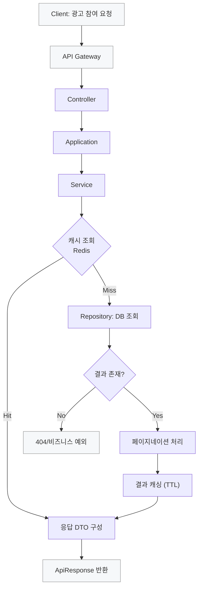
```mermaid
flowchart TD
    A[Client: 광고 참여 요청] --> B[API Gateway]
    B --> C[Controller]
    C --> D[Application]
    D --> E[Service]
    E --> F{캐시 조회\nRedis}
    F -- Hit --> G[응답 DTO 구성]
    G --> H[ApiResponse 반환]

    F -- Miss --> I[Repository: DB 조회]
    I --> J{결과 존재?}
    J -- No --> X[404/비즈니스 예외]
    J -- Yes --> K[페이지네이션 처리]
    K --> L["결과 캐싱 (TTL)"]
    L --> G

    classDef io fill:#f6f8fa,stroke:#999;
    class A,B,H,X io;
```

**설명 포인트**

- 캐시 미스 시 DB 조회 후 페이지네이션·캐싱 적용.
- Cache Key: `advert:{campaignId}:{page}:{filters}` 형태 예시.
- TTL과 캐시 무효화는 배치/이벤트로 갱신.

------

## 2) 광고 참여 API – Sequence Diagram (레이어 상호작용)

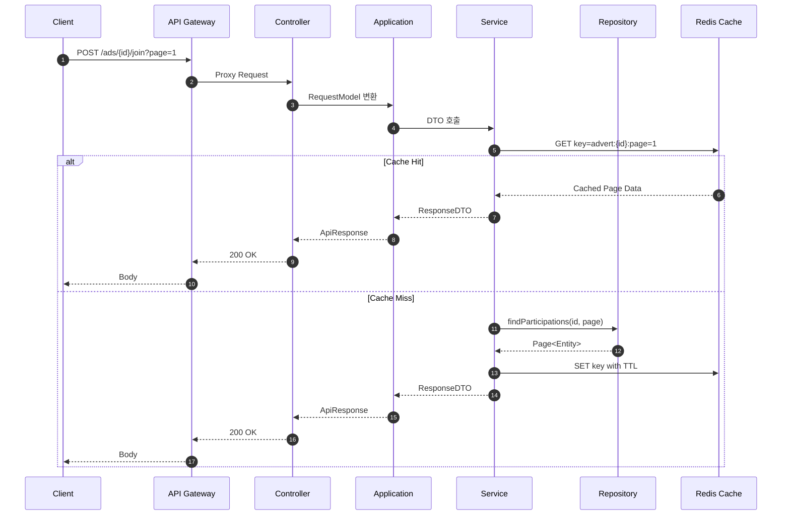
```mermaid
sequenceDiagram
    autonumber
    participant Client
    participant Gateway as API Gateway
    participant C as Controller
    participant A as Application
    participant S as Service
    participant R as Repository
    participant Cache as Redis Cache

    Client->>Gateway: POST /ads/{id}/join?page=1
    Gateway->>C: Proxy Request
    C->>A: RequestModel 변환
    A->>S: DTO 호출
    S->>Cache: GET key=advert:{id}:page=1
    alt Cache Hit
        Cache-->>S: Cached Page Data
        S-->>A: ResponseDTO
        A-->>C: ApiResponse
        C-->>Gateway: 200 OK
        Gateway-->>Client: Body
    else Cache Miss
        S->>R: findParticipations(id, page)
        R-->>S: Page<Entity>
        S->>Cache: SET key with TTL
        S-->>A: ResponseDTO
        A-->>C: ApiResponse
        C-->>Gateway: 200 OK
        Gateway-->>Client: Body
    end
```

**설명 포인트**

- 레이어드 구조와 캐시 히트/미스 분기, 반환 경로 명확화.

------

## 3) 재고 처리 – FlowChart (분산락·롤백·이벤트)

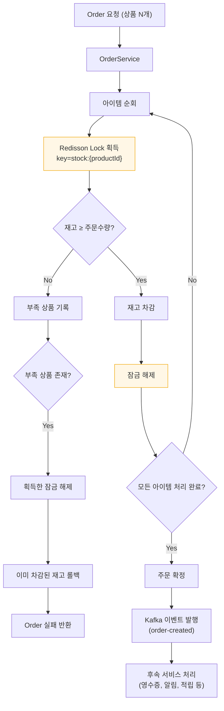
```mermaid
flowchart TD
    A["Order 요청 (상품 N개)"] --> B[OrderService]
    B --> C[아이템 순회]
    C --> D["Redisson Lock 획득<br>key=stock:{productId}"]
    D --> E{재고 ≥ 주문수량?}
    E -- No --> F[부족 상품 기록]
    F --> G{부족 상품 존재?}
    G -- Yes --> H[획득한 잠금 해제]
    H --> I[이미 차감된 재고 롤백]
    I --> J[Order 실패 반환]

    E -- Yes --> K[재고 차감]
    K --> L[잠금 해제]
    L --> M{모든 아이템 처리 완료?}
    M -- No --> C
    M -- Yes --> N[주문 확정]
    N --> O["Kafka 이벤트 발행<br>(order-created)"]
    O --> P["후속 서비스 처리<br>(영수증, 알림, 적립 등)"]

    classDef lock fill:#fff7e6,stroke:#f0a500;
    class D,L lock;
```

**설명 포인트**

- **아이템 단위 잠금**으로 경합 최소화.
- 실패 시 **차감분 롤백** 후 전체 실패 처리.
- 확정 후 이벤트 발행으로 **사후 처리 비동기화**.

------

## 4) 재고 처리 – Sequence Diagram (분산 환경 상호작용)

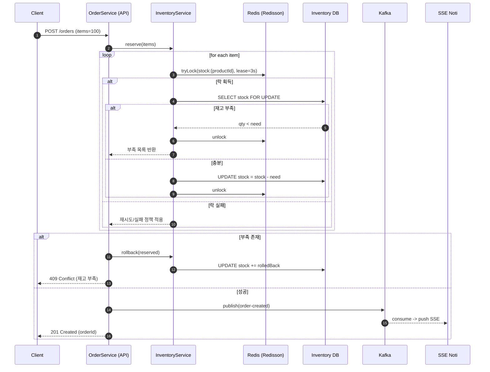
```mermaid
sequenceDiagram
    autonumber
    participant Client
    participant OS as OrderService (API)
    participant IS as InventoryService
    participant R as Redis (Redisson)
    participant DB as Inventory DB
    participant K as Kafka
    participant NS as SSE Noti

    Client->>OS: POST /orders (items=100)
    OS->>IS: reserve(items)
    loop for each item
        IS->>R: tryLock(stock:{productId}, lease=3s)
        alt 락 획득
            IS->>DB: SELECT stock FOR UPDATE
            alt 재고 부족
                DB-->>IS: qty < need
                IS->>R: unlock
                IS-->>OS: 부족 목록 반환
            else 충분
                IS->>DB: UPDATE stock = stock - need
                IS->>R: unlock
            end
        else 락 실패
            IS-->>OS: 재시도/실패 정책 적용
        end
    end
    alt 부족 존재
        OS->>IS: rollback(reserved)
        IS->>DB: UPDATE stock += rolledBack
        OS-->>Client: 409 Conflict (재고 부족)
    else 성공
        OS->>K: publish(order-created)
        K-->>NS: consume -> push SSE
        OS-->>Client: 201 Created (orderId)
    end
```

**설명 포인트**

- `tryLock` + 짧은 lease로 데드락/유지 비용 완화, **타임아웃/재시도 정책** 명시.
- 실패 시 롤백 트랜잭션 분리·보상 처리.
- 이벤트 발행 후 사후 파이프라인으로 확장.

------

### 포트폴리오에 넣는 팁

- 각 다이어그램 위에 **요약 2~3줄**·**핵심 키워드**(캐시, 페이징, 분산락, 보상 트랜잭션, 이벤트 기반)를 적어 가독성 강화.
- 실 서비스명/지표(예: TTL=5m, P95 120ms→65ms, 동시성 50rps→400rps)를 함께 표기하면 임팩트 상승.

------

# 1) 구매: FlowChart

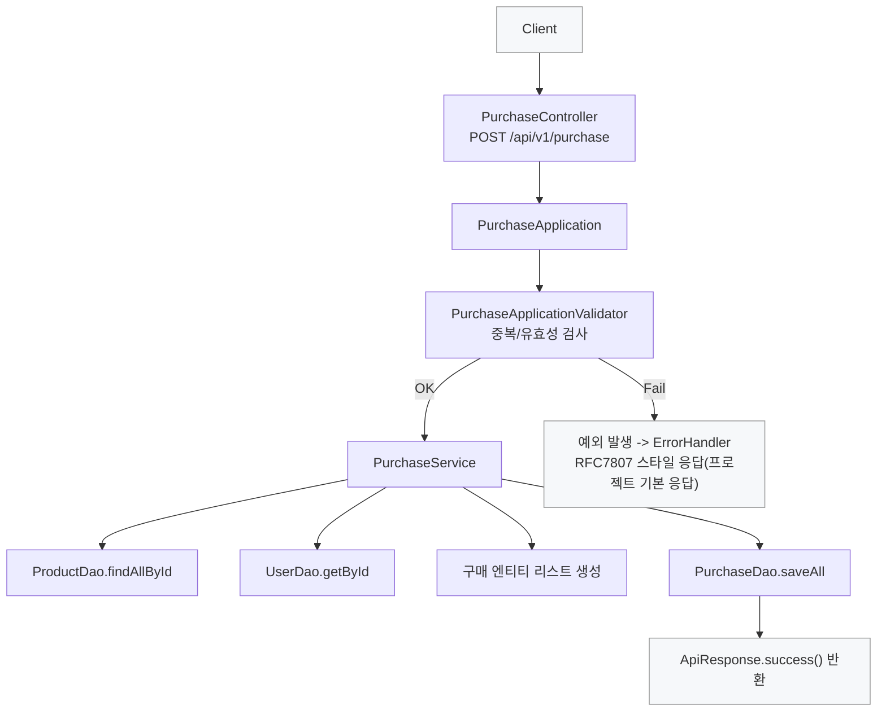
```mermaid
flowchart TD
    A["Client"] --> B["PurchaseController<br>POST /api/v1/purchase"]
    B --> C["PurchaseApplication"]
    C --> V["PurchaseApplicationValidator<br>중복/유효성 검사"]
    V -->|OK| D["PurchaseService"]
    V -->|Fail| X["예외 발생 -> ErrorHandler<br>RFC7807 스타일 응답(프로젝트 기본 응답)"]

    D --> PDAO["ProductDao.findAllById"]
    D --> UDAO["UserDao.getById"]
    D --> MK["구매 엔티티 리스트 생성"]
    D --> PR["PurchaseDao.saveAll"]

    PR --> R["ApiResponse.success() 반환"]

    classDef io fill:#f6f8fa,stroke:#999;
    class A,R,X io;
```

------

# 2) 구매: Sequence Diagram

```mermaid
sequenceDiagram
    autonumber
    participant Client
    participant C as "PurchaseController"
    participant A as "PurchaseApplication"
    participant V as "PurchaseApplicationValidator"
    participant S as "PurchaseService"
    participant PD as "ProductDao"
    participant UD as "UserDao"
    participant P as "PurchaseDao"

    Client->>C: POST /api/v1/purchase (body: userId, productIds)
    C->>A: purchaseProduct(request)
    A->>V: validatePurchaseProductDuplicateOrThrow(request)
    V-->>A: OK
    A->>S: purchaseProduct(request.toDto())

    S->>PD: findAllById(productIds)
    PD-->>S: List<Product>
    S->>UD: getById(userId)
    UD-->>S: User
    S->>S: Purchase.of(...) 리스트 생성
    S->>P: saveAll(purchases)
    P-->>S: saved

    S-->>A: done
    A-->>C: ApiResponse.success()
    C-->>Client: 200 OK
```

------

# 3) 구매 통계: FlowChart

```mermaid
flowchart TD
    A["Client"] --> B["PurchaseStatisticsController<br>GET /api/v1/purchase/statistics/monthly-sum?year=&type="]
    B --> C["PurchaseStatisticsApplication"]
    C --> D["연도 기준 UTC 기간 계산<br>convertKstToUtcDateMin/Max"]
    D --> E["PurchaseStatisticsService"]
    E --> Q["sumPriceByPaymentDatetimeGroupByMonthlyAndType<br>(start,end,type)"]
    Q --> M["DTO 매핑<br>(USER/PRODUCT 타입 분기)"]
    M --> R["ApiResponse.success(list)"]

    classDef io fill:#f6f8fa,stroke:#999;
    class A,R io;
```

------

# 4) 구매 통계: Sequence Diagram

```mermaid
sequenceDiagram
    autonumber
    participant Client
    participant C as PurchaseStatisticsController
    participant A as PurchaseStatisticsApplication
    participant S as PurchaseStatisticsService
    participant R as Repository/QueryLayer

    Client->>C: GET /.../monthly-sum?year=2024&type=USER|PRODUCT
    C->>A: sumPriceByMonth(year, type)
    A->>A: 연도 -> UTC 기간 계산
    A->>S: sumPriceByPaymentDatetimeGroupByMonthlyAndType(start,end,type)
    S->>R: 집계 쿼리 (월별 GROUP BY, 타입별)
    R-->>S: List<AggregateRow>
    S-->>A: List<AggregateRow>
    A->>A: 타입별 Response 매핑
    A-->>C: List<PurchasePriceByMonthResponse>
    C-->>Client: 200 OK (list)
```

------

```mermaid
flowchart TD
    subgraph Client
        A["사용자"]
    end

    subgraph Server["서버 계층"]
        B["Controller"]
        C["Service"]
        D["Repository"]
    end

    subgraph Infra["인프라 계층"]
        R["Redis"]
        DB["Database"]
    end

    A --> B --> C --> D --> DB
    C --> R --> A

```

```mermaid
sequenceDiagram
    autonumber
    participant Client
    box Server Layer
        participant C as Controller
        participant S as Service
    end
    box Infra
        participant R as Redis
        participant DB as Database
    end

    Client->>C: Request
    C->>S: call()
    S->>R: Cache check
    alt Miss
        S->>DB: Query
        DB-->>S: Result
        S->>R: Save cache
    end
    S-->>Client: Response

```

