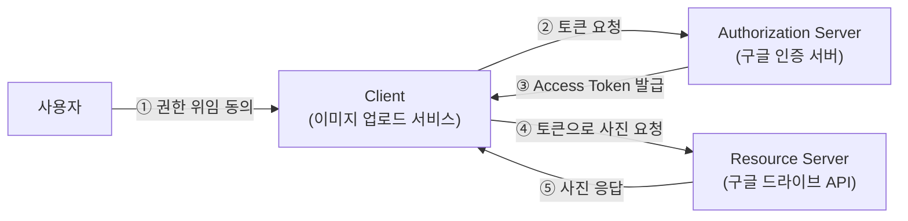
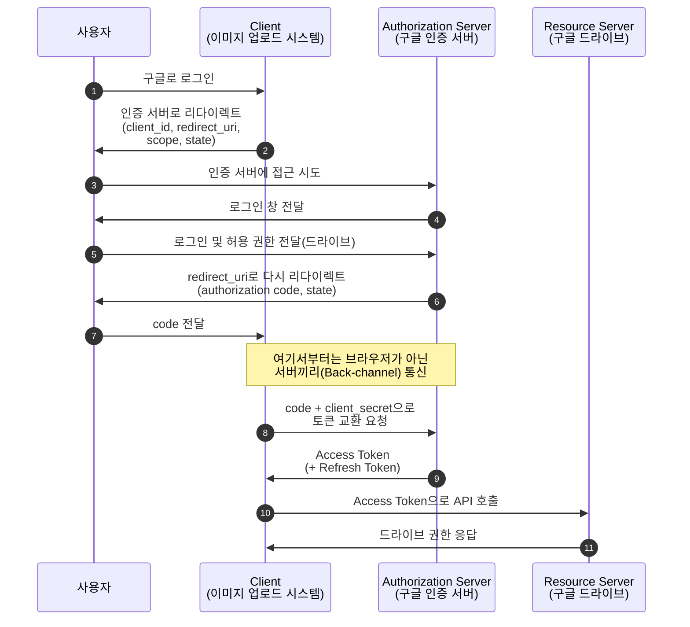

# OAuth2와 OIDC

## 들어가며

전 직장에서 상사분에게 요즘 로그인을 어떻게 만드는지에 대해 물어본 경험이 있었다. 그때, 상사분께서 최근에는 OAuth2와 OIDC를 이용해서 로그인 시스템을 만든다고 하셨는데, 그래서 간단한 개념 정도만 짚고 넘어간 경험이 있었다.
퇴사 이후에 회원쪽 채용공고를 찾아보면 거의 대부분이 OAuth2와 OIDC가 채용공고에 기본으로 들어가 있길래 다시 한번 개념에 대해 정리를 해봐야될 필요성을 느꼈기 때문에 이에 대해 다시 한번 정리해보고자 작성하게 되었다.
## 개념 정의

> OAuth2는 "인가(Authorization)" 프로토콜으로써, 다른 앱에 데이터를 접근하기 위해 권한을 위임받는 방법이다.
> OIDC는 OAuth2 위의 인증 레이어로써, 사용자가 누구인지를 표준화된 방식(ID Token, JWT Token)으로써 알려주는 방식이다.

## OAuth2란?

> 서비스가 비밀번호를 얻지 않아도, 타 시스템으로부터 토큰을 대신 발급받아서, 그 서비스는 출입증만 받는 것을 말한다.

예를 들면, 휴대폰으로 사진을 찍는 다면 그걸 자동으로 구글 드라이브에 업로드 한다고 해보자, 하지만 이때 구글 비밀번호를 공유해버리는건 최악의 방식이다.
이 경우 발생하는 문제를 4가지가 있다.
- 과한 권한 : 비밀 번호를 넘기는 순간, 나느 구글 이미지만 접근하게 하고 싶었지만, Gmail, 결제 정보, 드라이브 등등 모든 권한에 접근할 수 잇게 된다. 드라이브 뿐만 아니라 모든 계정 정보에 접근할 수 있게 열어준 셈이다.
- 철회 불가 : 중간에 서비스를 중단 하고 싶어도, 비밀번호를 바꾸지 않는한, 그 서비스의 접근을 방법 이 없다.
- 유출 위험 : 서비스가 해킹 당하면 내 비밀 번호가 그대로 해킹범한테 넘어가게 된다.

그래서 이걸 막고, 토큰만 발급 받아서 접근 권한을 열어주고, 마음이 바뀐다면 얼마든지 접을을 막을 수 있게 하는 것을 말한다.

## Access Token, Refresh Token, Scope
OAuth2에서 가장 중요한게 토큰인데, 이 종류는 3가지가 있다.
### Access Token
- 자원에 접근할 때 쓰는 토큰
- API를 호출할 때 `Authorization: Bearer <token>` 헤더에 담아 보낸다.
- 유출 되더라도 피해를 줄이기 위해 수명이 짧다.
- 포멧은 랜점 문자열인 opaque token일수도 있고, 정보가 담겨있는 JWT 일 수도 있다.
-  Client는 Access Token의 내용을 들여다보면 안 된다
### Refresh Token
-  Access Token이 만료됐을 때, 재로그인 없이 Access Token을 받아오기 위한 토큰
- 수명이 길다.
- 유출되면 위험하기 때문에 안전한 곳에 보관한다.
### Scope
- 토큰으로 접근할 수 있는 자원을 정의한다.
- 사진만 접근하는 토큰인 경우, 사진 말고 다른 정보에 접근 할수 없도록 막는다.

### Authorization Code Grant

이 프로세스에서 핵심 요소는 아래와 같다.
> [!IMPORTANT]
> 브라우저를 통해 오가는 정보와 서버끼리 오가는 정보를 분리한다

### Code와 토큰을 분리하는 이유
인증 코드를 받고 토큰을 교환하는 과정이 아니라, 그냥 처름부터 토큰을 주지 않는 이유는 아래와 같다.

- 리다이렉트는 브라우저 주소창을 일어나기 때문에, 이건 악성 앱이 접근할 수 있는 부분이다.
- 그래서 이 부분에서 오가는 값은, 중간에 탈취당하더라도 문제 없는 인증 코드이다.
- 정말로 데이터에 접근할 수 있는 Access 토큰은 client_secret를 함께 제출해서 Server-To-Server로 받아온다.

> [!NOTE]
> 탈취당할 수 있는 부분은 교환권만 받고, 서버끼리의 통신으로 토큰을 받는 구조이다. 중간에 탈취당하더라도 client_secret를 알지 못하는 한 토큰을 받아 올수가 없다.

